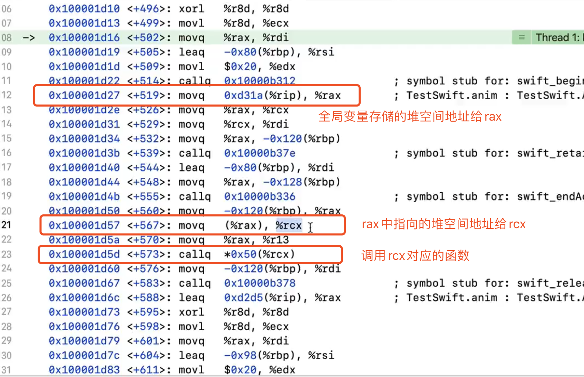
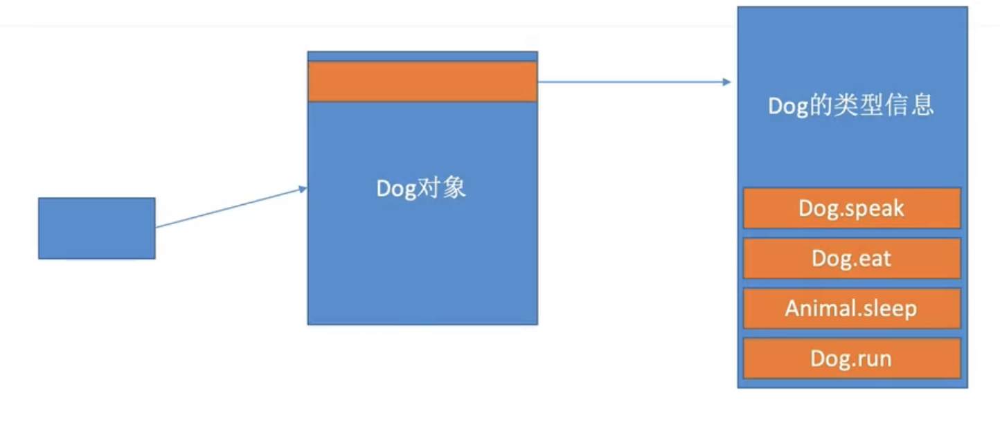

# 多态、初始化、可选链

### 多态

类似c++虚表， 将调用信息存放在类型信息中，编译完就确定   

无论创建多少对象，所有的类对象的类型信息都是一份 存放在全局区



rax前八个字节是类型信息 通过类型信息确定调用哪个speak




### 初始化器

#### 指定初始化器

```swift
init(parameters) {}
```

#### 便捷初始化器

```swift
convenience init(paramenters) {
  self.init(paramenters)
}	
```

便捷初始化器必须内部调用指定初始化器

指定初始化器必须从他侄媳妇类调用指定初始化器

这么设计是为了安全，所有的都走指定初始化器


先初始化子类 后初始化父类 `super.init()` 放在后面


指定初始化器不能调用指定初始化器，确保多个指定初始化器不会乱（多条主线不穿插）

便捷可以调用指定和便捷，只要确保最后调用指定既可


#### 初始化阶段

* 初始化所有存储属性 由下至上（子类到父类）
* 设置新的存储属性值 由上至下（父类到子类）


Convenience 横向调用 


#### 自动继承

如果父类有自定义指定初始化器，子类自动继承。

如果提供所有父类的指定初始化器都有，那么便捷初始化器也会继承

如果子类自定义初始化器，则会不自动继承。