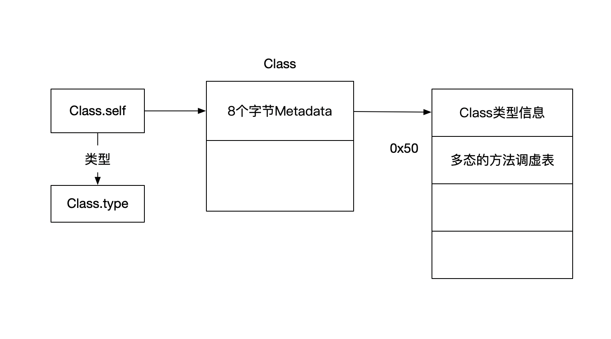

# Init deinit可选链 协议 元类型

## Init

### required

如果required修饰指定初始化器，子类必须实现（自动继承也可以）

### 属性观察器

如果在自己的init方法中不会触发属性观察器，如果子类调用会触发


### 可失败初始化器

定义可是白的初始化器，可以返回nil  类 枚举 结构体都可以

```swift
init?(){
  return nil
}

init!(){//隐式解包
  return nil
}
```

不能同时实现可失败和不可失败同名称的初始化器


可失败初始化器可以调用非可失败初始化器 ，

反过来需要解包


非可失败可以重写可失败，反过来不行


## Deinit

类似析构函数 dealloc

只有类可以使用

先deinit子类 后deinit父类


## 可选链（Optional Chaining）

```swift
var num1: Int? = 5
num1? = 10 //Optional(10)

var num2: Int? = nil
num2? =10 //nil   // 先判断？前面是不是nil 如果是nil 后面不会进行
```


## 协议(protocol)

* `Class`/`Struct`/`Enum`中都可以
* 协议中定义方法时不能有默认参数 

* 默认情况下，协议中定义的内容必须全部全部实现

### 协议中的属性

* 协议中属性必须用var修饰（因为可能通过计算属性实现）

* 协议中属性的权限>= 实现的权限

* 实现的时候可以是计算属性也可以是存储属性

```swift
protocol Drawable {
  func draw()
  var x: Int{get set} //表示可读可写 
  var y: Int{get}//只读
  subscript(index: Int) -> Int{get set}
}

class Persion: Drawable {
  var x: Int = 0
  let y: Int = 0
  func draw() {

  }
  subscript(index: Int) -> Int {
    set{}
    get{index}
  }
}
```


协议中必须使用`static`修饰类型方法、类型属性、类型下标。（为了保证协议在`class`和`struct`中通用）

### associatedtype

在协议中添加泛型

### mutating 

如果修饰值类型需要用mutating修饰

* `Struct`/`Enum`中需要加mutating  ,`Class` 中不需要


### init

* 非`final`类实现必须加上`required`   （确保子类也会实现init方法）

* final修饰的不能被子类继承

协议中定义init?、init! ，可以用init、init?、init!实现

协议中定义init可以用init、init!实现

### 协议组合

```swift
func fn(obj: Protocol1 &  Protocol2) { // 同事遵守Protocol1 和Protocol2
  
}
func fn(obj: Person & Protocol1 &  Protocol2) { // 同事遵守Protocol1 和Protocol2的Person类型或者Person的子类 
}

typealias a =  Person & Protocol1 &  Protocol2
func fn(obj: a) { 
}
```

### CaseIterable

让`Enum`遵守`caseIterable`,可以遍历枚举值  自动实现`allCases`

### CustomStringConvertible


实现  

```swift
var description:String {}
```

和oc中description一样


### Any 、AnObject

Any:任意类型

AnyObject:任意类类型

### is、as?、as!、as

is 判断是否为某种类型

as用来强制转换

### X.self、X.Type、AnyClass

x.self 指向 metadata 存放这类型信息

x.self 的类型是x.Type  地址指向的都是x的前8个字节（metadata）

`type(of)`本质可能不是函数，在汇编中无call   可能是返回类型的前八个字节，返回类型为x.Type

`x.self`  类似于`[x class]`

```swift
class Person {
  required init(){}
}

clsas Stu : Person {}
func creat() ->(){
  Stu.self.init()  // 在这通过X.self调用init方法，  init必须用required修饰，原因是Stu.self可能是Person的子类，如果调用init方法，必须要实现init方法，因为添加required能确保子类实现init方法，所以必须要用required
}
```

Swift隐藏基类Swift._SwiftObject   通过 `class_getSuperclass`




### Self

一般作为返回值类型，限定返回值跟方法的调用者必须是同意类型（类似instancetype） 

> 也可以作为参数类型

```swift
protocol Runnable {
  func test() -> Self
}
class Person : Runnable {
  required init() {}
  func test() -> Self {type(of:self).init()}
}
class Studend : Person{}
```


### 只能被Class继承的类

1. 协议继承于AnyObject ` protocol name :AnyObject {} `
2. 协议继承于class  `@objc protocol name {} `
3. protocol通过objc修饰  `@objc protocol name {} `

### 可选协议

1. 通过@objc添加可选协议
	 ```swift
	@objc protocol name {
		func test()
  	@objc optional func test()
	} `
	```

2. 通过 extension 实现空方法 来达到可选目的

   ```swift
   @objc protocol protocolName {
   	func test()
	func test1()
   } 
   class abc {
   	func test(){}
   }
   ```
   
   