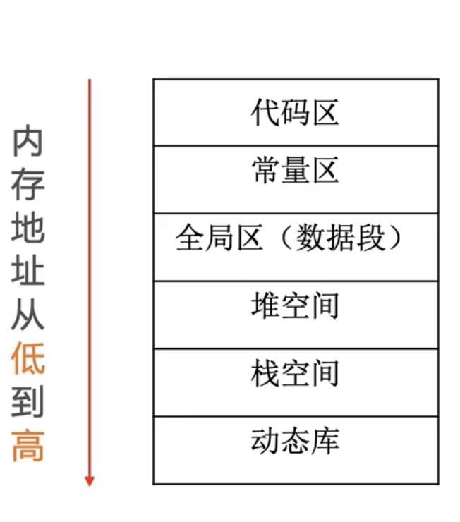
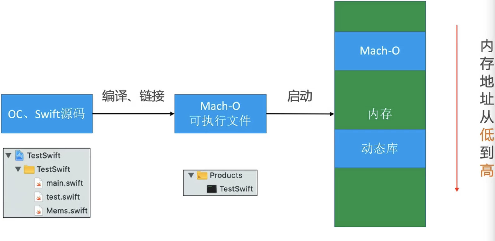
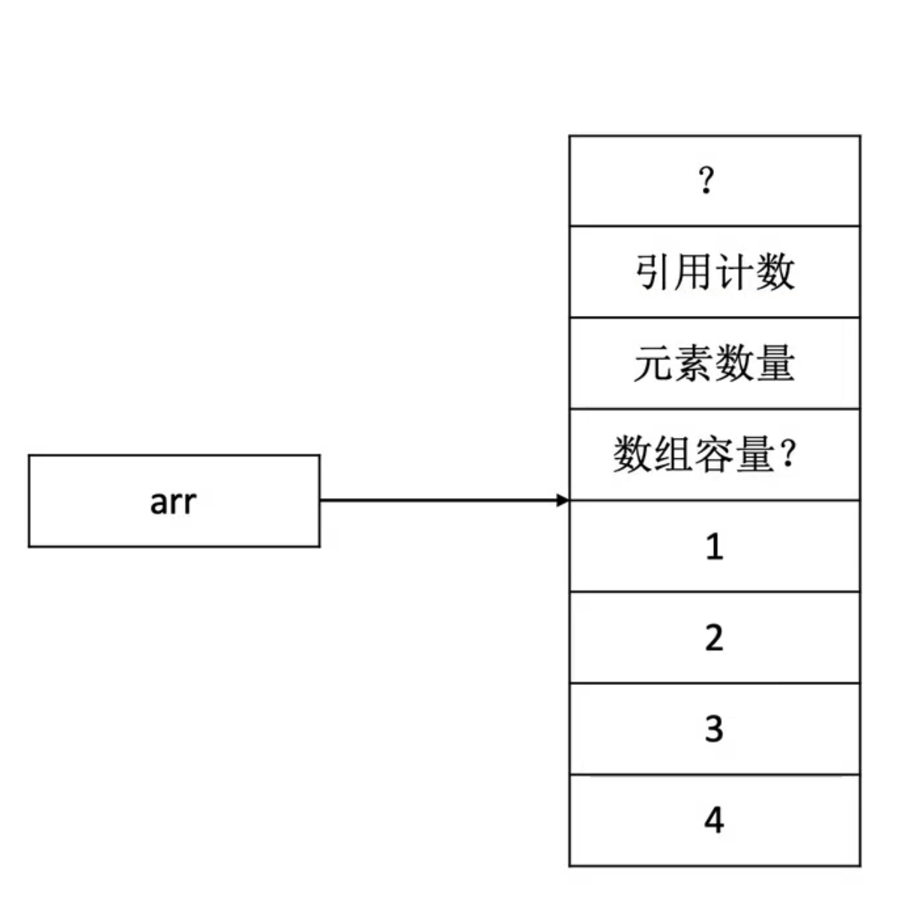

## String

```swift
var st1 = "0123456789"  
//0x736353433323130 0xea0000000003938   
//0xea   e标识类型，是以什么方式存储 e：用变量占用字节存储字符串（16字节）
//0xea   a是字符串长度 最大是e 存储15个字节
// 当前存储方式类似于OC tagger point
```


```swift
var st1 = "0123456789ABCDEF"
//长度超过15 
//字符串真实地址是在后8位  //前八位是字符串长度  0xd0是标志位  d0:常量区
// 0xd000000000000010  0x800000010000a790
//字符串真实地址 + 0x7fffffffffffffe0 = 0x800000010000a790
// 真实地址 = 0x800000010000a790 - 0x7fffffffffffffe0
// 等价于 0x00000010000a790 + 0x20
//0x7fffffffffffffe0 存储在rdx中 
```




VM Address

Mach-o 中地址值是`0x100000000` + 偏移量

windows是地址值是`0x400000000` + 偏移量

`100001234 ` 如果0000有值 一般是堆空间  无值一般在全局区

### 总结

```swift
//字符串 <= 0xF，字符串内容直接存放str1变量的内存中
var str1 = "0123456789"

//字符串 > 0xF 字符串内容存放在__Text.cstring中（常量区）
var st2 = "0123456789ABCDEF"

//字符串依然<=0xF，所以字符串内容直接存放在str1内存中
str1.append("ABCDE")

//字符串>0xF 开辟堆空间
str1.append("ABCDF")

//开辟堆空间
str2.append("G")`
```


### dyld_stub_binder

调用动态库动态调用，先调用个假地址（占位地址）,在动态库中找到真实地址并做绑定，然后调用函数真实地址

lazy binder  用到的时候绑定，只绑定一次。 再次调用直接会调用函数真实地址，不会再次绑定

> `jump *0x2c4c(%rip)` 这类指令占6个字节


## Array

实际也是指针引用，占8个字节，8个字节为堆中地址




