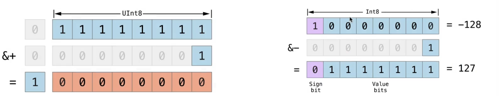
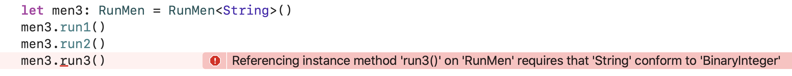

## 可选项本质

可选项本质是enum类型

```swift
public enum Optional<Wrapped> : ExpressibleByNilLiteral {
  case none
  case some(Wrapped)
  public init(_ some: Wrapped)
}
```

```swift
var age: Int? = 10
age = nil
// 等价于
var age1: Optional<Int> = .some(10)
age1 = .none
```

```swift
var age: Int? = 10
switch age  {
case let v?:  // 如果v不为nil 自动解包
	print("age != nil")
case nil 
	print("age != nil")
}

if let v = age {
  print("age != nil")
}else {
  print("age != nil")
}

switch age  {
case let .some(v):  // 如果v不为nil 自动解包
	print("age != nil")
case .none 
	print("age != nil")
}


```

## 高级运算符

### 溢出运算符（overflow Operator）

* `&-`

* `&+`

* `&*` 

```swift
var v1 = UInt8.max
v1 += 11 //会报错溢出

//&-  &+  &* 溢出运算符
var v2 = UInt8.max
v2 &+= v2  v2 = 0   //因为Uint8 0 -255  此时255 &+1 循环到0  如果 &+2 就是1
```




### 运算符重载（Operator Overload）

类、结构体、枚举可以为现有的运算符提供自定义的实现。

可自定义实现 `==` ` i++`   `++i`  `+`  `-` `*` `/`  等操作

地址比较为 

* `===` ： 是否相等   
* `!==`： 是否不等

```swift
struct Point {
  var x = 0, y = 0
  static func + (p1: Point, p2: Point) ->Point { //在结构体中要用static修饰
    Point(x: p1.x + p2.x, y:p1.y + p2.y)
  }
  static perfix func + (p1: Point, p2: Point) ->Point { //perfix 前缀运算符 正号 负号
    Point(x: p1.x + p2.x, y:p1.y + p2.y)
  }
  static postfix func + (p1: Point, p2: Point) ->Point { //perfix 后缀运算符 正号 负号
    Point(x: p1.x + p2.x, y:p1.y + p2.y)
  }
}
var p1 = Point(x:10,y:20)
var p2 = Point(x:20,y:40)
var p3 = p1 + p2 //(x:30,y:60)
```
#### Equatable

> 如果比较两个是否相等 要遵守`Equatable ` 协议 然后重载`==`运算符

> 如果Enum类型没有关联类型，则默认遵循`Equatable`

> 如果Enum/Stack类型如果遵守`Equatable`协议，如果成员变量也是遵守`Equatable` 则系统自动会实现`==`

#### Comparable

可自定义实现 `>` ` <`   `>=`  `<=`   等操作

遵守`Comparable`协议 重载响应的运算符

### 自定义运算符（Custom Opeartor）

可自定义新的运算符:在全局作用于使用operator进行生命

```swift
prefix opeator 名称（前缀运算符）
postfix opeator 名称（后缀运算符）
infix opeator 名称 优先级组（中缀运算符）
```

```swift
precedencegroup PlusPrecedence { 
    associativity: none //结合性   left/right/none 如果没有结合性 就不能a++b++c
    higherThan:AdditionPrecedence //比谁优先级高
    lowerThan: MultiplicationPrecedence //比谁优先级低
    assignment: true //代表在可选链z操作中拥有和赋值运算符一样的优先级  
}

infix operator ++ :PlusPrecedence （中缀运算符）
```

> 可选链优先级

```swift
var p: Person?
p?.age = test()  如果p不存在，就不会调用test() 。 
```

>  如果`assignment = true` 就和这个效果一样


## 扩展（Extension）

类似于oc中的`Category`

* 扩展可以为Enum、Struct、Class、Protocol添加新功能
  * 可以添加方法、计算属性、下标、便捷初始化器、嵌套类型、协议等等
* 协议不能
  * 覆盖原有功能
  * 不能添加存储属性、不能向已有属性添加属性观察器
  * 不能添加父类
  * 不能添加指定初始化器 、不能添加deinit
  * ...

>  在扩展中定义初始化器、会保留默认初始化器。
>
> 类中用required修饰的初始化器，不能在Extension中实现

#### Protocol

可以给Protocol添加Extension，可以实现Protocol中生命的方法。如果实现后，即将Protocol方法默认的Rqeuired变成了Optional，即遵守Protocol不用必须实现被Prototol的Extension的方法。

也可以给Protocol添加一个未声明的实现方法，遵守Protocol的对象也可以调用


##### 注意点

```swift
protocol Runables {
    func run1()
}
extension Runables {
    func run1() {
        print("Runables_run1()")
    }
    func run2() ->(){
        print("Runables_run2()")
    }
}

class RunMen: Runables {
    func run1() {
        print("RunMen_run1()")
    }
    func run2() {
        print("RunMen_run2()")
    }
}
var men = RunMen()
men.run1();
men.run2();
/// RunMen_run1()
/// RunMen_run2()

var men2: Runables = RunMen()
men2.run1();
men2.run2()
/**
输出结果
RunMen_run1()
Runables_run2() 因为当你定义类型为Runables  Run1为默认实现，系统会通过class找 而run2并不是required类型。所以优先找协议分类中的实现
*/
```

扩展中也可以对泛型添加要求，已达到根据泛型信息来确定是否展示这个扩展  例如

```swift
protocol Runables {
    func run1()
}
extension Runables{
    func run1() {
        print("Runables_run1()")
    }
    func run2() ->(){
        print("Runables_run2()")
    }
}

class RunMen<E>: Runables{
    func run1() {
        print("RunMen_run1()")
    }
    func run2() {
        print("RunMen_run2()")
    }
}

extension RunMen where E: BinaryInteger {
    func run3() {
        print("RunMen_run3()")
    }
}

let men = RunMen<Int>()
men.run1();
men.run2();
men.run3();


let men3: RunMen = RunMen<String>()
men3.run1()
men3.run2()
men3.run3() //报错
```





