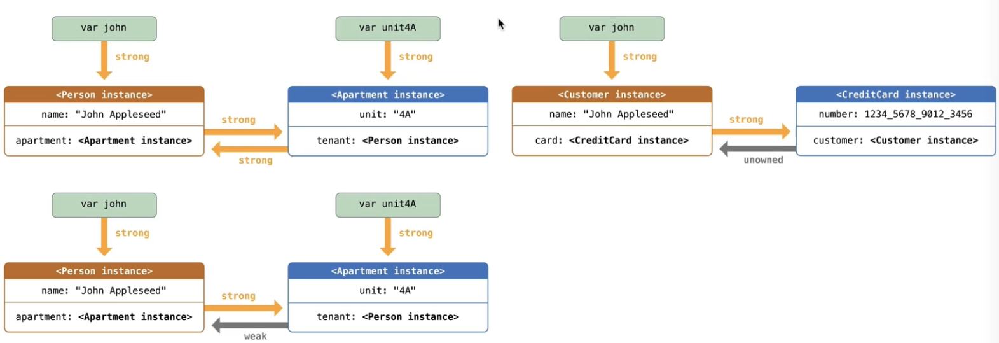

## 访问控制

### 5个不同的访问级别

由高到低如下所示

```swift
open //不同模块间可以通信 例如其他动态库，target  只能用在类、类成员上、允许继承、重写
public //可以在不同模块通信 在其他模块不可以继承重写
internal // 只允许在定义的实体模块中访问， 绝大部分默认
fileprivate //只允许在定义实体的源文件中访问 
private // 只循序在定义实体的封闭生命中访问    
```

**一个实体不可以被更低访问级别的实体定义**

**元组的的访问级别是所有类型类型访问级别最低的**

**泛型访问级别也是所有泛型访问级别最低的**

* 类型的访问级别会影响成员（属性、方法、初始器、下标）、嵌套类型访问级别
  * 一般情况下，类型为`private`和`fileprivate`,那么成员也是`private`和`fileprivate`
  * 一般情况下，类型为`internal`或者`public`，那么成员\嵌套类型默认是`internal `


#### 例子

```swift
class Test {
  private struct Dog {
    var age: Int = 0  //默认的private是和Dog类同一等级的private -> 在test内
    private func speak(){}}   //而这个private是在Dogn内部
  }

	private struct Person {
    var dog: Dog = Dog()
    mutating func run walk(){
      dog run()
      dog.speak() //会报错  权限问题
      dog.age = 1
    }
  }
}
```


#### getter、setter

可以给setter设置一个比getter更低的访问级别、用以控制写的权限’

```swift
fileprivate(set) public var num = 10	
```

#### 初始化器

##### 类

```swift
public class abc {
  // init  如果默认生成  权限为internal
  public init() //必须手动书写plublic
}
```

##### 结构体

初始化器的权限是最小属性的权限  无论怎们初始化


#### Enum、Protocol

不允许单独设置权限，权限跟随Enum的修饰

#### protocol

不允许单独设置权限，权限跟随Protocol的修饰

protocol实现的方法 权限比protocol或者class中的一个高就可以


#### Extension

* 如果Extension有明显修饰，就跟随明显修饰

* 如果Extension没有明显修饰
  * 在一个文件里书写，那Extension内部的成员和在类中写是一样的（private修饰成员也能在类中调用）
  * 如果没在一个文件里，那么就正常区分

## 内存管理

#### Strong

强引用

#### weak

弱引用

* weak修饰的必须是可选类型 & 必须是var

* 保证可变以及可以自动设置为nil

> 弱引用置为nil 的时候不会触发属性观察器

#### unowned

无主引用

*  不会产生强引用，非可选类型，实例销毁后仍存储着实例的地址（类似OC中的`unsafe_unretained`）
* 访问已经实例销毁的`unowned`，会报野指针错误

#### 注意

`weak`、`unowned`只能修饰类实例上面


#### 循环引用

`weak` unowned都可以解决循环引用

* 生命周期可能为nil 使用`weak`

* 赋值后不会变为nil 侧泳`unowned`



#### 闭包的循环引用


```swift
class Person {
	var fn:(() ->())?
	func run() {print("run")}
}
func test {
	var p = Person()
	p.fn = {
		[weak p] in // 用in隔开，添加捕获列表    //[weak wp = p]  in   //也可以自定义名称
		p?run() //此时p为可选类型
	}
}

*------------------------------------------------------


class Person {
	var fn:((Int) ->())?
	func run() {print("run")}
}
func test {
	var p = Person()
	p.fn = {
		[weak p] (age) in // 用in隔开，添加捕获列表  age为参数  捕获列表放在参数前面
		p?run() //此时p为可选类型
	}
}
```


> 初始化闭包的同时使用self， 则需要用lazy修饰闭包， 因为要保证实例被初始化后使用self

如果lazy属性是闭包调用的**结果** ，那么不用考虑循环引用的问题（因为闭包调用后，闭包的生命周期就结束了）

```swift
class Person {
	var age: Int = 10
  lazy vat getAge: Int ={
    self.age
  }()  //这里有个（）表示执行， 执行后闭包消失，无循环引用
}
```


#### @escaping

* 非逃逸闭包、逃逸闭包，一般都是当做参数传递给函数
* 非逃逸闭包：闭包调用发生在函数前，闭包调用在函数作用域内
* 逃逸闭包：闭包在有可能结束后调用，闭包逃离了函数的作用域，需要用@escaping

```swift
var gFn: Fn?
func test(fn: @escaping Fn) {gFn = fn} // gFn在函数作用域外调用 逃逸闭包 需要用@escaping修饰
```

```swift
func test(_ fn: @escaping FN) {
    DispatchQueue.global().async { 
      //异步  执行在test作用域外  所以也是逃逸闭包
        fn()
    }
}
```


> 逃逸闭包不可以捕获inout参数

