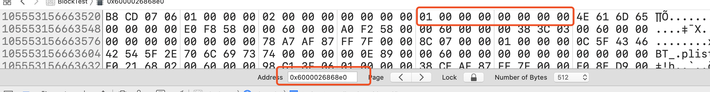

## 内存访问冲突(Conflicting Access to memory)

### 产生冲突的条件

* 至少一个是写入操作

* 他们访问的是同一块内存

* 他们访问的时间重叠（比如在同一个函数内）


##### 例如

```swift
var step = 1
func test(_ num: inout Int) {
  num += step   // num和step访问一块内存  在同一个函数。num是写入操作
}
test(&step)
```

下面条件满足，就说明重叠访问结构体的属性是安全的

1. 你只访问实例的存储属性，不是计算属性或者类属性
2. 结构体是结构变量不是全局变量
3. 结构体要么没有被闭包捕获要么只被非逃逸闭包捕获

> 总结这三点，满足只要不是在全局区 就认为是安全的。

##### 例如

```swift
func test() {
  //如果不在test里定义 而是在全局区定义 那么就有内存访问冲突。 如果在test中定义。就在栈空间。不在堆空间
	var tulpe = (health:10, energy:20)
	balance(&tulpe.health, &tulpe.energy)
  
  var holly = Play(name:"play", age:10)
  balance(&holly.name, &holly.age)
}

test()
```


## 指针（swift中的指针）

swift中有专门的指针类型。这些都被定义为`Unsafe`  常见有以下4中类型

* `UnsafePointer<Pointee>` 类似于`const Pointee *`
* `UnsafeMutablePointer<Pointee>` 类似于`Pointee *`
* `UnsafeRawPointer` 类似于`const void *`
* `UnsafeMutableRawPointer` 类似于`void *`

```swift
func test1(_ ptr: UnsafePointer<Int>) {
    print(ptr.pointee)
}

func test2(_ ptr: UnsafeMutablePointer<Int>) {
  ptr.pointee = 20
  print(ptr.pointee)
}

func test3 (_ ptr: UnsafeRawPointer) {
    print(ptr.load(as: Int.self))
}

func test4 (_ ptr: UnsafeMutableRawPointer) {
    ptr.storeBytes(of: 30, as: Int.self)
    print(ptr.load(as: Int.self))
}

test1(&a) 10
test2(&a) 20
test3(&a) 20
test4(&a) 30

```


#### 创建指针

创建方式1

```swift
let p1 = malloc(16) // 生成可选类型
//p1 = UnsafeMutableRawPointer.allocate(byteCount: 16, alignment: 1) 这么初始化也可以 不是可选类型   释放用p1.deallocate()
p1?.storeBytes(of: 10, as: Int.self) //前8字节存10
p1?.storeBytes(of: 20, toByteOffset: 8, as: Int.self) //后8字节存20
print(p1!.load(as: Int.self))  //输出10 
print(p1!.load(fromByteOffset: 8, as: Int.self)) //输出20  offset为偏移量
free(p1)  //手动释放
```
创建方式2

```swift
let p1 = UnsafeMutableRawPointer.allocate(byteCount: 16, alignment: 1)
p1.advanced(by: 8)// 偏移8个字节，返回新的指向的指针
//...修改读取操作相同和方式1一样
p1.deallocate() //释放
```

创建方式3

```swift
var p1 = UnsafeMutablePointer<Int>.allocate(capacity: 3)//容量  根据前面泛型确定具体字节 Int= 8  字节数等于8 * 3
p1.initialize(to: 2)// 初始化2  //前8字节
p1.successor().initialize(to: 3)  //successor()使指针向后移1个单位（例子是Int 也就是8个字节
p1.successor().successor().initialize(to: 4)  //最后8个字节 赋值4

print(p1.pointee)  // 第一个
print((p1 + 1).pointee) //第二个
print((p1 + 2).pointee) //第三个

print(p1[0])  // 第一个
print(p1[1]) //第二个
print(p1[2]) //第三个
p1.deinitialize(count: 3)  //前面调用initialize后  后面就需要调用deinit反初始化
p1.deallocate()
```


#### 获取变量的地址

```swift
var age = 10
lazy var ptr = withUnsafeMutablePointer(to: &age) { (p) -> UnsafeMutablePointer<Int> in
    return p   //也可以写$0  也可以包装成UnsafeMutableRawPointer($0)
}
ptr.pointee = 20
print(age)  //20

// 获取一个变量的指针并修改
```


#### 获取对象地址

```swift
class person :CustomStringConvertible{
    var age: Int = 1
    var description: String {
        return "Person.age = " + "\(self.age)"
    }
}

var age = person.init()
lazy var ptr = withUnsafeMutablePointer(to: &age) { UnsafeMutableRawPointer($0)  //获取person变量的地址值
let ad: UInt =  ptr.load(as: UInt.self)    //person存储的值（person堆空间地址值）
let personAd = UnsafeMutableRawPointer(bitPattern: ad)

print(ptr) //0x00007febabe096f0   因为在函数中定义的 所以在栈中
print(personAd!) //0x00006000026868e0 person地址    
                                                   
```

##### 验证

进入Xcode ->Debug ->ViewMemory  将地址打出，可以看出红色为age ，且 age= 1 ,验证成功




#### 转换

非泛型指针转为泛型指针

```swift
var p1 = UnsafeMutableRawPointer.allocate(byteCount: 16, alignment: 1) //非泛型
var p2 = p1.assumingMemoryBound(to: Int.self)//泛型
//var p2 = unsafeBitCast(p1, to: UnsafeMutablePointer<Int>.self)  //这种也可以

p2.pointee // 泛型后可恶意直接用p2.pointee
(p2 + 1).pointee
```


##### assumingMemoryBound和unsafeBitCast的区别

* `unsafeBitCast()` 忽略类型的强制转换，就是换句话说就是不会改变存储类型的方式，上述p1,p2如果通过这种方式转换，内存存的二进制都是一样的，不会因为强制转换而更改。
  *  例如Int 10转化为Double 会改变成10.0  内存也会改变。 但是`unsafeBitCast()` 不会因为转换改变。
  * `unsafeBitCast()` 直接将二进制字节搬过去。然后更改类型。


