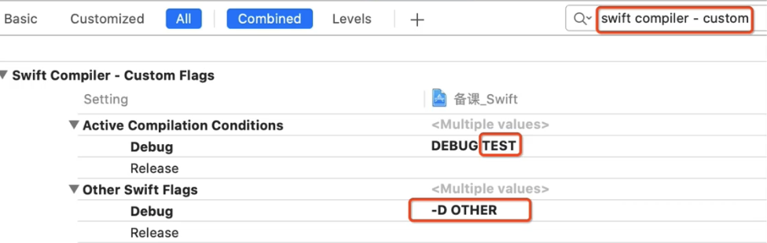
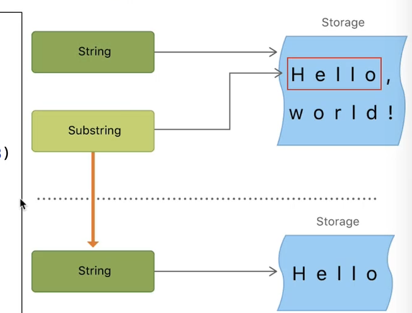
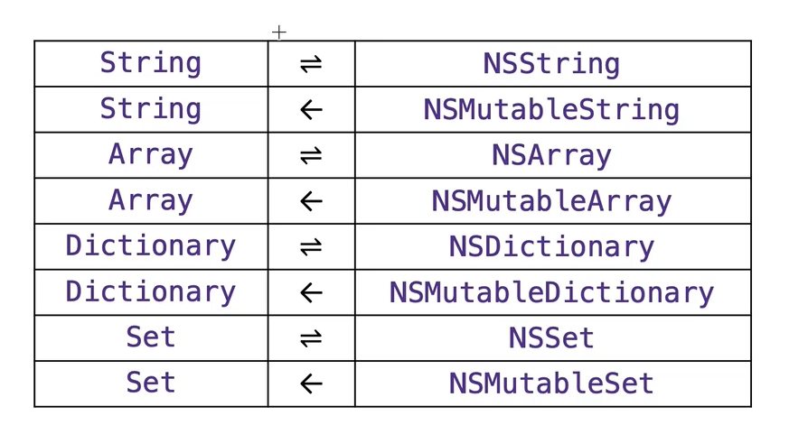

```swift
// MARK:类似于#pragmat mark

// TODO:标记未完成的任务

// FIXME:用于标记待修复的问题

#warning("undo")
//可以在需要返回值的地方添加fatalError() 再组合上warning
```


## 条件编译

`swift compiler - custom`  自定义标记



打印详细

```swift
print(#fine,#line,#function)  //文件名 行数 对象名称
```

系统版本检测

```swift
if #available(iOS 10,macOS 10.12, *) {

}

@available(iOS,deprecated:11)
func run() //run只在iOS 11前使用

@available(*, unavailable,renamed:"name2")
func name1()  //name1改名为name2
```


## iOS入口

```swift
AppDelegate ->@UIApplicationMain 
```

更改入口

```swift
import UIKit

class MyAppDelegate: UIApplication{}

UIApplicationMain(CommandLine.argc,
                  CommandLine.unsafeArgv,
                  NSStringFromClass(MyAppDelegate.self),
                  NSStringFromClass(AppDelegate.self))
```


### 桥接文件

#### Swift调用OC

```swift
{targetName}-Bridging-Header.h
target -> build setting ->bridging 添加文件目录
```

如果c语言定义的和swift定义的冲突 例如

```swift
func add(a: Int32, b: Int32) -> Int32 {
	 a - b
}
int add(int a, int b) {
  return a + b
}
//如果冲突了 优先使用swift
//处理
@_silgen_name("add")
func swift_add(a: Int32, b: Int32) -> Int32 {
	 a + b
}
// 将c语言的add更改为swift的swift_add
// 可以将底层的c替换 可以从github找源码

```


#### OC调用Swfit

```swift
{targetName}-Swift.h
target -> build setting ->generated interface
//如果swift项目想要暴露给Objective-C，首先要继承NSObject
// 需要@objc 暴露给OC
// 在类钱添加@objcMembers  所有成员都暴露给OC  swift的扩展也会暴露

@objcMembers class Car: NSObject {
	var band: String
  func test() {}
}
//或者
class Car: NSObject {
	@objc	var band: String
  @objc func test() {}
}
```

##### @objc

```swift
//可以通过@objc重命名Swift暴露给OC的符号名（类名，属性名，函数名）等
@objc(MJCar)
@objcMembers class Car: NSObject {
	@objc(name)
	var band: String
}
```


#### Swift依然可以使用选择器

```swift
#selector() //只有暴露给oc的方法名才可以使用选择器
```


### 底层实现

* OC调用swift  swift调用oc 都是走runtime 

* swift中调用swift不管什么环境 都走swift虚表 
  *  如果需要runtime的东西 前面加`dynamic`修饰既可

### String



* 遵守这个协议 BidirectionalCollection

  三个双引号

  ```swift
  let str = """
  
  					1.13
  						13
  							3
  							
  					"""//以下面对齐
  print(str)
  ```

* String不能转换到NSMutableString 

* NSMutableString 可以桥接为String

* swift 中 `==` 等于 `isEqual`

