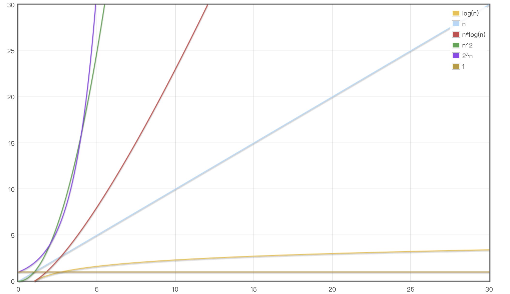
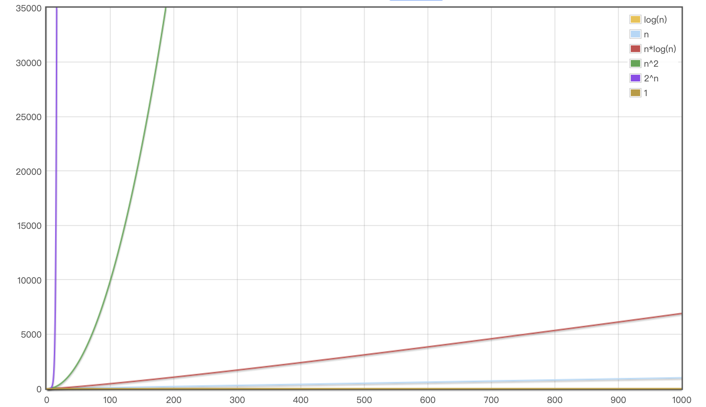
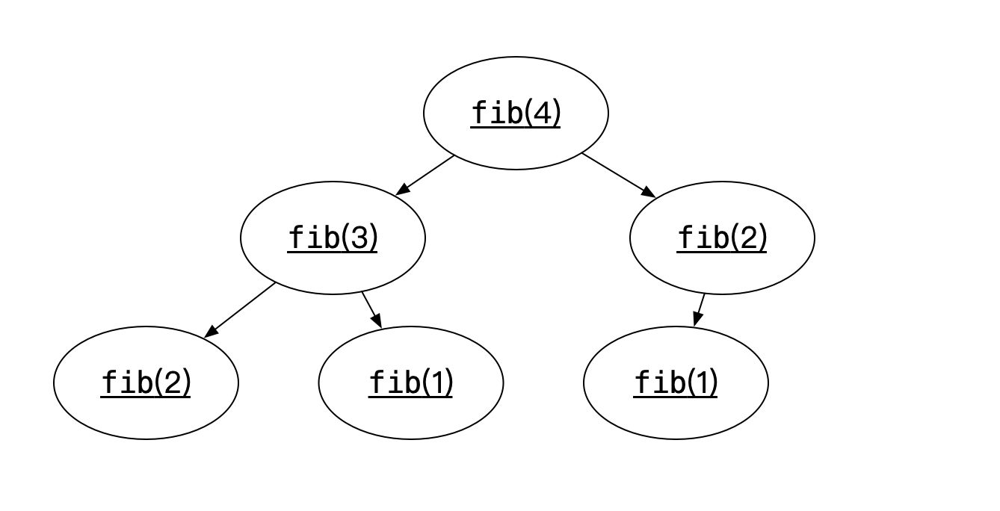

####时间复杂度和空间复杂度


用O 标识时间复杂度 以及空间复杂度

简单来说就是执行代码的次数

我们分析下下面的时间复杂度

```java
public static void test(int n) {
  // i = 0 执行1次  i < n 执行n次 i++ 执行n次
  for (int i = 0; i < n; i++) {
      // j = 0 执行n次  j < n 执行n^2次 j++ 执行n^2次
    for (int j = 0; j < n; j++) {
      //执行n^2次
      System.out.println("123");
    }
  }
}
```

##### 时间复杂度计算

所以总的时间为1 + n + n + n + n^2 + n^2 + n^2 = 1 +3n +3n^2  由于计算时间复杂度可以省略常数，系数以及低阶  所以这个算法的时间复杂度为O(n^2)

```java


public static void test2(int n) {
 // i = 0 执行1次  i < n 执行n次 i++ 执行n次
  for (int i = 0; i < n; i++) {
    //j = 0 执行n次   j < i 执行 0 + 1 + 2 + 3 +...+ (i - 1)次  j++执行 0 + 1 + 2 + 3 +...+ (i - 1)次
    for (int j = 0; j < i; j++) {
      //执行 0 + 1 + 2 + 3 +...+ (i - 1)次
      System.out.println("123");
    }
  }
}
```

##### 时间复杂度计算

​	总时间为 1 + n + n + n + (0 + 1 + 2 + 3 +...+ (i - 1)) + (0 + 1 + 2 + 3 +...+ (i - 1)) + (0 + 1 + 2 + 3 +...+ (i - 1)) 由于i = n - 1 所以

  1 + n + n + n + (0 + 1 + 2 + 3 +...+ (n - 2)) + (0 + 1 + 2 + 3 +...+ (n - 2)) + (0 + 1 + 2 + 3 +...+ (n - 2))
	//  0 + 1 + 2 + 3 +...+ (n - 2) =  (0 + n -2) * n/2 = n^2/2 -n
  所以原式为1 + n + n + n + 3(n^2/2 - n) = n^2/2 + 1
  所以时间复杂度为O(n^2)

```java


public static void test3(int n) {
   // i = 0 执行1次  i < n 执行n次 i++ 执行n次
  for (int i = 0; i < n; i++) {
    //j = 0 执行n次
		// j + = j等价于 j = j * 2  所以执行次数就是 2^j < n 因为2^j = n  j = log2^n 
    // 因为log5^n = log2^5 *long5^n  所以一般我们忽略底部系数 次数为log n
    // 所以j < n 和 j += j 的执行次数为n * logn
    for (int j = 0; j < n; j += j) {
      // 执行次数为n * logn
      System.out.println("123");
    }
  }
}
```

##### 时间复杂度计算

//  总的执行次数为 1 + n + n +n + n *logn + n * logn + n * logn = 1 + 3n + 3nlogn
  //所以时间复杂度为nlogn


#### 常见的复杂度







##### 举个🌰  斐波那契数列

斐波那契数列（Fibonacci sequence），又称[黄金分割](https://baike.baidu.com/item/黄金分割/115896)数列、因[数学家](https://baike.baidu.com/item/数学家/1210991)列昂纳多·斐波那契（Leonardoda Fibonacci）以兔子繁殖为例子而引入，故又称为“[兔子数列](https://baike.baidu.com/item/兔子数列/6849441)”，指的是这样一个数列：1、1、2、3、5、8、13、21、34、……在数学上，斐波那契数列以如下被以[递推](https://baike.baidu.com/item/递推/1740695)的方法定义：F(1)=1，F(2)=1, F(n)=F(n-1)+F(n-2)（n>=3，n∈N*）

```java
	public static int fib(int n) {
		if(n <= 1 ) return n;
		return fib(n - 1) + fib(n - 2);
	}
```

我们算一下时间复杂度 举个例子 如果我们输入的是4 我们看一下这个时间复杂度是多少



2^0 + 2^1 + 2^2 + ...2^n)=  2^(n-1) - 1 = 0.5*2^n

所以这个时间复杂度为2^n

```java
public static int fib2(int n) {
  if (n <= 1) {
    return n;
  }
  // 1
  int first = 0;
  // 1
  int second = 1;
  // int i > 1次  i的判断 -> n-1次  i++ -> n-1次
  for (int i = 0; i < n - 1; i++) {
    int  sum = first + second;
    first = second;
    second = sum;
  }
  return second;
}
```

而下面这个算法就一个for循环  可见时间复杂度为n

