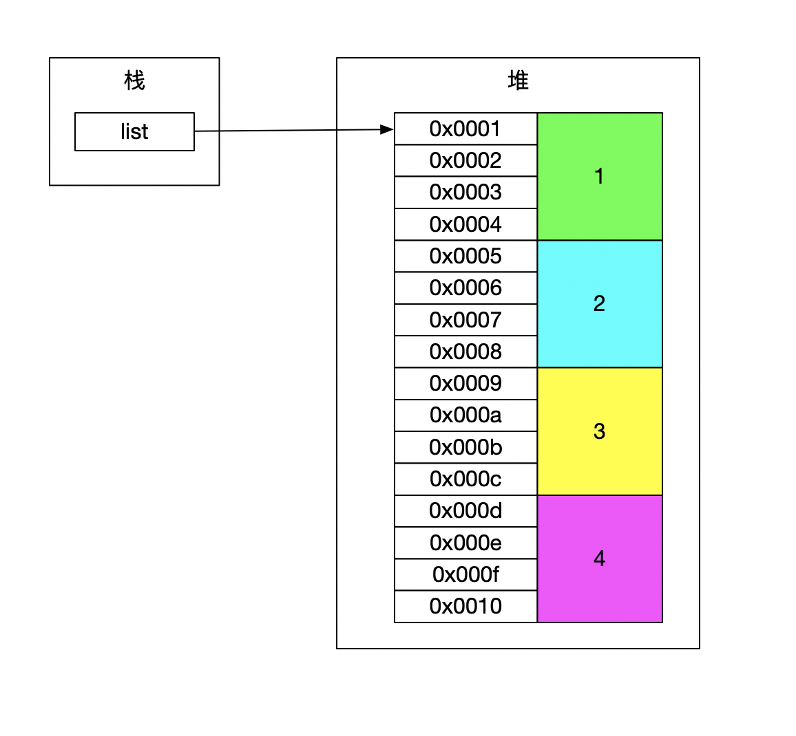

### 数组：

在堆中连续开辟的一段空间，每个元素占有相同大小的空间。



### 对数组如何增删查改

#### 插入


```java
public void insetAtIndex(int index, int element) {
  cheakRange(index); // 检查插入的是否超过数组开辟范围
  cheakCapicity(); // 看是否需要扩容

  for (int i = size; i > index; i--) {
    elementDatas[i] = elementDatas[i - 1];
  }
  elementDatas[index] = element;
}
```


##### 数组的插入操作 效率很低 如果数组长度特别大，在首部附近插入数据，将会把几乎所有的数组数组都要向后移动。

#### 删除

 

```java
public int removeAtIndex(int index) {
  // 检查删除的是否超过数组开辟范围
  cheakRange(index);

  int old = elementDatas[index];
  for (int i = index + 1; i < size; i++) {
    elementDatas[i - 1] = elementDatas[i];
  }
  //清空最后的空间
	elementDatas[index] = null;
}
```

### 查询


##### 通过角标偏移就可以找到对应的数组。 由于内存地址是连续的  所查数据只要是(查找数据index*偏移量)。

```java
public int get(int index) {
	// 判断查找的是否在范围内
		cheakRange(index);
		return elementDatas[i];
}
```

#### 替换


##### 在查找的基础上直接替换就可以

```java
elementDatas[i] = element;
```

* 优点:：查找,替换快
* 缺点：插入删除效率低


