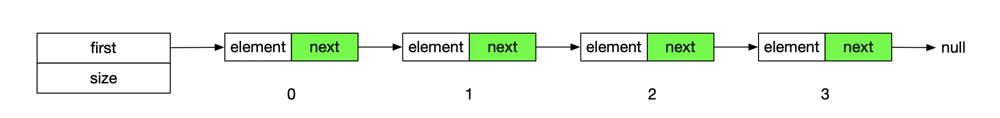
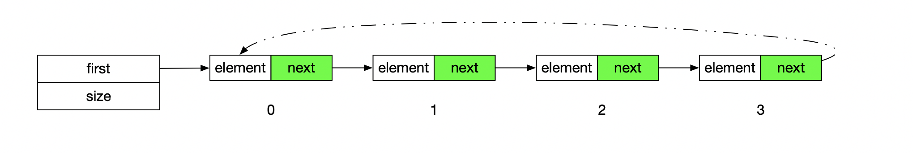
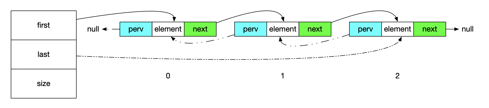
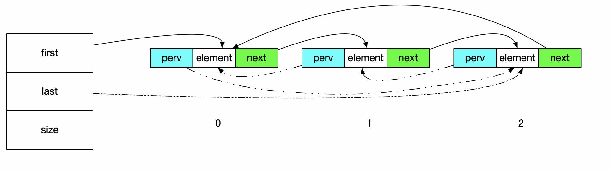

Https://visualgo.net/zh

### 单向链表

##### 单向链表结构如下图所示



##### 注意事项

* 插入操作的时候 如果想在角标1添加，要找到角标1的上一个元素。
* 边界问题 例如首个元素添加 以及最后一个元素添加


### 单向循环链表



单项循环链表就是在最后一个元素的next 指向第一个元素

##### 注意事项

* 单向链表的注意事项 
* 当元素只有一个的时候，进行删除操作需要注意

### 双向链表



在单链表的基础上 添加一个perv指针，指向上一个元素。用于优化单项链表查找问题。

##### 注意事项

* 通常我们添加元素，找到添加元素对应位置的元素 进行插入既可
* 当添加操作的时候，注意边界问题，特殊处理

### 双向循环链表



在双向链表的基础上 

将最后一项的next指向首个元素 

将第一项的perv的元素指向最后一个元素

##### 注意事项

* 删除操作只剩下一个元素的问题
* 边界处理问题


建议手写代码实现上述操作的增删查改，以及在leet code上刷关于链表的题、

### 面试题：

#### 1、翻转链表

将一个单链表进行翻转

链表为1，2，3，4，5 翻转输出为5，4，3，2，1

```java
public class ListNode {
	int val;
	ListNode next;
	ListNode(int x) { val = x; }
}
```
123123

```java
//递归
public ListNode reverseList(ListNode head) {
  if (head == null || head.next == null) {
  return head;
}
  ListNode headerListNode = reverseList(head.next);
  head.next.next = head;
  head.next = null;
	return headerListNode;
}
```
递归思想：

将事件模拟成最小单元事件。以及方法想要做的事情。

```java
//迭代
public ListNode reverseList2(ListNode head) {
  ListNode temp = null;
  ListNode newHeader = null;

  while(head != null) {

    temp = head.next;
    head.next = null;
    newHeader = head;
    head = temp;
  }
	return newHeader;
}
```

迭代思想

借助新的链表，遍历旧链表，在新的链表上头插法进行插入(在角标为0的位置插入)

##### 时间复杂度

两种方式的时间复杂度都是O(n)

#### 2、判断一个链表是否有环


```java
public class _141_环形链表 {
	public boolean hasCycle(ListNode head) {

		if (head == null || head.next == null) {
			return false;
		}

		ListNode slow = head;
		ListNode fast = head.next;
		while (slow != fast) {
			if (fast == null || fast.next == null) {
				return false;
			}
			slow = slow.next;
			fast = fast.next.next;
		}
		return true;
	}
}
```

思想

 快慢指针方式 例如在赛道上两人跑步，跑的快的是跑的慢的速度的两倍，如果是环形赛道，跑的慢的终究会和跑的快的相遇(跑的路程比你多一圈)。

##### 时间复杂度

时间复杂度都是O(n) 


lee code

237

206 面试题 翻转链表（递归和迭代两种方式）

141 判断链表是否有环 快慢指针思想


 ◼ 移除链表元素 https://leetcode-cn.com/problems/remove-linked-list-elements/  

◼ 删除排序链表中的重复元素 https://leetcode-cn.com/problems/remove-duplicates-from-sorted-list/  

◼ 链表的中间结点 https://leetcode-cn.com/problems/middle-of-the-linked-list/solution/  


最好复杂度 最坏复杂度 平均复杂度  n为规模

 均摊复杂度  动态数组add 扩容情况 1+ 1+ 1+ 1+ 1+ ...1+ n


###  

### 双向循环链表

* 只有一个的情况

###  约瑟夫问题

### ArrayList 优化

