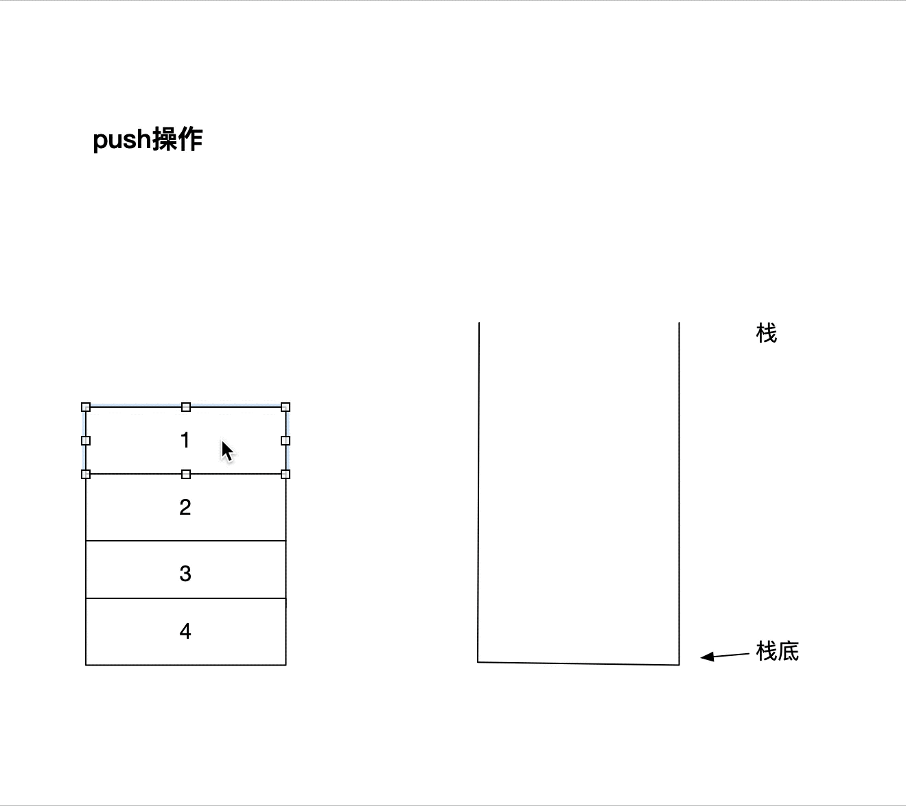
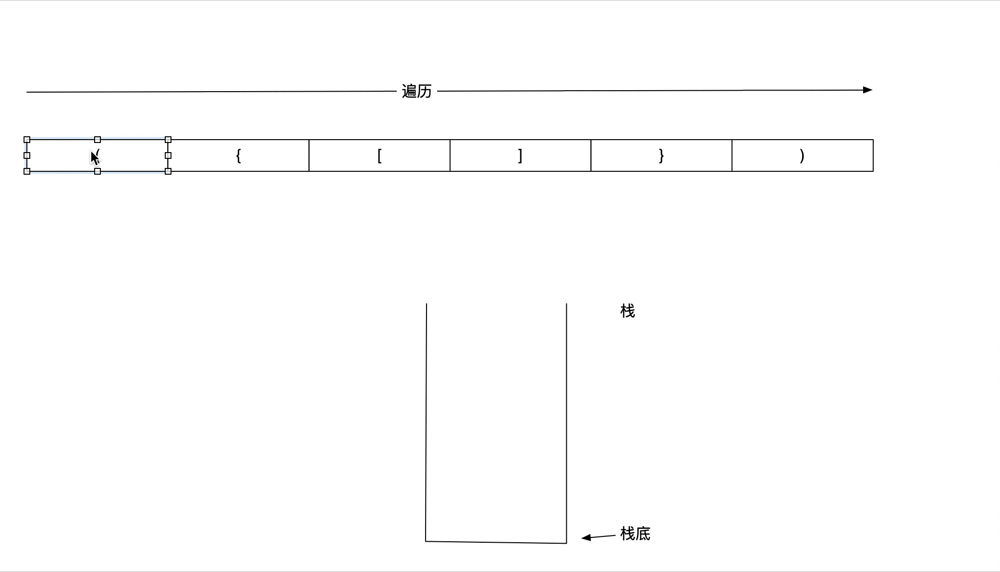

### 概念

栈（stack）又名堆栈，它是一种运算受限的线性表。限定仅在表尾进行插入和删除操作的线性表。这一端被称为栈顶，相对地，把另一端称为栈底。向一个栈插入新元素又称作进栈、入栈或压栈，它是把新元素放到栈顶元素的上面，使之成为新的栈顶元素；从一个栈删除元素又称作出栈或退栈，它是把栈顶元素删除掉，使其相邻的元素成为新的栈顶元素。

由于栈的特性为先进后出 所以称之为First In Last Out 简称FILO



### 有效括号（leetCode 20题）

#### 题目

给定一个只包括 '('，')'，'{'，'}'，'['，']' 的字符串，判断字符串是否有效。

有效字符串需满足：

左括号必须用相同类型的右括号闭合。
左括号必须以正确的顺序闭合。
注意空字符串可被认为是有效字符串。

来源：力扣（LeetCode）
链接：https://leetcode-cn.com/problems/valid-parentheses


#### 解题思路

我们吧`(` `[` `{`定义为统称为左括号

我们吧`)` `]` `}`定义为统称为右括号

* 给定字符串"({[]]})";  如果发现是左面括号 就入栈。 一直到发现是右括号

* 当为右括号就把栈顶元素pop出来， 如果和右括号匹配就继续， 否则返回false
* 如果遍历字符串到最后 栈为空，就范围true 否则就为false



```java
private static HashMap<Character, Character> map = new HashMap<Character, Character>();
static {
  map.put('(', ')');
  map.put('[', ']');
  map.put('{', '}');
}

public boolean isValid(String s) {
  int length = s.length();
  Stack<Character> stack = new Stack<>();
  for (int i = 0; i < length; i++) {
    Character character = s.charAt(i);

    if (map.containsKey(character)) {
      stack.push(character);
    } else {
      if (stack.isEmpty()) {
        return false;
      }
      if (character != map.get(stack.pop())) {
        return false;
      }
    }
  }
  if (stack.isEmpty()) {
    return true;
  }
  return false;
}
```

#### 时间复杂度

因为需要遍历字符串 长度为n 所以时间复杂度为O(n);

