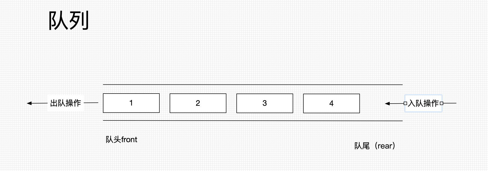
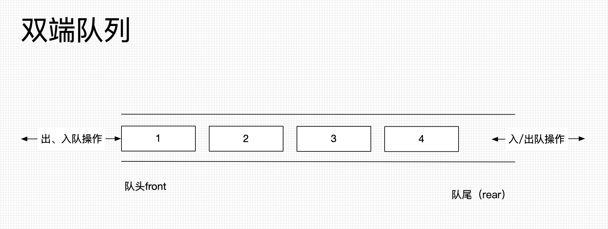
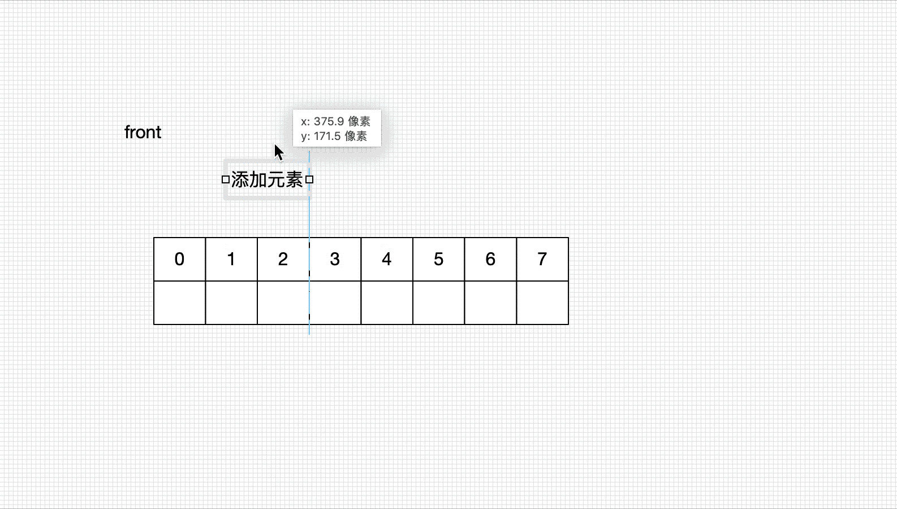
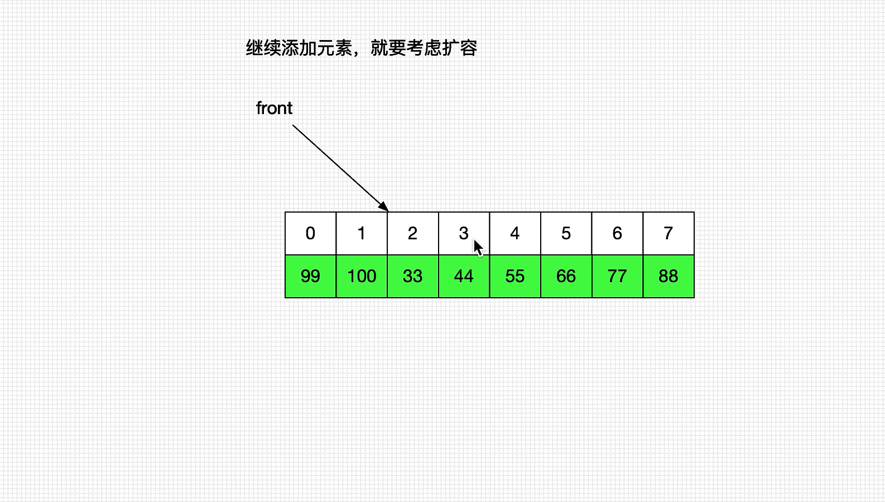

# 队列

### 队列 (Queue)

#### 定义

队列是一种特殊的线性表（只能操作队头front 和 队尾rear） 

* 先进先出原则（First In First Out） FIFO

* 队尾（rear）:只能进行入队操作(enQueue)->添加元素

* 队头（front）:只能进行出队(deQueue) ->取出元素
* 一般底层由双链表来实现



#### 接口设计

```java
int size();//大小
boolean isEmpty(); //是否为空
void enQueue(element); //入队
E deQueue();//出队
E front();// 最前面元素
void clear();//清空
```


### 双端队列 (DeQue) Double Ended Queue

#### 定义

* 双端队列是能在头尾两端都可以添加和删除的队列 

* 一般底层由双链表来实现



####  接口设计

```java
int size();//大小
boolean isEmpty(); //是否为空
void enQueueFront(element); //从队头入队
void enQueueRear(element); //从队尾入队
void deQueueFront(element); //从队头出队
void deQueueRear(element); //从队尾出队
E deQueue();//出队
E front();// 最前面元素
void clear();//清空
```


### 循环队列(Circle Queue)

* 底层一般由数组实现
* 扩容问题

#### 1、原理


#### 

#### 2、扩容问题




### 双端循环队列

类似于动态数组，只是在动态数组的基础上缺少插入的操作。


### 用栈实现队列  (leetCode 232)

#### 题目

使用栈实现队列的下列操作：

push(x) -- 将一个元素放入队列的尾部。
pop() -- 从队列首部移除元素。
peek() -- 返回队列首部的元素。
empty() -- 返回队列是否为空。
示例:

MyQueue queue = new MyQueue();

queue.push(1);
queue.push(2);  
queue.peek();  // 返回 1
queue.pop();   // 返回 1
queue.empty(); // 返回 false
说明:

你只能使用标准的栈操作 -- 也就是只有 push to top, peek/pop from top, size, 和 is empty 操作是合法的。
你所使用的语言也许不支持栈。你可以使用 list 或者 deque（双端队列）来模拟一个栈，只要是标准的栈操作即可。
假设所有操作都是有效的 （例如，一个空的队列不会调用 pop 或者 peek 操作）。

来源：力扣（LeetCode）
链接：https://leetcode-cn.com/problems/implement-queue-using-stacks
著作权归领扣网络所有。商业转载请联系官方授权，非商业转载请注明出处。

#### 思路

inStack 和 outStack

* 入队时候push到 inStack
* 出队的时候
  * 如果outStack为空 将所有inStack 进行pop 并push到outStack中， 再将outStack栈顶元素pop
  * 如果outStack不为空 直接将outStack栈顶元素pop

#### 代码

```java
public class MyQueue {

	private Stack<Integer> inStack;
	private Stack<Integer> outStack;

	public MyQueue() {
		inStack = new Stack<>();
		outStack = new Stack<>();
	}

	/** Push element x to the back of queue. */
	public void push(int x) {
		inStack.push(x);
	}

	/** Removes the element from in front of queue and returns that element. */
	public int pop() {
		cheackOutStack();
		return outStack.pop();
	}

	/** Get the front element. */
	public int peek() {
		cheackOutStack();
		return outStack.peek();
	}

	/** Returns whether the queue is empty. */
	public boolean empty() {
		return outStack.empty() && inStack.empty();
	}
	
	void cheackOutStack() {
		if (outStack.empty()) {
			while (!inStack.empty()) {
				outStack.push(inStack.pop());
			}
		}
	}
}
```


### 