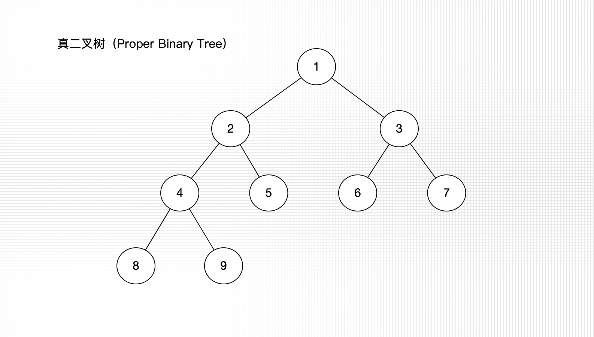
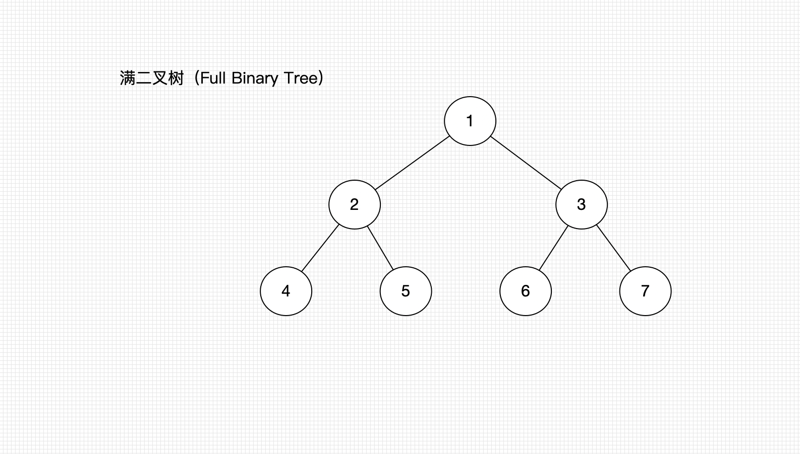
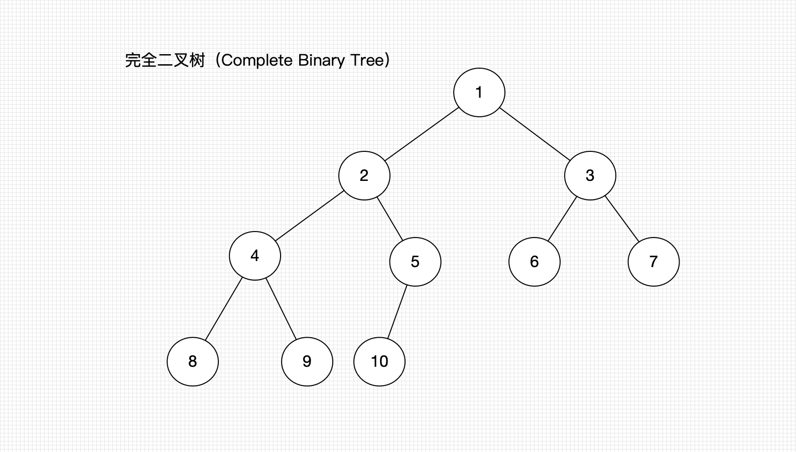

# 二叉树（Binary Tree）

### 二叉树（Binary Tree）

* 每个节点的**度**最大为2。
* 左子树和右子树是有序的。
* 即使某个节点只有一颗子树，也要区分是左右子树。

#### 性质

非空二叉树的第i层，最多有  $2^{i - 1}$ 个节点。

对于任何一课非空二叉树，如果叶子节点的个数为$n_0$，度为2的节点个数为$n_2$，则有$n_0 = n_2 + 1 $。

* 假设度为1的节点数为$n_1$ 那二叉树的节点总数为$$n = n_0 + n_2$$。

* 二叉树的边数$$T = n_1 + 2*n_2  = n - 1 = n_0 + n_1 + n_2 -1 $$。

#### 真二叉树（Proper Binary Tree）

所有节点的度为0或者为2。

#### 满二叉树（Full Binary Tree）

所有节点的度为0或者为2（真二叉树）&& 所有的叶子节点都在最后一层。

$$n (节点总数量) = 2^0 + 2^1 +2^2 +...+2^{h-1} = 2^{h} - 1$$

$$h = log2^{n + 1}$$

#### 完全二叉树(Complete Binary Tree)

叶子节点只会出现最后**2**层，而且最后**1**层的节点都**向左**对齐

* 度为1的节点只有左子树
* 度为1的节点个数<=1
* 同样节点个数的二叉树，完全二叉树的高度最小
* 假设完全二叉树的高度为h（h>=1）那么
  * 至少有$2^{h - 1}$个节点
  * 至多有$2^h - 1$个节点（满二叉树）
  * 总结点数量为n
    * $$2^{h-1} \leq n < 2^h$$
    * $$h - 1 \leq log2^n < h $$
      * h = $floor(log2^n)$ + 1  
        *  floor()向下取整
        * ceiling向上取整

### 习题：

#### 如果有一颗完全二叉树有589个节点 求叶子节点个数

##### 假设：

​	叶子节点个数为$n_0$
​	度为1的节点个数为$n_1$
​	度为2的节点个数为$n_2$
​	总节点个数为$T$

##### 就有

$$
 T = n_0 + n_1 + n_2
$$

已知  $n_0 = n_2 + 1$

##### 所以

$$
T = n_0 + n_1 + (n_0 - 1)  = 2n_0 + n_1 - 1
$$

因为T = 589 完全二叉树度为1的节点个数$\le1$

假设n1 = 1 

589 = $2n_0$ + 1 - 1

$n_0$ = 494.5     

###### ==不成立==

假设n1 = 0

589 = $2n_0$ + 0 - 1

$n_0$ = 495     

###### **成立**

#### 所以叶子节点的个数为495

