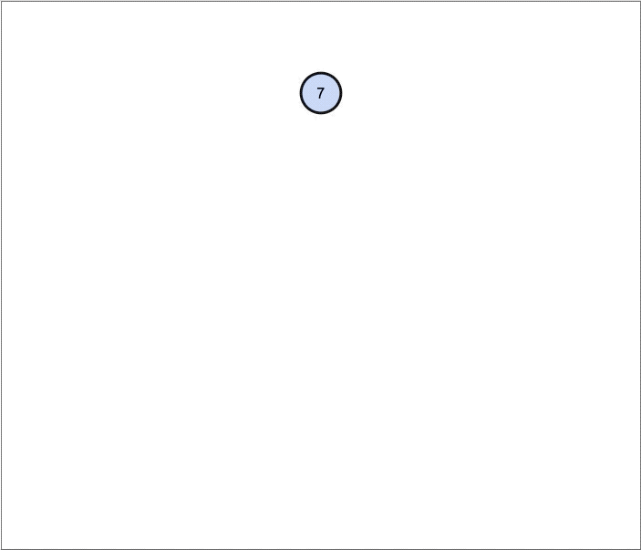

### 二叉搜索树（Binary Search Tree）

又称为二叉查找树，二叉排序树。简称为BST

* 任意一个节点的值都**大于**其**左**子树的值

* 任意一个节点的值都**小于**其**右**子树的值

* 他的左右子树也是一颗二叉搜索树
* 二叉搜索树可以大大提高效率（搜索和添加删除时间复杂度都是logn）
* 二叉搜索树的元素必须是具备**可比较性** 
  * 自定义类型需要指定比较方式
  * 不允许为null
* 二叉树没有索引的概念




## 二叉树遍历

* 前序遍历（Preorder Traversal）
* 中序遍历（Inorder Traversal）
* 后序遍历（Postorder Traversal）
* 层序遍历（Level Order Traversal）

> 所说的序是指根节点的顺序


### 前序遍历（Perorder Traversal）

遍历顺序：根节点，左子树，右子树

10，8，6，3，7，8，9，12，11，13

```java
	/// 前序遍历
	public void preorderTraversal() {
		preorderTraversal(root);
	}
	
	private void preorderTraversal(Node<E> node) {
		if (node == null) {
			return;
		}
		System.out.println(node.element);
		preorderTraversal(node.left);
		preorderTraversal(node.right);
	}
```


### 中序遍历（Inrorder Traversal）

遍历顺序：左子树，根节点，右子树。

3，6，7，8，9，10，11，12，13

遍历顺序：右子树，根节点，左子树。

13，12，11，10，9，8，7，6，3

* 如果是二叉搜索树（BST）中序遍历输出为有序数列

```java
/// 中序遍历
public void inorderTraversal() {
  inorderTraversal(root);
}

private void inorderTraversal(Node<E> node) {
  if (node == null) {
    return;
  }
  inorderTraversal(node.left);
  System.out.println(node.element);
  inorderTraversal(node.right);
}
```


### 后序遍历（Postorder Traversal）

遍历顺序：左子树，右子树，根节点。

3，7，6，9，8，11，13，12，10

遍历顺序：右子树，左子树，根节点。

13，11，12，9，7，3，6，8，10


```java
/// 后序遍历 
public void postorderTraversal() {
  postderTraversal(root);
}

private void postderTraversal(Node<E> node) {
  if (node == null) {
    return;
  }
  postderTraversal(node.left);
  postderTraversal(node.right);
  System.out.println(node.element);
}
```


### 层序遍历（Level Order Traversal）

一层一层的访问， 从上到下 ，从左到右。

10，8，9，6，9，11，13，3，7


#### 实现思路：

利用队列

1、将跟节点入队

2、while（队列不为空）{

​		将队头节点出队 进行访问

​		将队头左右子节点分别入队

​	}

```java
///层序遍历
public void levelOrderTraversal() {
  if (root == null) {
    return;
  }
  Queue<Node<E>> queue = new LinkedList<>();
  queue.offer(root);
  while (!queue.isEmpty()) {
    Node<E> node = queue.poll();
    System.out.println(node.element);
    if(node.left != null) {
      queue.offer(node.left);	
    }
    if(node.right!= null) {
      queue.offer(node.right);
    }	
  }
}
```

