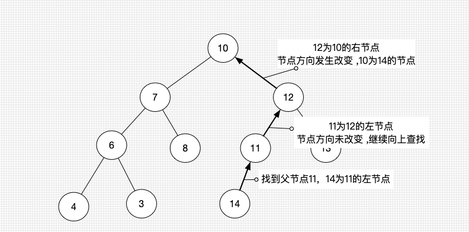

### 一、计算二叉树高度

#### 递归

相当于求根节点的高度  根节点高度等于`1+子节点最高的高度`

```java
public int height() {
  return height(root);
}

private int  height(Node<E> node) {
  if (node == null) {
    return 0;
  }
  return 1 + Math.max(height(node.left), height(node.right));
}
```

#### 迭代

##### 利用层序遍历

* 设定levelSize初始值为1（只有一个根节点）
* 当进行while循环的时候 `levelsize--` 操作。 因为levelSize和每层节点个数相等。所以当levelSize为0的时候，下一个levelSize的大小就等于此时在队列中的元素个数。
* 当`levelSize== 0`的时候 
  * 进行赋值下一层的个数  `levelSize = queue.size()` 
  * 此时代表一个层级遍历结束 `height++`

##### 代码如下图所示

```java
public int height() {
		if (root == null) {
			return 0;
		}
		int height = 0;
		int  levelSize = 1;
		
		Queue<Node<E>> queue = new LinkedList<>();
		queue.offer(root);
		while (!queue.isEmpty()) {
			Node<E> node = queue.poll();
			levelSize--;

			if(node.left != null) {
				queue.offer(node.left);	
			}
			if(node.right!= null) {
				queue.offer(node.right);
			}	
			if (levelSize == 0) {
				levelSize = queue.size();
				height ++;
			}
		}
		return height;
	}
```

### 二、判断一颗树是否为完全二叉树

层序遍历

#### 思路

while(队列不为空) {

​	如果标记为叶子节点   判断是否为叶子节点，如果不是返回false

- Left 
  - 如果left ！= null  入队
  - 如果left == null 
    - 如果right != null  返回false；
- Right
  - 如果right != null  入队
  - 标记其余都是叶子节点

}

* 当层序遍历结束后返回true；

```java
private boolean isCompleteTree(Node<E> root) {

  Queue<Node<E>> queue = new LinkedList<Node<E>>();
  queue.offer(root);
  boolean leaf = false;

  while (queue.size() != 0) {
    Node<E> node = queue.poll();

    if (leaf) {
      if (!node.leaf()) {
        return false;
      }
    }

    if (node.left != null) {
      queue.offer(node.left);
    }else {
      if (node.right != null) {
        return false;
      }
    }

    if (node.right != null) {
      queue.offer(node.right);
    }else {
      leaf = true;
    }
  }
  return true;
}
```


### 三、翻转二叉树

#### 示例：

```
输入：
	   4
   /   \
  2     7
 / \   / \
1   3 6   9

输出：

		 4
   /   \
  7     2
 / \   / \
9   6 3   1

来源：力扣（LeetCode）
链接：https://leetcode-cn.com/problems/invert-binary-tree
著作权归领扣网络所有。商业转载请联系官方授权，非商业转载请注明出处。
```


#### 解题思路

##### 利用遍历翻转

```java
/**
 * Definition for a binary tree node.
 * public class TreeNode {
 *     int val;
 *     TreeNode left;
 *     TreeNode right;
 *     TreeNode(int x) { val = x; }
 * }
 */
class Solution {
    public TreeNode invertTree(TreeNode root) {
        if (root == null) {
			return root;
		}
		
		TreeNode tempNode = root.left;
		root.left = root.right;
		root.right = tempNode;
		
		invertTree(root.left);
		invertTree(root.right);
		
        return root;
    }
}
```


### 四、根据遍历结果重构二叉树

* 中序遍历+ 前/后序遍历 
  * 可以确定一颗唯一二叉树

* 前序遍历+ 后序遍历
  * 如果他是一颗真二叉树(Proper Binary Tree) ,结果是唯一的。
  * 其他情况 不唯一。

```java
List<Integer> perorder = Arrays.asList(5,1,2,4,3,9);
List<Integer> inorder = Arrays.asList(2,1,4,5,9,3);


private  Node<E> RefactoringTree(List<E> perorderList, List<E> inorderList) {
  if (perorderList.size() == 0|| inorderList.size() == 0) {
    return null;
  }
  E element = perorderList.get(0);

  Node<E> root = new Node<>(element, null);
  perorderList = perorderList.subList(1, perorderList.size());
  int index = inorderList.indexOf(element);
  List<E> leftInorderList = inorderList.subList(0, index);
  List<E> rightInorderList = inorderList.subList(index + 1, inorderList.size());

  List<E> leftperOrderList = perorderList.subList(0, leftInorderList.size());
  List<E> rightperOrderList = perorderList.subList(leftperOrderList.size(), perorderList.size());

  root.left = RefactoringTree(leftperOrderList, leftInorderList);
  root.right = RefactoringTree(rightperOrderList, rightInorderList);
  return  root;
}
```


### 前驱节点(predecessor)

#### 介绍

* 前驱节点：**中序遍历**时的前一个节点

* 如果左子树存在，从该节点的左子节点的最右的节点。

* 如果左子树 == null && 父节点！= null   父节点为父节点遍历，一直到节点关系发生改变。如下图所示。

* 如果左子树 == null && 父节点== null ，没有前驱节点。

  



#### 代码

```java
public Node<E> findPredecessorNode(E element) {
  return findPredecessorNode(node(element));
}

private Node<E> findPredecessorNode(Node<E> element) {
  if (element.left != null) {
    Node<E> node = element.left;
    while (node.right!= null) {
      node = node.right;
    }
    return node;
  }

  while (element.parent != null && element == element.parent.left) {
    element = element.parent;
  }
  return element.parent;
}
```


### 后继节点(succeessor)

- 前驱节点：**中序遍历**时的后一个节点

- 如果右子树存在，从该节点的左子节点的最左的节点。
- 如果右子树 == null && 父节点！= null   父节点为父节点遍历，一直到节点关系发生改变。
- 如果右子树 == null && 父节点== null ，没有后继节点。


### 删除节点

#### 叶子节点

* 直接删除

#### 度为1的节点

- 用子节点替换既可

#### 度为2的节点

- 找到**前驱**或者**后继**节点的值，并替换原节点。
- 他的前驱、后继节点的度只可能是0或者是1。

```java

private void remove(Node<E> node) {
  if (node == null) return;
  size--;

  // 度为2的节点
  if (node.twoChildren()) { 
    // 找到后继节点
    Node<E> s = findSucceessorNode(node);
    // 用后继节点的值覆盖原节点的值
    node.element = s.element;

    node = s;
  }

  // 删除的node节点  （node的度必然是1或者0） 如果是0 replacement为null
  Node<E> replacement = node.left != null ? node.left : node.right;

  // 度为1
  if (replacement != null) {
    // 更改parent
    replacement.parent = node.parent;
    // 更改parent的 chil
    if (node.parent == null) { // node是度为1的节点并且是根节点
      root = replacement;
    } else if (node == node.parent.left) {
      node.parent.left = replacement;
    } else { // node == node.parent.right
      node.parent.right = replacement;
    }
  } else if (node.parent == null) { // node是叶子节点并且是根节点
    root = null;
  } else { // node是叶子节点
    if (node == node.parent.left) {
      node.parent.left = null;
    } else { 
      node.parent.right = null;
    }
  }
}
```


