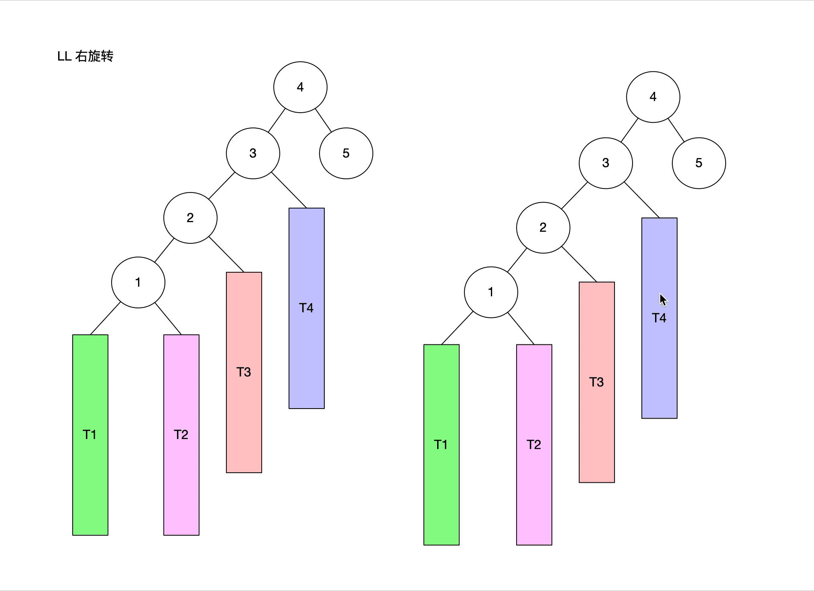
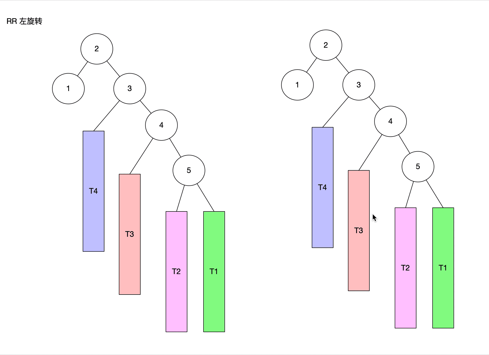
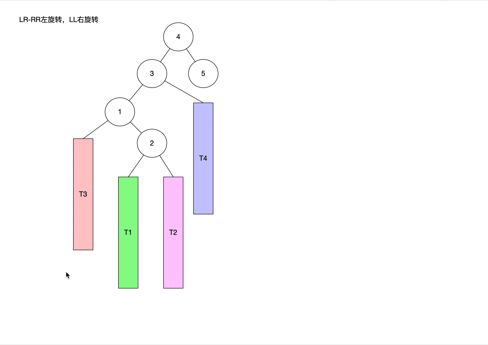

### 平衡二叉树来源

二叉搜索树的复杂度分析

和高度有关

O(h) = O(logn) 

最坏复杂度是从小到大添加节点 （和链表差不多）

O(h) = O(n)

如何二叉搜索树退化成链表？？

让添加删除搜索的复杂度维持在logn

 #### 平衡（Balance）

当节点固定时，左右字数高度就越接近，这可二叉树就越平衡

#### 理想平衡

最理想的平衡，例如 完全二叉树，满二叉树

#### 如何改进二叉搜索树

因为无法改变添加删除顺序（用户操作决定），所以在每次操作之后，让二叉树达到平衡状态。

* 用最少的调整次数达到适度的平衡既可。

### 平衡二叉搜索树(Balanced Binary Search Tree)

简称BBST

常见的平衡二叉搜索树有

* AVL树

  * Windows NT内核中管饭使用

* 红黑树

  * C++ STL(map set)
  * Java中的TreeMap、TreeSet、HashMap、HashSet
  * Linux 的进程调度
  * Ngix的timer


**一般称他们为：自平衡的二叉搜索树(Self-Balance Binary Search Tree)** 


### AVL树

#### 介绍：

最早发明的自平衡二叉树之一

取名为G.M.Adelson-Velsky和E.M.Landis（来自苏联的科学家） 两个人的名字称呼

> 平衡因子：某节点的左右子树高度差

#### 特点：

* 每个节点的左右高度差不超过1
* 搜索、添加、删除的时间复杂度为O(logn)


#### LL- 右旋转（单旋）

* 注意维护T3、2、3的 parent的属性

* 以及更新2、3的高度




#### RR-左旋转

* 注意维护T3、3、4的 parent的属性

* 以及更新3、4的高度



#### LR-RR左旋转,LL右旋转(双旋)

* 首先对 LR的进行中的**2** 进行 RR左旋转



* 对旋转后对**3**进行LL右旋转

  参考上方LL右旋转

#### RL-LL右旋转,RR左旋转(双旋)

* 参考上方LR-RR左旋转,LL右旋转(双旋)。方法即是LR的对称


##### 删除导致失衡

* 只可能导致父节点或者祖先节点（只有一个）失衡（原因是因为 失衡因子= 子节点相减）

##### LL\RR\LR\RL情况：

* 极端情况  所有的祖先节点都会失衡 共（logn）次调整

##### 解决方式：

在删除后进行平衡操作

##### 删除

让父节点恢复失衡后，可能导致更高节点的祖先接点失衡(最多需要log(n)次调整)


##### 添加：

 添加会导致所有祖先节点都失衡

处理：只要让最低失衡节点回复平衡，整棵树就回复平衡(O(n))

##### 解决方式：

添加后进行平衡操作


#### 时间复杂度

搜索：平均时间复杂度O(logn)

添加：平均时间复杂度O(logn) O(1)次旋转

删除：平均时间复杂度O(logn) O(logn)次旋转


```java
private void rebalance(Node<E> grand) {
  Node<E> parent = ((AVLNode<E>)grand).tallChild();
  Node<E> node = ((AVLNode<E>)parent).tallChild();
  if (parent.isLeftChild() ) { //L
    if (node.isLeftChild()) { //LL
      rotateRight(grand);
    }else { //LR
      rotateLeft(parent);
      rotateRight(grand);
    }
  }else { //R
    if (node.isLeftChild()) { //RL
      rotateRight(parent);
      rotateLeft(grand);
    }else { //RR
      rotateLeft(grand);
    }
  }
}

private void rotateLeft(Node<E> grand) {
  Node<E> parent = grand.right;
  Node<E> child = parent.left;
  grand.right = child;
  parent.left = grand;

  afterRotate(grand, parent, child);
}

private void rotateRight(Node<E> grand) {

  Node<E> parent = grand.left;
  Node<E> child = parent.right;

  grand.left = child;
  parent.right = grand;
  afterRotate(grand, parent, child);

}
// 旋转后更新操作
private void afterRotate(Node<E> grand,Node<E> parent, Node<E> child) {
  parent.parent = grand.parent;

  if (grand.isLeftChild()) {
    grand.parent.left = parent;	
  }else if (grand.isRightChild()){
    grand.parent.right = parent;
  }else {
    root = parent;
  }
  if (child != null) {
    child.parent = grand;
  }
  grand.parent = parent;

  updateHeight(grand);
  updateHeight(parent);
}

```

