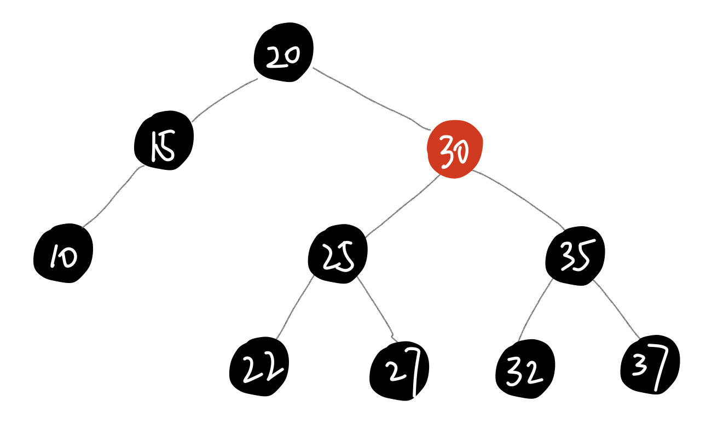
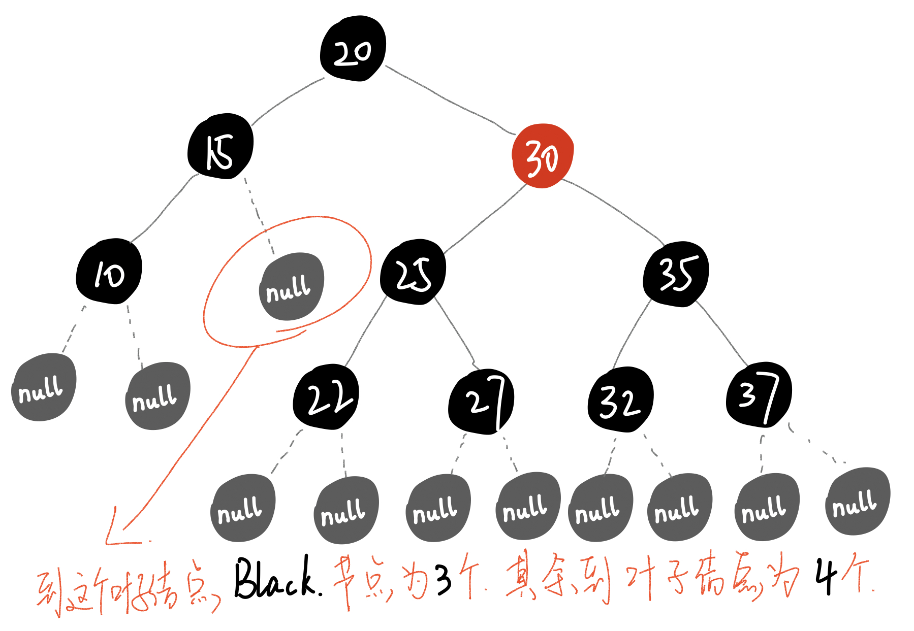

# 红黑树

红黑树也是一种自平衡二叉搜索树

以前也叫做平衡二叉B树

红黑树必须满足一下5个性质

* 节点是有颜色的**Red**/**Black**

* 根节点必须是**Black**

* 叶子节点必须是**Black** 
  * 红黑树的叶子节点会自动将度为0 或者度为1的节点的度自动补充为2，补充的节点称之为外部节点
    * 外部节点是空想出来的，代码中不会实现
  
* **red**节点的子节点都是**black**色

* 从任意一节点到叶子节点的所有路径包含的**black**节点**数目相同**

  * 这里说的叶子节点包含假想出来的叶子节点
  
  

  
  
  

### 下面是否为红黑树

  

* 不是

  满足

  - 节点是有颜色的**Red**/**Black**
  - 根节点必须是**Black**
  - 叶子节点必须是**Black** 
    - 红黑树的叶子节点会自动将度为0 或者度为1的节点的度自动补充为2，补充的节点称之为外部节点
      - 外部节点是空想出来的，代码中不会实现
  - **red**节点的子节点都是**black**色

* 不满组

  * 从任意一节点到叶子节点的所有路径包含的**black**节点**数目相同**

