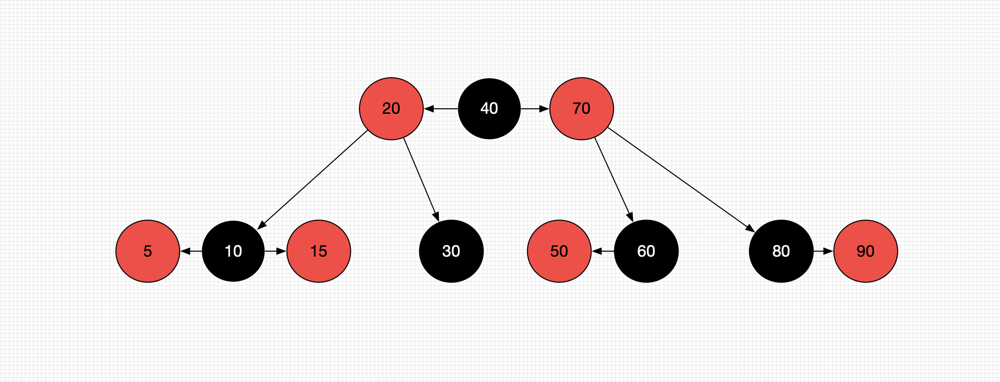
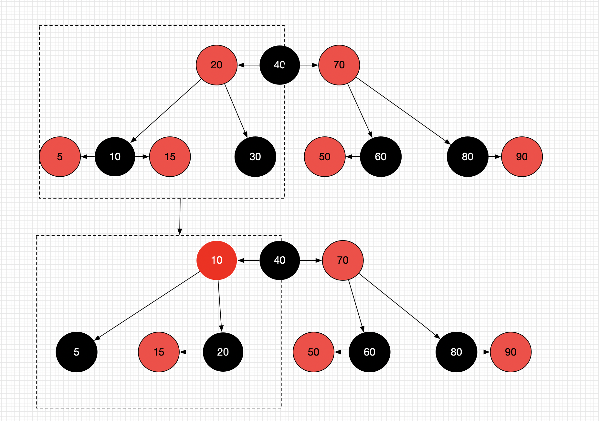
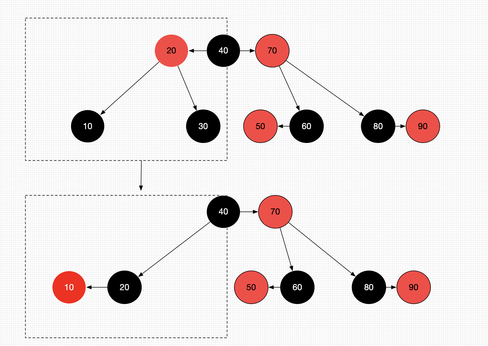
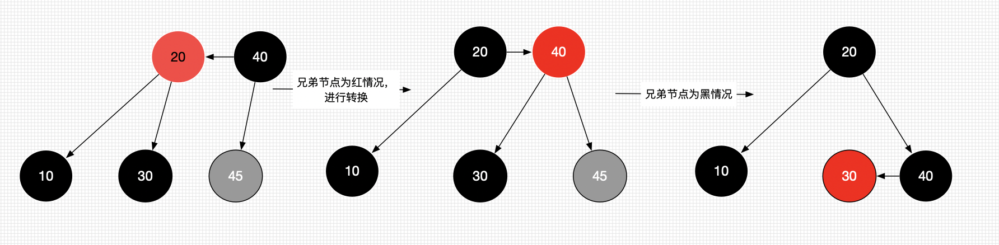

# 红黑树

红黑树也是一种自平衡二叉搜索树

以前也叫做平衡二叉B树

红黑树必须满足一下5个性质

* 节点是有颜色的**Red**/**Black**

* 根节点必须是**Black**

* 叶子节点必须是**Black** 
  * 红黑树的叶子节点会自动将度为0 或者度为1的节点的度自动补充为2，补充的节点称之为外部节点
    * 外部节点是空想出来的，代码中不会实现
  
* **red**节点的子节点都是**black**色

* 从任意一节点到叶子节点的所有路径包含的**black**节点**数目相同**

  * 这里说的叶子节点包含假想出来的叶子节点
  

## 一、判断下面是否为红黑树

  

* 不是

  满足

  - 节点是有颜色的**Red**/**Black**
  - 根节点必须是**Black**
  - 叶子节点必须是**Black** 
    - 红黑树的叶子节点会自动将度为0 或者度为1的节点的度自动补充为2，补充的节点称之为外部节点
      - 外部节点是空想出来的，代码中不会实现
  - **red**节点的子节点都是**black**色

* 不满组

  * 从任意一节点到叶子节点的所有路径包含的**black**节点**数目相同**
  
    

## 二、红黑树的等价变换

* 红黑树和4阶B树具有等价性

  * **Black**节点与他的**Red**子节点融合在一起，就形成一个B树节点

* 红黑树的**Black**节点个数与4阶B树的节点总数相等

  

## 三、红黑树的操作

### 1、添加

* 想像成4阶B树
  * 添加操作都在叶子节点中。
  * 4阶B树所有节点的元素个数为 `1 <= x <= 3`。
* 建议新添加的节点默认为`Red` （这样能更快的满足红黑树的性质）。
* 根节点默认为`Black`。

所有的添加情况如下图所示

#### 添加情况处理：

##### a、当parent为`black`的情况，直接添加，无需特殊处理。（4种情况）

##### b、当parent为`Red`的情况。有以下几种情况（8种）

###### 1、当uncle节点为`Black`时

* RR/LL情况

  * 先对parent染成黑色，在对grand染红（染色的意义是在与让后面旋转后parent的节点为黑色，parent的子节点为黑色）
  * 当RR/LL情况的时候，需要对其进行左旋转/右旋转。（grand变成parent的子节点）。
  * 情况如下图所示:
    * 

  

* LR\RL情况

  * 将自己染成`Black`，grand染成`Red` 。（染色的意义是进行后面的双旋转操作后自己成为parent节点，规定partent的节点为黑色，parent的子节点（原来的parent和grand）为Red。）。
  * 进行双选转
    * LR:parent左旋转，grand右旋转。
    * RL:parent右旋转，grand左旋转。
  * 情况如下图所示:
    * 

###### 2、当uncle节点为`Red`时

当uncle为Red的时候，红黑树对比4阶B树会发生上溢操作。

* 将parent、uncle染成`Black`。（为了单独为一个节点做准备）。
* 将grand向上合并
* 将grand染成Red。当做是新节点进行处理。（递归）
* 情况如下图所示:

### 2、删除

在B树中真正删除的元素都在叶子节点

#### 添加情况处理：

##### a、当删除的是`Red`节点的时候

* 可以直接删除 无需其他操作

##### b、删除`Black`节点的时候

* 当拥有2个`Red`子节点的black节点

  * 不可能直接删除、因为平衡二叉树要找到2个度节点的前驱或者后继、替换后删除的是前驱或者后继。（所以不用考虑这个情况）。

* 当拥有1个`Red`子节点的black节点

  * 判断条件：用代替的子节点是`Red`
  * 将替代的的子节点染成`Black`
  * 情况如下图所示(删除46 和76) 直接55->50  80->72
  * 

* `Black`叶子节点

  * 如果Black叶子节点的兄弟节点为`Black`

    * 兄弟节点有红色节点

      * 叶子节点被删除后、可能导致B树下溢（删除88节点）
      * 进行旋转操作，旋转之后中心节点继承parent的颜色
      * 旋转之后左右节点染色为`Black`
      * 

    * 兄弟节点没有红色节点

      * 将兄弟节点染`Red`、parent节点染`Black` 既可。

        * 如果parent为`Black`, 会导致下溢，只需要把parent当做被删除的节点处理既可（递归）

        * 
    
  * 如果Black叶子节点的兄弟节点为`Red`
    * 将兄弟节点染成`Black` ,parent染成`Red`,再进行旋转。

    * 回到了兄弟节点为black的情况。

    * 

      