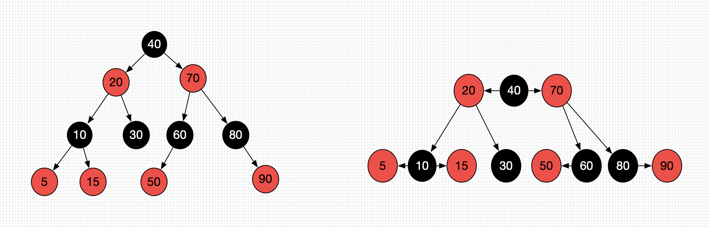

# 红黑树

红黑树也是一种自平衡二叉搜索树

以前也叫做平衡二叉B树

红黑树必须满足一下5个性质

* 节点是有颜色的**Red**/**Black**

* 根节点必须是**Black**

* 叶子节点必须是**Black** 
  * 红黑树的叶子节点会自动将度为0 或者度为1的节点的度自动补充为2，补充的节点称之为外部节点
    * 外部节点是空想出来的，代码中不会实现
  
* **red**节点的子节点都是**black**色

* 从任意一节点到叶子节点的所有路径包含的**black**节点**数目相同**

  * 这里说的叶子节点包含假想出来的叶子节点
  
  

  
  
  

### 下面是否为红黑树

  

* 不是

  满足

  - 节点是有颜色的**Red**/**Black**
  - 根节点必须是**Black**
  - 叶子节点必须是**Black** 
    - 红黑树的叶子节点会自动将度为0 或者度为1的节点的度自动补充为2，补充的节点称之为外部节点
      - 外部节点是空想出来的，代码中不会实现
  - **red**节点的子节点都是**black**色

* 不满组

  * 从任意一节点到叶子节点的所有路径包含的**black**节点**数目相同**

这里说的3个**Black节点** 2个**black节点**是指**经过**多少个Black节点。

### 红黑树的等价变换

* 红黑树和4阶B树具有等价性

  * **Black**节点与他的**Red**子节点融合在一起，就形成一个B树节点

* 红黑树的**Black**节点个数与4阶B树的节点总数相等

  

### 红黑树的操作

#### 添加

* 想像成4阶B树
  * 添加操作都在叶子节点中。
  * 4阶B树所有节点的元素个数为 `1 <= x <= 3`。
* 建议新添加的节点默认为`Red` （这样能更快的满足红黑树的性质）。
* 根节点默认为`Black`。

####  所有的添加情况

#### 8中不同情况讲解

##### 1、添加52和60的情况 RR/LL情况

##### 步骤

* 添加50
  * 将50染黑。将46染红
  * 再将46进行左旋转
* 添加60
  * 将72染黑，将76染红
  * 再将76进行右旋转。

##### 操作和结果如下图所示

#### 2、LR\RL情况

#### 3、上溢-LL情况

#### 4、上溢RR情况

#### 5、上溢LR情况

#### 6、上溢RL情况

