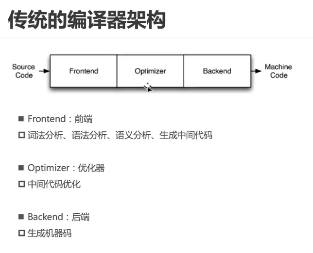
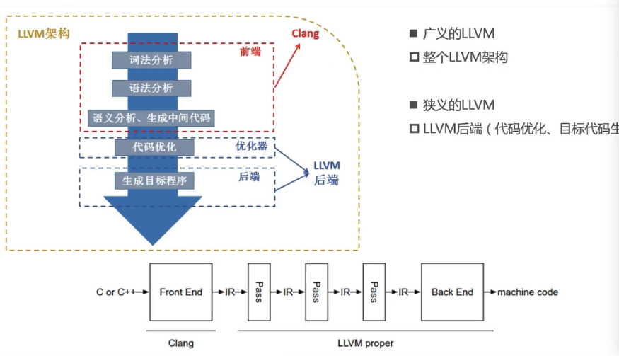
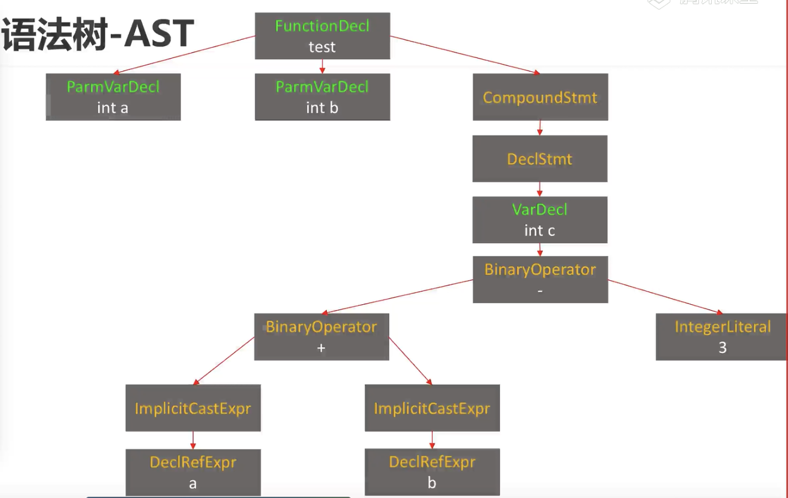
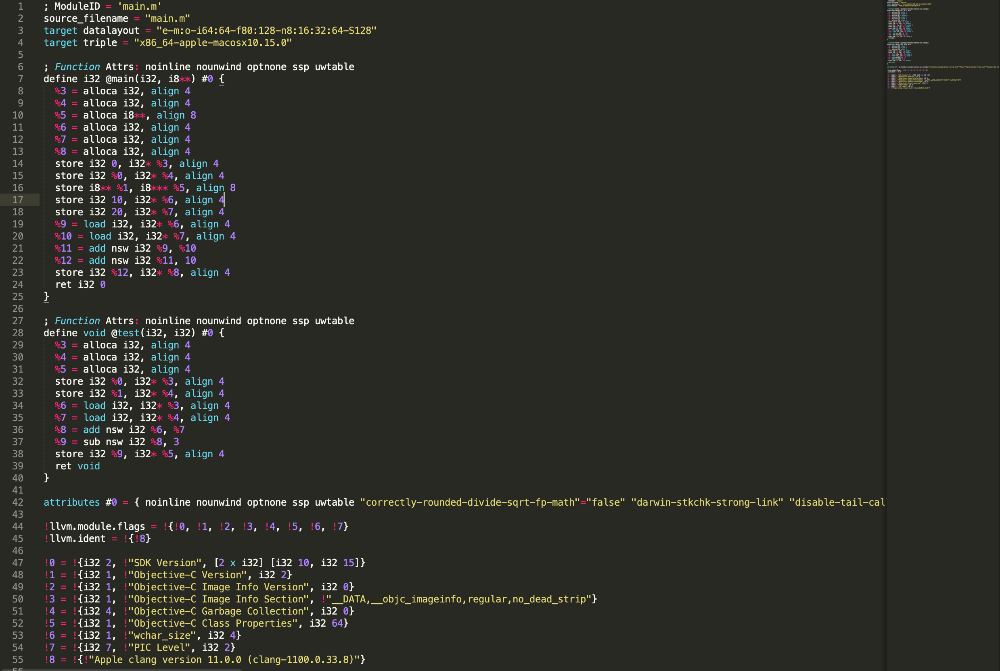

# LLVM

http://llvm.org






在main.m中输入以下内容

```objective-c
#include "stdio.h"
#define C 10
int main(int argc, char * argv[]) {
    int a = 10;
    int b = 20;
    int c  = a + b + C;
    return 0;
}
```


#### 1. 命令行查看编译过程

`clange -ccc-print-phases fileName`

```c
sharuideMacBook-Pro:TestLLVM iOS$ clang -ccc-print-phases main.m
0: input, "main.m", objective-c  
1: preprocessor, {0}, objective-c-cpp-output  //预处理
2: compiler, {1}, ir  //编译成ir  中间代码
3: backend, {2}, assembler //生成汇编
4: assembler, {3}, object //生成目标代码
5: linker, {4}, image //链接动态库等
6: bind-arch, "x86_64", {5}, image //绑定哪个架构
```

#### 2.查看preprocessor预处理结果

在终端输入`clange - E main.m` 得到以下内容

```c
...
//一大堆文件  是stdio的内容
...
# 408 "/Applications/Xcode.app/Contents/Developer/Platforms/MacOSX.platform/Developer/SDKs/MacOSX.sdk/usr/include/stdio.h" 2 3 4
# 10 "main.m" 2

int main(int argc, char * argv[]) {
    int a = 10
    int b = 20
    int c = a + b + 10
    return 0
}
sharuideMacBook-Pro:TestLLVM iOS$
```

**可以看出，通过预处理把头文件导入，以及替换宏**

#### 3.词法分析

词法分析，生成Token

`clang -fmodules -E -Xclang -dump-tokens filename`

```
annot_module_include '#include "stdio.h"
#define C 10
int main(int argc, char * argv[]) {
    int a = 10
    int b = 20
    int c  = a + b + C
    re'		Loc=<main.m:9:1>
int 'int'	 [StartOfLine]	Loc=<main.m:11:1>
identifier 'main'	 [LeadingSpace]	Loc=<main.m:11:5>
l_paren '('		Loc=<main.m:11:9>
int 'int'		Loc=<main.m:11:10>
identifier 'argc'	 [LeadingSpace]	Loc=<main.m:11:14>
comma ','		Loc=<main.m:11:18>
char 'char'	 [LeadingSpace]	Loc=<main.m:11:20>
star '*'	 [LeadingSpace]	Loc=<main.m:11:25>
identifier 'argv'	 [LeadingSpace]	Loc=<main.m:11:27>
l_square '['		Loc=<main.m:11:31>
r_square ']'		Loc=<main.m:11:32>
r_paren ')'		Loc=<main.m:11:33>
l_brace '{'	 [LeadingSpace]	Loc=<main.m:11:35>
int 'int'	 [StartOfLine] [LeadingSpace]	Loc=<main.m:12:5>
identifier 'a'	 [LeadingSpace]	Loc=<main.m:12:9>
equal '='	 [LeadingSpace]	Loc=<main.m:12:11>
numeric_constant '10'	 [LeadingSpace]	Loc=<main.m:12:13>
int 'int'	 [StartOfLine] [LeadingSpace]	Loc=<main.m:13:5>
identifier 'b'	 [LeadingSpace]	Loc=<main.m:13:9>
equal '='	 [LeadingSpace]	Loc=<main.m:13:11>
numeric_constant '20'	 [LeadingSpace]	Loc=<main.m:13:13>
int 'int'	 [StartOfLine] [LeadingSpace]	Loc=<main.m:14:5>
identifier 'c'	 [LeadingSpace]	Loc=<main.m:14:9>
equal '='	 [LeadingSpace]	Loc=<main.m:14:12>
identifier 'a'	 [LeadingSpace]	Loc=<main.m:14:14>
plus '+'	 [LeadingSpace]	Loc=<main.m:14:16>
identifier 'b'	 [LeadingSpace]	Loc=<main.m:14:18>
plus '+'	 [LeadingSpace]	Loc=<main.m:14:20>
numeric_constant '10'	 [LeadingSpace]	Loc=<main.m:14:22 <Spelling=main.m:10:11>>
return 'return'	 [StartOfLine] [LeadingSpace]	Loc=<main.m:15:5>
numeric_constant '0'	 [LeadingSpace]	Loc=<main.m:15:12>
r_brace '}'	 [StartOfLine]	Loc=<main.m:16:1>
eof ''		Loc=<main.m:16:2>
```

把每一个字符拆分为一个`token`

#### 4.语法书AST

在main.m中添加函数

```c
void test(int a, int b) {
    int c = a + b - 3
}
```

查看下语法树，输入以下指令

`clang -fmodules -fsyntax-only -Xclang -ast-dump main.m`

```c
...
...

|-FunctionDecl 0x7fab9185c518 <line:18:1, line:20:1> line:18:6 test 'void (int, int)'
| |-ParmVarDecl 0x7fab9185c3a8 <col:11, col:15> col:15 used a 'int'
| |-ParmVarDecl 0x7fab9185c420 <col:18, col:22> col:22 used b 'int'
| `-CompoundStmt 0x7fab9185c738 <col:25, line:20:1>
|   `-DeclStmt 0x7fab9185c720 <line:19:5, line:20:1>
|     `-VarDecl 0x7fab9185c5f0 <line:19:5, col:21> col:9 c 'int' cinit
|       `-BinaryOperator 0x7fab9185c700 <col:13, col:21> 'int' '-'
|         |-BinaryOperator 0x7fab9185c6c0 <col:13, col:17> 'int' '+'
|         | |-ImplicitCastExpr 0x7fab9185c690 <col:13> 'int' <LValueToRValue>
|         | | `-DeclRefExpr 0x7fab9185c650 <col:13> 'int' lvalue ParmVar 0x7fab9185c3a8 'a' 'int'
|         | `-ImplicitCastExpr 0x7fab9185c6a8 <col:17> 'int' <LValueToRValue>
|         |   `-DeclRefExpr 0x7fab9185c670 <col:17> 'int' lvalue ParmVar 0x7fab9185c420 'b' 'int'
|         `-IntegerLiteral 0x7fab9185c6e0 <col:21> 'int' 3
```




#### 5.中间代码

LLVM IR有3中表示形式（但本质是等价的）

1. text：便于阅读的文本格式，类似于汇编语言，拓展名`.II`    `clang -S -emit-llvm main.m`

   生成main.II，代码如下图所示

	

2. memory:内存格式

3. bitcode：二进制格式，拓展名.bc  clang -c -emit-llvm main.m

   生成为二进制代码  如下所示

   ```
   dec0 170b 0000 0000 1400 0000 540a 0000
   0700 0001 4243 c0de 3514 0000 0700 0000
   620c 3024 9596 a6a5 f7d7 7f5d d3b4 4ffb
   f7ed f33f 2d44 0132 0500 0000 210c 0000
   5102 0000 0b02 2100 0200 0000 1600 0000
   0781 2391 41c8 0449 0610 3239 9201 840c
   2505 0819 1e04 8b62 8010 4502 4292 0b42
   ...
   ...
   ```

   

##### a. IR阅读

* `；`：注释

* ` @`：全局标识
* `%`： 局部标识
* `alloc`: 在当前函数栈帧中分配内存
* `i32`: 32bit，4个字节
* `align`：对齐

* `store` ：写入数据
* `load` ：读取数据

官方参考

https://llvm.org/docs/LangRef.html


### LLVM编译

#### 源码下载

##### llvm源码

`git clone https://git.llvm.org/git/llvm.git`

##### clang源码

`cd llvm/tools`

`git clone https://git.llvm.org/git/clang.git`

#### 源码编译

安装cmake和ninja（先安装brew） //如果不安装会编译俩小时

`brew install cmake`

`brew install ninja`

如果ninja安装失败，，可以从github直接过去release版本放入【/usr/local/bin】中

##### 操作 

1. 在llvm源码同级目录添加llvm_build文件夹，存放编译后的东西

2. 在终端进入在llvm_build   
3. 执行`cmake -G`命令

4. 执行`cmake -G Ninja  .../llvm -CMAKE_INSTALL_PREFIX=/User/xxx/Desktop/文件夹名称`     
   * 添加模板以及需要llvm的路径（通过llvm源码生成ninja模板），  以及存放目录

5. 当生成buld.ninja 文件后，代表成功
6. 依次执行编译、安装指令
   1. `$ ninja`   //编译完成后大概21G
   2. `ninja install`

> 也可以用xcode编译  在同级创建llvm_xcode   执行`cmake -G Xcode ../llvm` 。 生成xcode文件 进行编译  大概1小时

### 应用与实践

libclang 、libTooling

应用：语法树分析、语言转换等


LLVM插件开发

官方文档

https://clang.llvm.org/docs/ClangPlugins.html

https://clang.llvm.org/docs/ExternalClangExamples.html

https://clang.llvm.org/docs/RAVFrontendAction.html


Pass开发

开发新的编程语言