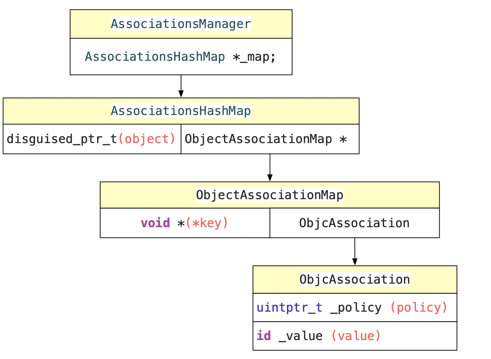

### 一.  objc_setAssociatedObject


#### 1. 调用盏

```objc
void objc_setAssociatedObject(id object, const void *key, id value, objc_AssociationPolicy policy)
	|--- _object_set_associative_reference(object, (void *)key, value, policy)
  	|--- AssociationsManager
		|--- AssociationsHashMap
  	|--- ObjectAssociationMap
  	|--- ObjcAssociation
```

#### 2. 先了解一下AssociationsManager的数据结构

 

#### 3. _object_set_associative_reference逻辑

```objc
void _object_set_associative_reference(id object, void *key, id value, uintptr_t policy) {
    // retain the new value (if any) outside the lock.
    // 创建一个初始的ObjcAssociation
    ObjcAssociation old_association(0, nil);
    // 通过acquireValue关联policy和value
    id new_value = value ? acquireValue(value, policy) : nil;
    
    {
        // manager单利
        AssociationsManager manager;
        // 获取manager的AssociationsHashMap
        AssociationsHashMap &associations(manager.associations());
        // 通过object 生成 disguised_ptr_t 可理解为AssociationsHashMap中的key
        disguised_ptr_t disguised_object = DISGUISE(object);
        // 如果new_value存在
        if (new_value) {
            // break any existing association.
            // 通过disguised_ptr_t 找到对应的 AssociationsHashMap
            AssociationsHashMap::iterator i = associations.find(disguised_object);
            
            // 如果找到ObjectAssociationMap
            if (i != associations.end()) {
                // secondary table exists
                ObjectAssociationMap *refs = i->second;
                // 通过key找到对应的ObjcAssociation
                ObjectAssociationMap::iterator j = refs->find(key);
                // 如果找到
                if (j != refs->end()) {
                    //获取old_association  方便后面释放
                    old_association = j->second;
                    // 覆盖
                    j->second = ObjcAssociation(policy, new_value);
                } else {
                    //添加
                    (*refs)[key] = ObjcAssociation(policy, new_value);
                }
            } else {
                // 如果 没有 找到ObjectAssociationMap
                // create the new association (first time).
                // 创建新的ObjectAssociationMap
                ObjectAssociationMap *refs = new ObjectAssociationMap;
                associations[disguised_object] = refs;
                (*refs)[key] = ObjcAssociation(policy, new_value);
                object->setHasAssociatedObjects();
            }
            
        } else {
            // 如果不存在
            // setting the association to nil breaks the association.
            AssociationsHashMap::iterator i = associations.find(disguised_object);
            // 在AssociationsHashMap中找ObjectAssociationMap
            // 如果找到
            if (i !=  associations.end()) {
                ObjectAssociationMap *refs = i->second;
                ObjectAssociationMap::iterator j = refs->find(key);
                //找到对应的ObjcAssociation
                // 如果找到
                if (j != refs->end()) {
                    // 赋值方便后面释放
                    old_association = j->second;
                    // 释放对应的ObjcAssociation
                    refs->erase(j);
                }
            }
        }
    }
    // release the old value (outside of the lock).
    // 释放替换掉的association
    if (old_association.hasValue()) ReleaseValue()(old_association);
}
```

### 二. objc_getAssociatedObject

####  1. 调用盏

```objc
id objc_getAssociatedObject(id object, const void *key)
	|--- id _object_get_associative_reference(id object, void *key) 
```

#### 2.  源码分析

```objc
id _object_get_associative_reference(id object, void *key) {
    id value = nil;
    //weak 属性
    uintptr_t policy = OBJC_ASSOCIATION_ASSIGN;
    {
        AssociationsManager manager;
        AssociationsHashMap &associations(manager.associations());
        disguised_ptr_t disguised_object = DISGUISE(object);
        // 查找ObjectAssociationMap
        AssociationsHashMap::iterator i = associations.find(disguised_object);
        // 如果找到
        if (i != associations.end()) {
            ObjectAssociationMap *refs = i->second;
            // 查找ObjcAssociation
            ObjectAssociationMap::iterator j = refs->find(key);
            // 如果找到
            if (j != refs->end()) {
                ObjcAssociation &entry = j->second;
                value = entry.value();
                policy = entry.policy();
                if (policy & OBJC_ASSOCIATION_GETTER_RETAIN) {
                    // 判断协议类型 是否需要retain
                    objc_retain(value);
                }
            }
        }
    }
    if (value && (policy & OBJC_ASSOCIATION_GETTER_AUTORELEASE)) {
        // 判断协议类型 是否需要autorelesase
        objc_autorelease(value);
    }
    return value;
}
```


### 三. objc_removeAssociatedObjects

#### 1. 调用盏

```objc
void objc_removeAssociatedObjects(id object) 
	|--- _object_remove_assocations(object);
```

#### 2.  源码分析

```objc
void objc_removeAssociatedObjects(id object) 
{
	  // 判断对象是否存在 以及是否被关联
    if (object && object->hasAssociatedObjects()) {
        _object_remove_assocations(object);
    }
}
```


```objc
void _object_remove_assocations(id object) {
    vector< ObjcAssociation,ObjcAllocator<ObjcAssociation> > elements;
    {
        AssociationsManager manager;
        AssociationsHashMap &associations(manager.associations());
				// 如果AssociationsHashMap为空 返回
        if (associations.size() == 0) return;
      
        disguised_ptr_t disguised_object = DISGUISE(object);
	      //查找ObjectAssociationMap
        AssociationsHashMap::iterator i = associations.find(disguised_object);
      	//如果找到
        if (i != associations.end()) {
            // copy all of the associations that need to be removed.
       	   // 将所有需要删除的ObjcAssociation拷贝 到盏中
            ObjectAssociationMap *refs = i->second;
            for (ObjectAssociationMap::iterator j = refs->begin(), end = refs->end(); j != end; ++j) {
                elements.push_back(j->second);
            }
            // remove the secondary table.
         	 // 删除ObjectAssociationMap
            delete refs;
            associations.erase(i);
        }
    }
    // the calls to releaseValue() happen outside of the lock.
	  // 释放拷贝到占中的元素
    for_each(elements.begin(), elements.end(), ReleaseValue());
}
```


ps:进行关联对象的话 key最好用@selector(getter),并且@selector(getter)  == getter中的_cmd