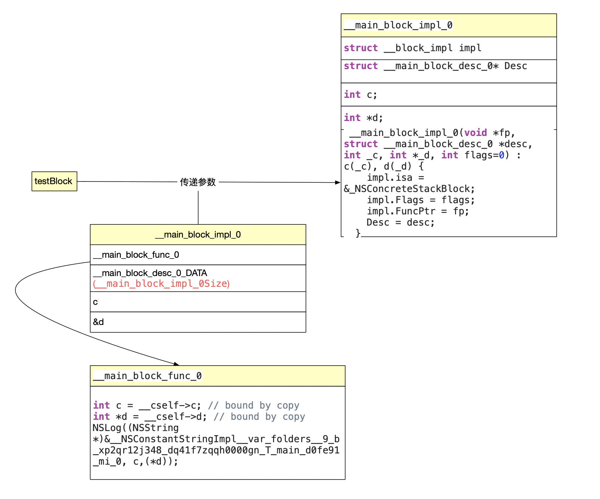
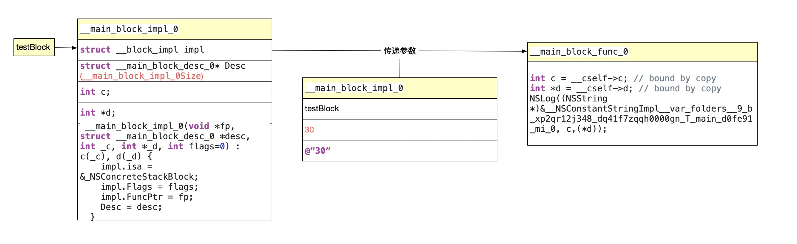

### 一. block实质

#### 1. block本质

#### 1>.举个例子

```objc
int main(int argc, const char * argv[]) {
    @autoreleasepool {
        // insert code here...
        int c = 10;
        static int d = 10;
        void (^testBlock)(int a, NSString *b) = ^(int a, NSString * b) {
            NSLog(@"c = %d, d = %d", c, d);
        };
        d = 20;
        testBlock(30,@"40");
    }
    return 0;
}
```

输出:

```objc
Block内部实现原理[96327:13489327] c = 10, d = 20
```

#### 2>. 内部实现原理

a. 我们将block 转成cpp文件

```c++
int main(int argc, const char * argv[]) {
    /* @autoreleasepool */ { __AtAutoreleasePool __autoreleasepool; 

        int c = 10;
        static int d = 10;
        void (*testBlock)(int a, NSString *b) = ((void (*)(int, NSString *))&__main_block_impl_0((void *)__main_block_func_0, &__main_block_desc_0_DATA, c, &d));
        d = 20;
        ((void (*)(__block_impl *, int, NSString *))((__block_impl *)testBlock)->FuncPtr)((__block_impl *)testBlock, 30, (NSString *)&__NSConstantStringImpl__var_folders__9_b_xp2qr12j348_dq41f7zqqh0000gn_T_main_d0fe91_mi_1);
    }
    return 0;
}
```

b. 看着是有点乱 但是把类型强制转换去掉我们在看一下

```objc
	int main(int argc, const char * argv[]) {
        int c = 10;
        static int d = 10;
    		// 定义block  生成__main_block_impl_0结构体 并传入两个参数
    		// 1.block方法
    		// 2.blcok信息
        void (*testBlock)(int a, NSString *b) = &__main_block_impl_0(__main_block_func_0, &__main_block_desc_0_DATA, c, &d));
    
        d = 20;
    
  	  	// testBLock->FuncPtr   参数为testblock 30 和字符串
        ((__block_impl *)testBlock)->FuncPtr)((__block_impl *)testBlock, 30, (NSString *)&__NSConstantStringImpl__var_folders__9_b_xp2qr12j348_dq41f7zqqh0000gn_T_main_d0fe91_mi_1);
    }
    return 0;
}
```

c. 我们先看一下__ main_block_impl_0结构体和    __ main_block_func_0 还有__main_block_desc_0_DATA都代表写什么

```objc
struct __main_block_impl_0 {
  struct __block_impl impl;
  struct __main_block_desc_0* Desc;
  
  // c 和 d 是block捕捉（capture）进来的。如果block没有引用，则不会出现c和d
  // 具体什么情况会捕捉，文章后面会讲解。 同学可以去验证下
  // 没有修饰的为值传递
  int c;
  // static 修饰的为地址传递 
  int *d;
  // 构造函数    c(_c), d(_d) 直接_d 给d赋值 直接_c 给c赋值
  __main_block_impl_0(void *fp, struct __main_block_desc_0 *desc, int _c, int *_d, int flags=0) : c(_c), d(_d) {
    impl.isa = &_NSConcreteStackBlock;
    impl.Flags = flags;
    impl.FuncPtr = fp;
    Desc = desc;
  }
};
```

d. 通过这个 我们可以知道 d为地址传递  c为值传递。 所以当d重新赋值后, 因为d传递的是d变量的地址。所以值会跟着改变，而c为值传递 所以当c改变的时候 block结构体中并不会跟着改变。

我们继续往下看传入的参数main_block_func_0和__main_block_desc_0_DATA

* main_block_func_0	

```c++
static void __main_block_func_0(struct __main_block_impl_0 *__cself, int a, NSString *b) {
  // _cself 为结构体本身  获取c 和 *d
  int c = __cself->c; // bound by copy
  int *d = __cself->d; // bound by copy
  NSLog((NSString *)&__NSConstantStringImpl__var_folders__9_b_xp2qr12j348_dq41f7zqqh0000gn_T_main_d0fe91_mi_0, c,(*d));
}
```

* __main_block_desc_0_DATA

```c++
static struct __main_block_desc_0 {
  size_t reserved;
  //__main_block_impl_0的大小
  size_t Block_size;
} __main_block_desc_0_DATA = { 0, sizeof(struct __main_block_impl_0)};
```

e. 我们继续往下看  我们如何调用block  我们简化一下代码

```objc
(__block_impl *)testBlock)->FuncPtr((__block_impl *)testBlock, 30, (NSString *)&__NSConstantStringImpl__var_folders__9_b_xp2qr12j348_dq41f7zqqh0000gn_T_main_d0fe91_mi_1);		
```


通过testBlock强制转换为__block_impl * 去调用FuncPtr 然后传入参数testBlock,30和字符串

我们可以看到定义的时候 testBlock 为&__main_block_impl_0  

从下图构造函数 我们可以知道 传入的block方法给了impl的funcptr。funcptr也就是上面的main_block_func_0

```objc
struct __main_block_impl_0 {
  struct __block_impl impl;
  struct __main_block_desc_0* Desc;

  // 构造函数    c(_c), d(_d) 直接_d 给d赋值 直接_c 给c赋值
  __main_block_impl_0(void *fp, struct __main_block_desc_0 *desc, int _c, int *_d, int flags=0) : c(_c), d(_d) {
    impl.isa = &_NSConcreteStackBlock;
    impl.Flags = flags;
    impl.FuncPtr = fp;
    Desc = desc;
  }
};
```

**问**：为什么testBlock可以直接调用impl中的FuncPtr呢 ？

**答：** 因为impl为__ main_block_impl_0中的第一个结构体.在内存中是头指针是指向的一个地址 所以可以转换。


#### 3>. 结论

通过上述的源码 我们可以知道了结构体的大致结构。以及调用方式 下图看起来可能更直观

* block构造

  

* block调用

  

#### 2. block capture

| 变量类型                             | 是否可以被捕捉 | 访问方式 |
| ------------------------------------ | -------------- | -------- |
| auto(默认为auto) int a == auto int a | 是             | 值传递   |
| static                               | 是             | 地址传递 |
| 全局变量                             | 不需要捕获     | 直接访问 |


### 二. block 类型

#### block分为以下三个类型

* __ NSGlobalBlock __  

* __ NSStackBlock __ 

*  __ NSMallocBlock __

#### 继承关系

**__ NSMallocBlock __ , __ NSMallocBlock , NSBlock, NSObject**

**__ NSStackBlock __ , __ NSStackBlock , NSBlock, NSObject**

**__ NSGlobalBlock __ , __ NSGlobalBlock __ , NSBlock, NSObject**


#### 如何分配

| __ NSGlobalBlock __ | 没有访问auto对象             |
| ------------------- | ---------------------------- |
| __ NSStackBlock __  | 访问了auto对象               |
| __ NSMallocBlock __ | __ NSStacBlock __ 调用了copy |

==关闭arc验证==

**在ARC上 **

__ NSStackBlock __ 在进行`copy` 会copy到 __ NSMallocBlock __区  

> 目的是为了防止block自动释放


