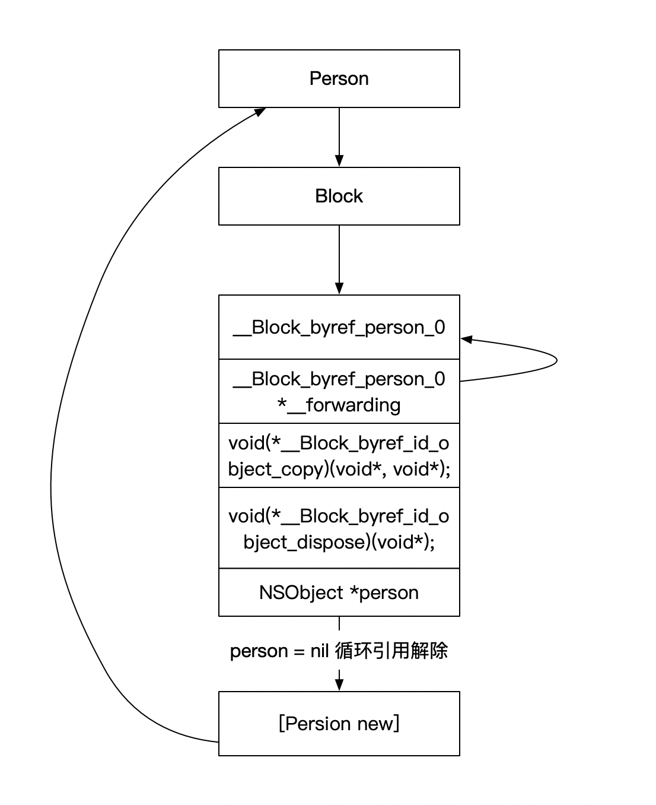

### 1. 在某些ARC情况 会将栈内的block copy到 堆 中

1. block 在作为函数返回值的时候 会自动copy操作

   > 在函数中作为返回值的时候。生成的是盏中的block 在函数结束后,如果block在盏中，有可能会被销毁，当我们在调用的时候,会发生错误。所以会对block进行 copy操作 copy到堆中，确保后续操作正确.

2. Block 被强指针引用

   ```objc
   int a = 10;
   void(^test)(void) = ^{
   	NSLog(@"%d",a);
   };
   NSLog(@"%@",[test class]);
           
   NSLog(@"%@",[^{
   							NSLog(@"%d",a);
                 } 
   ```

   打印结果为  **ARC**

   ```objc
   2019-08-21 14:20:55.125206+0800 Block内部实现原理[96810:14357802] __NSMallocBlock__
   2019-08-21 14:20:55.125244+0800 Block内部实现原理[96810:14357802] __NSStackBlock__
   ```

   

3. block作为Cocoa API中方法名含有usingBlock方法参数时

   例如[Array enum]遍历

4. GCD中的block

### 2. copy

盏空间的block **不会**对外面capture的变量进行强引用   ==无论weak修饰 还是strong修饰==

堆空间的block **会** 对外面capture的变量进行强引用


`__weak` 修饰后 block结构体中引用对象也会变成 `__weak`

当对block进行copy操作的

 block desc中会添加两个方法

* __main_block_copy_0
* __main_block_dispose

copy会调用`block_object_assign`函数 

> `Block_object_assign` 自动根据capture到的变量的引用是weak还是strong 来进行操作 类似于retain

在block从堆上移除会调用`__main_block_dispose`

> `__main_block_dispose`会调用`_Block_object_dispose`。 `_Block_object_dispose`函数会自动释放引用的变量， 类似release


### 3. __block

我们书写下下面代码  然后看一下rewrite-objc 后生成什么

```objc
__block NSObject *person = [NSObject new];    
void (^testBlock)(void) = ^(void) {
	NSLog(@"%@",person);// person 为__block结构体中的person
};
```


```c++
__attribute__((__blocks__(byref))) __Block_byref_person_0 person = {
            (void*)0,
            (__Block_byref_person_0 *)&person,
            33554432,
            sizeof(__Block_byref_person_0),
            __Block_byref_id_object_copy_131,
            __Block_byref_id_object_dispose_131,
            ((NSObject *(*)(id, SEL))(void *)objc_msgSend)((id)objc_getClass("NSObject"), sel_registerName("new"))
};
```

当被`__block` 修饰后的persion 会被构造到个结构体`__Block_byref_person_0`中

```objc
struct __Block_byref_person_0 {
  void *__isa;  // isa
	__Block_byref_person_0 *__forwarding; //指向自己的指针 当block从栈copy到堆中  则指向堆中block的地址
 int __flags; // 标记
 int __size; // 大小
 void (*__Block_byref_id_object_copy)(void*, void*); // 当block被拷贝到堆中执行此方法
 void (*__Block_byref_id_object_dispose)(void*);  // 当block释放 执行这个方法
 NSObject *person; //persion
};
```


在ARC环境下 block在赋值的时候  会发生拷贝。 具体的指向由下图所示。

当`__block  __weak NSObject *person = [NSObject new];` 修饰符为weak时 弱引用  其他时候为强引用

这样的结构的好处是无论我们从栈中去找block找到`__forwrding` 还是堆中block`__forwarding`找person的时候，都能够找到堆中的block 中的person 这样就确保person的存在。


### 4. 循环引用

`__weak`   `unsafe_unretain`   `__block` 里面 

因为`__block`生成的结构体类似中间变量，所以在循环引用个的时候是一个三角结构，我们在在block中将`__block`修饰的变量置为nil 既可解决循环引用。如下图




