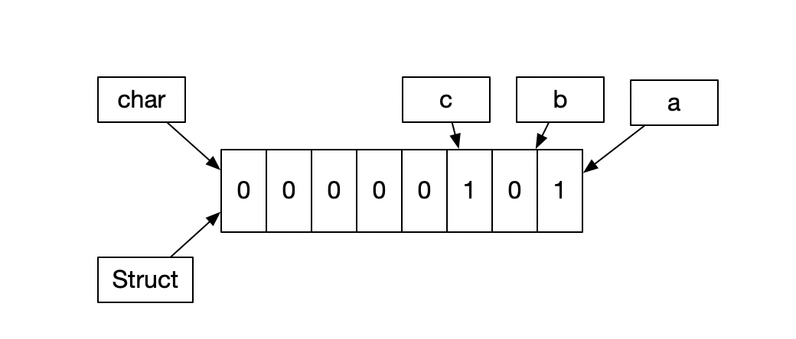

### 一. isa详解（一）

从iOS 源码中我们可以找到以下结构体 。 从这里我们开始看一下isa的构成

```objc
struct objc_object {
private:
    isa_t isa;
};

```


```c++
union isa_t {
    Class cls;
    uintptr_t bits;
#if defined(ISA_BITFIELD) // 我们看一下这个宏
    struct {
        ISA_BITFIELD;  // defined in isa.h
    };
#endif
};
```

我们截取了arm64部分的宏定义

```c++
# if __arm64__
#   define ISA_MASK        0x0000000ffffffff8ULL
#   define ISA_MAGIC_MASK  0x000003f000000001ULL
#   define ISA_MAGIC_VALUE 0x000001a000000001ULL
#   define ISA_BITFIELD                                                      \
      uintptr_t nonpointer        : 1;                                       \
      uintptr_t has_assoc         : 1;                                       \
      uintptr_t has_cxx_dtor      : 1;                                       \
      uintptr_t shiftcls          : 33; /*MACH_VM_MAX_ADDRESS 0x1000000000*/ \
      uintptr_t magic             : 6;                                       \
      uintptr_t weakly_referenced : 1;                                       \
      uintptr_t deallocating      : 1;                                       \
      uintptr_t has_sidetable_rc  : 1;                                       \
      uintptr_t extra_rc          : 19
#   define RC_ONE   (1ULL<<45)
#   define RC_HALF  (1ULL<<18)
```

**所以在arm64环境下isa如下所示 ** 

```c++
union isa_t {
    Class cls;
    uintptr_t bits;
  struct {
     uintptr_t nonpointer        : 1;                                       \
      uintptr_t has_assoc         : 1;                                       \
      uintptr_t has_cxx_dtor      : 1;                                       \
      uintptr_t shiftcls          : 33; /*MACH_VM_MAX_ADDRESS 0x1000000000*/ \
      uintptr_t magic             : 6;                                       \
      uintptr_t weakly_referenced : 1;                                       \
      uintptr_t deallocating      : 1;                                       \
      uintptr_t has_sidetable_rc  : 1;                                       \
      uintptr_t extra_rc          : 19
  } 
};
```


所以为了探究`isa`  我们先研究下`union`  

#### 1. union

> 为什么要用union以及位运算呢。 因为在计算机中为二进制。位运算是最快速的计算方式

`union`  C++ 中的共用体。 顾名思义 就是在union 中 公用一个内存地址 。

结构体  位域  ` : 1`  只占一位

```c++
struct {
char a : 1; //1位
char b : 1; //1位
char c : 1; //1位
} temp; //3位 1个字节

struct {
char a; //1个字节
char b; //1个字节
char c; //1个字节
} temp; // 3个字节

union {
  char bits; // 一个字节
  // struct 只是可读性，有和没有都一样
  struct {
    char a : 1; //1位 
		char b : 1; //1位
		char c : 1; //1位
  } temp;
} unionInstance
```

`union`的内存结构如下图所示，两个指针指针同时管理一个内存地址。 因为我们不操作struct中的  所以struct只是增强可读性。 表示每个字节代表的含义。




#### 2. 如果我们想访问union 中a,b,c的值如何设置 如何访问呢

```objc
#import "Person.h"
#define aMask (1<<0)
#define bMask (1<<1)
#define cMask (1<<2)
@interface Person()
{
    union {
        char bits;
        struct {
            int a : 1;
            int b : 1;
            int c : 1;
        } temp;
    } _property;
}
@end
@implementation Person

- (instancetype)init
{
    self = [super init];
    if (self) {
        self->_property.bits = 0b00000000;
    }
    return self;
}

- (void)setAvar:(BOOL) a {
    if (a == YES) {
        self->_property.bits |= aMask;
    }else {
        self->_property.bits =  (self->_property.bits & ~aMask);
    }
    
}
- (BOOL)a {
    return !!(self->_property.bits & aMask);
}

- (void)setBvar:(BOOL) b {
    if (b == YES) {
        self->_property.bits |= bMask;
    }else {
        self->_property.bits =  (self->_property.bits & ~bMask);
    }
    
}
- (BOOL)b {
    return !!(self->_property.bits & bMask);
}

- (void)setCvar:(BOOL) c {
    if (c == YES) {
        self->_property.bits |= cMask;
    }else {
        self->_property.bits =  (self->_property.bits & ~cMask);
    }
    
}
- (BOOL)c {
    return !!(self->_property.bits & cMask);
}
@end
```

```objc
    Person *person = [Person new];
    [person setAvar:NO];
    [person setBvar:YES];
    [person setCvar:NO];
    NSLog(@"a = %d, b = %d, c = %d",person.a,person.b,person.c);
```

输出结果为

```
runtime-isa详解01[8059:19727104] a = 0, b = 1, c = 0
```


#### isa指向

```c++
objc_object::ISA() 
{
    assert(!isTaggedPointer()); 
#if SUPPORT_INDEXED_ISA
    if (isa.nonpointer) {
        uintptr_t slot = isa.indexcls;
        return classForIndex((unsigned)slot);
    }
    return (Class)isa.bits;
#else
    return (Class)(isa.bits & ISA_MASK);
#endif
}
```


我们知道isa是指向class 或者是meta-class

但是源码上为什么要 & `ISA_MASK` 呢。

从上面的有关`union`以及位运算 我们可知道  通过 &运算符 可以找到对应的union中所指向位数包含的信息

```objc
#   define ISA_MASK        0x0000000ffffffff8ULL
#   define ISA_MAGIC_MASK  0x000003f000000001ULL
#   define ISA_MAGIC_VALUE 0x000001a000000001ULL

union isa_t {
    Class cls;
    uintptr_t bits;
  struct {
     uintptr_t nonpointer        : 1;                                       \
      uintptr_t has_assoc         : 1;                                       \
      uintptr_t has_cxx_dtor      : 1;                                       \
      uintptr_t shiftcls          : 33; /*MACH_VM_MAX_ADDRESS 0x1000000000*/ \
      uintptr_t magic             : 6;                                       \
      uintptr_t weakly_referenced : 1;                                       \
      uintptr_t deallocating      : 1;                                       \
      uintptr_t has_sidetable_rc  : 1;                                       \
      uintptr_t extra_rc          : 19
  } 
};
```


从上面代码我们可以知道 ` ISA_MASK`的值为`0x0000000ffffffff8ULL`  所对应的取值就是isa bits 中的`shiftcls`所在的字节  所以 这里面才是指向class 或者meta-class的地址

所以我们有一下结论

* arm64之前直接指向class 或者是meta-class

* 2.arm64之后 **isa & ISA_MASK** 为class 或者meta-class 地址。 isa为  `union` 结构,用位域来存储更多信息
* `union`  共用体  公用一个内存


1字节转8字节 会出现错误

查询  二进制负数


对象地址后面都是8 或者0

为什么&isa_mask  因为存了很多信息 采取共用体结构  通过isa_mask找到对应的 类 或者原类的地址信息

由于3位占用 所以地址后面是000  16进制的表象就是0或者8

