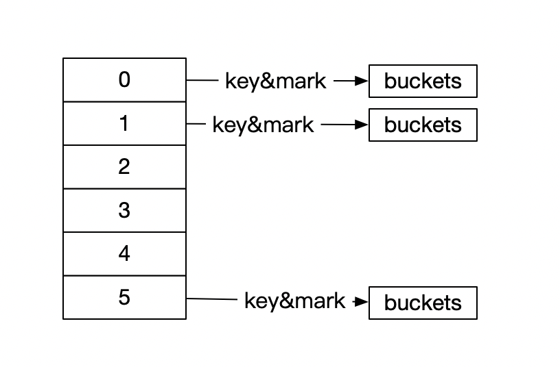

## 一. isa成员介绍

1. nonepointer

   0 ：代表普通指针,存储着class mate-class指针

   1 ：代表优化后的指针

2. has_assoc

   是否有==设置过==关联对象。如果没有，释放更快

3. has_cxx_dtor

   是否有c++的析构函数(.cxx.destruct), 如果没有，释放更快

4. shiftcls

   class 或者meta-class对象的地址值

5. magic

   分辨对象是否初始化

6. weakly_referenced 

   是否被弱引用过，如果没有，释放更快

7. deallocating

   是否被释放

8. has_sidetable_rc

   引用计数器是否大过无法存储在isa中

   如果为1 就存储在SideTable类的属性中

9. extra_rc  (retain count)

   存放引用计数器（存储引用计数器-1)

   

上面为什么说释放更快

源码中查找 objc_destructinstance 销毁一个实例对象。 发现需要进行相关判断。所以如果没有的话。释放更快


## 二  class 结构中的cache
在源码中我们可以找到class的结构。 我们看一下cache
1. class结构
```objc
struct objc_class : objc_object {
    // Class ISA;
    Class superclass;
    cache_t cache;             // formerly cache pointer and vtable
    class_data_bits_t bits;    // class_rw_t * plus custom rr/alloc flags

    class_rw_t *data() { 
        return bits.data();
    }
    ...
```

```objc
    class_rw_t* data() {
        return (class_rw_t *)(bits & FAST_DATA_MASK);
    }
```
```objc
    struct class_rw_t {
    // Be warned that Symbolication knows the layout of this structure.
    uint32_t flags;
    uint32_t version;

    const class_ro_t *ro;

    method_array_t methods;
    property_array_t properties;
    protocol_array_t protocols;
    ...
   }
```
```objc
class method_array_t : 
    public list_array_tt<method_t, method_list_t> 
    //内部存为method_t 元素的method_list_t列表
    //所以method_array_t为二位数组
```
可以在bits中找到方法列表,方法列表中存着`method_t`的数组 
我们看一下method_t的结构
2. method_t

   1. 查找SEL方法
      1. @selector()  或者sel_registerName()获得
      2. 可以通过sel_getName() 和NSStringFromSelector()转成字符串
      3. 不同类中相同方法 名字的方法，对应的方法选择器是相同的
   2. types
      1. @encode()  苹果官方type encoding 
      2. types含义  数字含义 以及字符含义

   

3. cache_t 方法缓存  用==散列表==来缓存曾经调用过的方法，可以提高方法的查找速度

   ```objc
   struct cache_t {
     struct bucket_t *buckets // 散列表
     mask_t _masks //散列表长度-1
     massk_t _occupied  // 已经缓存方法的数量
   }
   
   struct bucket_t {
     cache_ket_t _key; //SEL 做key
     IMP _imp; //函数的内存地址
   }
   ```

### 散列表

散列表结构




#### 角标:

根据key & mark的值获取

因为marks的值是不变的，定义为数组长度-1

当index = key& mark时,所有的index 都<= mark，所以数组并不会越界

#### 赋值：

当角标冲突时: 对角标进行 index - -操作。直到找到空闲位置，并赋值  

#### 取值：

同样角标通过 key &mark

当选出的key和传入的key不符合的时候  index- -操作 找到和key相同的值 并返回

#### 扩容：

每次记录赋值个数，当赋值个数大于数组的时候 对原数组进行扩容。并且清除散列表中的数据。重置mark为数组长度-1


### 自定义一个hash表(散列表)

```objc
#import "SRHash.h"

@interface SRHash_t:NSObject
@property (nonatomic, assign) char *key;
@property (nonatomic, strong) NSObject *value;
@end
@implementation SRHash_t

@end


#define kCapacityBase 4

@interface SRHash()
@property (nonatomic, strong) NSMutableArray <SRHash_t *>* hashs;
@property (nonatomic, assign) NSInteger masks; // maks 数组长度-1
@property (nonatomic, assign) NSInteger occupied; //已缓存个数
@end

@implementation SRHash
- (instancetype)init
{
    self = [super init];
    if (self) {
        self.hashs = [self creatHashsWithCapacity:(kCapacityBase * 1)];
    }
    return self;
}


- (void) setHashValue:(id)value forKey:(NSString *)key {
    // 如果缓存个数超过数组长度 则扩容
    if (self.occupied > self.masks) {
        self.hashs = [self creatHashsWithCapacity:self.hashs.count * 2];
    }
    // NSString 转化为char  用char的地址存储
    char *charKey = [self formartKey:key];
    // 找到索引 通过&mask
    NSInteger beginIndex = [self findMask:charKey];
    
    NSInteger index = beginIndex;
    
    //发生碰撞
    if (![self isNil:self.hashs[index]] &&
        self.hashs[index].key != charKey) {
        // 不为空 && key不同
        do {
            //遍历数组。如果找到空位置/或者遍历一圈 跳出循环
            index = index - 1;
            index = (index < 0) ? index = self.masks : index;
            
        } while (![self isNil:[self objectFromHashs:index]] && beginIndex != index);
    }
    
    SRHash_t *hash = [SRHash_t new];
    hash.key = charKey;
    hash.value = value;
    self.hashs[index] = hash;
    
    // 存储个数+1
    self.occupied ++;

}

- (id)hashValueForKey:(NSString *)key {
    
    char *charKey = [self formartKey:key];
    
    NSInteger beginIndex = [self findMask:charKey];
    NSInteger index = beginIndex;
    
    SRHash_t *hash = [self objectFromHashs:index];
    
    if (![self isNil:hash] &&
        hash.key != charKey) {
        // 如果找到hash存在并且与key不等
        do {
            // 遍历 在遍历一个周期内 找到key相等的hash值
            index = index - 1;
            index = (index < 0) ? index = self.masks : index;
            hash = [self objectFromHashs:index];
            
        } while (hash.key != charKey && beginIndex != index);
        
        // 如果未找到
        if (hash.key != charKey) {
            return nil;
        }
    }
    
    return hash.value;
}

#pragma mark - private API
- (NSInteger) findMask:(char *) key {
  
    NSLog(@"%p",key);
    return ((long long)key) & _masks;
}
// 初始化数组 @""为空
- (NSMutableArray *) creatHashsWithCapacity:(NSInteger) capacity {
    NSMutableArray * array = [NSMutableArray arrayWithCapacity:capacity];
    
    for (int i = 0 ; i < capacity; i ++) {
        [array addObject:@""];
    }
    _masks = array.count - 1;
    _occupied = 0;
    
    return array;
}

// 是否为空
- (BOOL) isNil:(id) hash {
    return [hash isKindOfClass:[NSString class]]  || hash == nil;
}

// 从数组中查找hash元素
- (SRHash_t *) objectFromHashs:(NSInteger) index {
    SRHash_t *temp = self.hashs[index];
    if ([temp isKindOfClass:[SRHash_t class]]) {
        return temp;
    }
    return nil;
}

- (char *) formartKey:(NSString *)key{
    return (char *)[key UTF8String];
}
@end
```


   

   

   

   

   

   

   