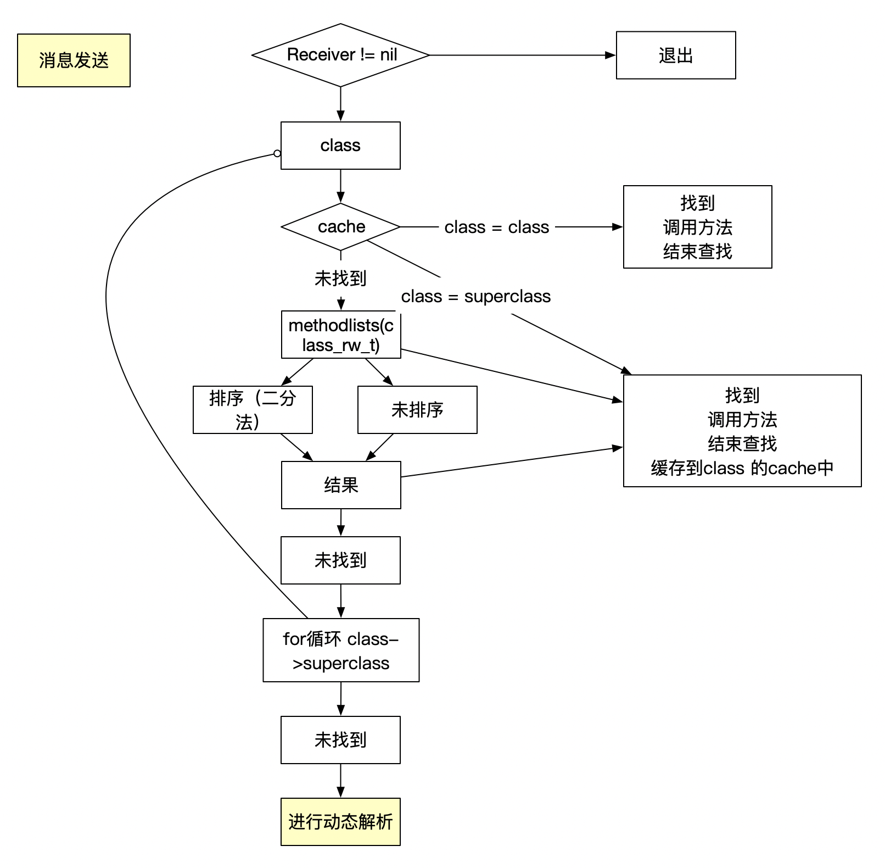
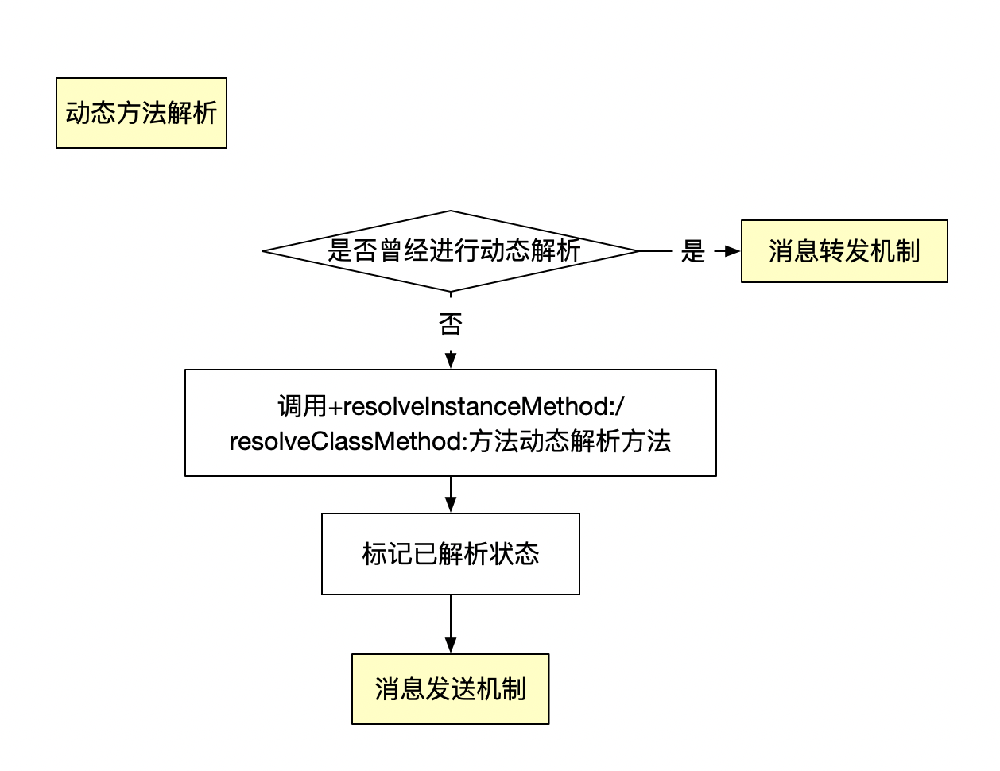
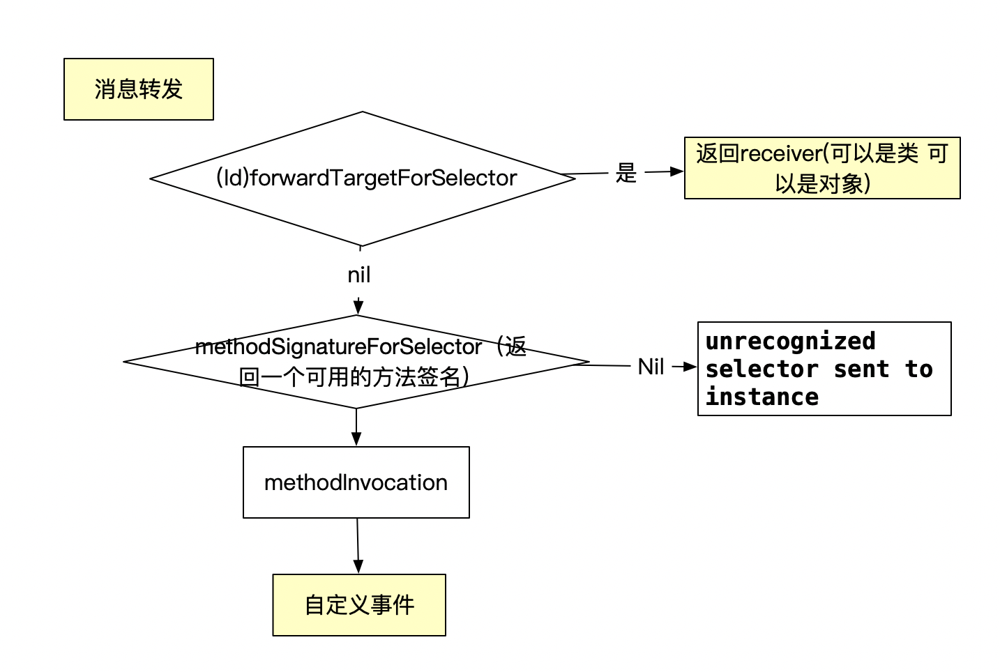

### 二. 消息传递机制 

#### 消息发送

​	


#### 动态解析



**消息转发的时候。由于oc的底层原理是消息机制,所以可以添加c语言函数等 **

```objc
//定义一个c函数
void test2(id self,SEL _cmd) {
    NSLog(@"%s",__func__);
}
```

```objc
// 动态解析
+ (BOOL)resolveInstanceMethod:(SEL)sel {
    if ([self respondsToSelector:sel]) {
        return [super resolveInstanceMethod:sel];
    }
    // 动态添加实现方法
	  //函数名即函数地址
    class_addMethod(self, sel, (IMP)test2, "v@:"); 
    return YES;
}
```


####  消息转发	



**消息转发的时候。由于oc的底层原理是消息机制,所以可以返回对象或者是类都可以**


### 三. super

super 底层原理

```objc
NSLog(@"%@",[super class]);
        
NSLog((NSString *)&__NSConstantStringImpl__var_folders__9_b_xp2qr12j348_dq41f7zqqh0000gn_T_Student_8019bf_mi_0,((Class (*)(__rw_objc_super *, SEL))(void *)objc_msgSendSuper)((__rw_objc_super){(id)self, (id)class_getSuperclass(objc_getClass("Student"))}, sel_registerName("class")));
```


精简后代码

```objc
struct rw_objc_super {
    struct objc_object *object;
    struct objc_object *superClass;
};

objc_msgSendSuper((struct rw_objc_super){(id)self,
                        (id)class_getSuperclass(objc_getClass("Student"))}
                          ,sel_registerName("class")));
```

大概就是调用`objc_msgSendSuper`方法  然后传入个super的结构体  然后调用class方法

然后我们在源码中看一下`objc_msgSendSuper的注释`

```
/** 
 * Sends a message with a simple return value to the superclass of an instance of a class.
 * 
 * @param super A pointer to an \c objc_super data structure. Pass values identifying the
 *  context the message was sent to, including the instance of the class that is to receive the
 // 这句  消息是从super开始查找。而不是self；
 *  message and the superclass at which to start searching for the method implementation.
 * @param op A pointer of type SEL. Pass the selector of the method that will handle the message.
 * @param ...
 *   A variable argument list containing the arguments to the method.
 * 
 * @return The return value of the method identified by \e op.
 * 
 * @see objc_msgSend
 */
OBJC_EXPORT id _Nullable
objc_msgSendSuper(struct objc_super * _Nonnull super, SEL _Nonnull op, ...)
    OBJC_AVAILABLE(10.0, 2.0, 9.0, 1.0, 2.0);
```

所以通过注释可以知道，`objc_msgSendSuper`其实接收器还是self,只不过在消息传递中,直接从super中查找，而不是自身的class/meta-class。 因为class 的实现使用过object_getClassName(**self**); 传入的是self，所以返回的是self的class。


@dynamic 告诉编译器不要自动生成setter和getter的实现


