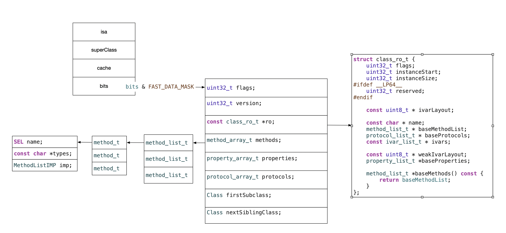

## 总结

一图胜千言

runtime 各类api传入参数 只要是符合class结构以及存储的位置就可以了。

Runtime API

Objc_allocateClassPair(类型，类名，扩展)

Class_addIvar（类名，size，对齐(一般为1) 类型 @encode()）//注册前可以添加 注册后不可以添加

objc_registerClassPair(newClass) 注册

Objc_disposeClassPair 销毁

Object_setClass()设置类的class  改变isa指向

`object_isClass()`

class_getInstanceSize（class ）获取大小

#### 成员变量相关

class_getInstanceVarible 获取成员变量信息

ivar_getName()   ivar_getTypeEncoding()

设置和获取成员变量的值

object_setIvar(对象，ivar,值)  // 基本类型要传值  (void *)10 地址   (__bridge id)(void *)10 桥接  试试&

object_getIvar(对象，ivar)  // 

class_copyIvarList

class_replaceMethod 替换方法  记住方法时在类还是元类

imp_implementationWithBlock   imp BLock

什么是runtime

oc是一门动态性比较强的编程语言，允许很多操作推迟到程序运行的时候再进行

oc的动态性是由runtime来支撑与实现的。runtime是一套c语言的api  封装了很多动态性相关的函数

平时的oc代码，底层都是转化成runtime进行调用的

利用关联对象associatedObject给分类添加属性

遍历类的所有成员变量（coder协议，copy协议，自动归档解档） 注意点 super ivars

交换方法实现（交换系统自带的方法）

利用消息转发机制解决方法找不到的异常问题

NSDictionartyI  类簇的父类

NSDictionartyM  类簇的父类