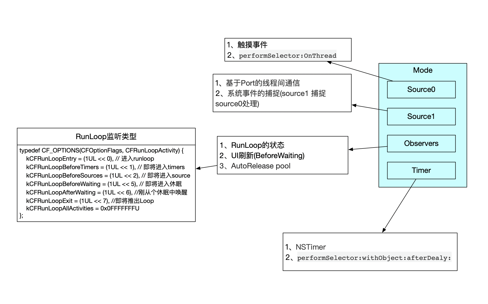
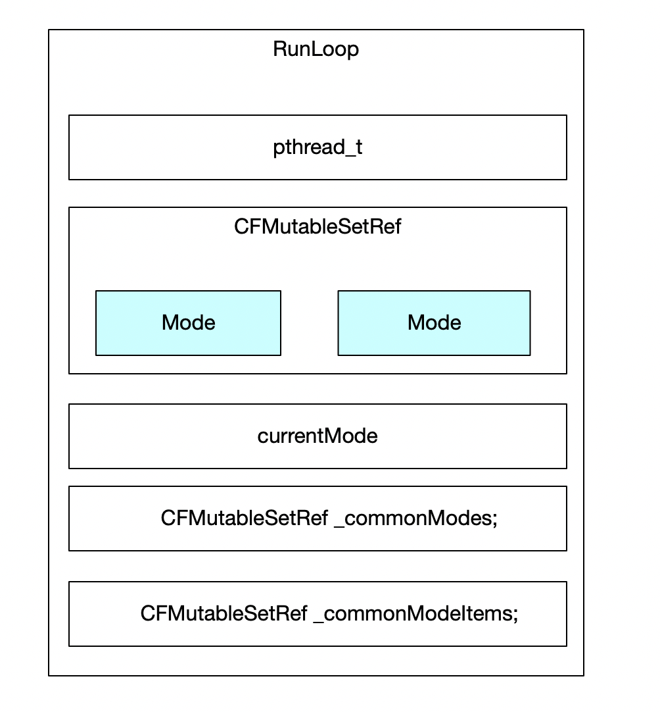
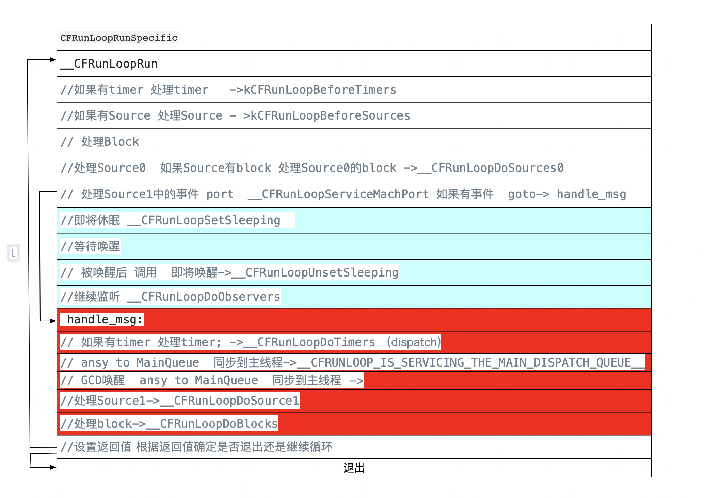
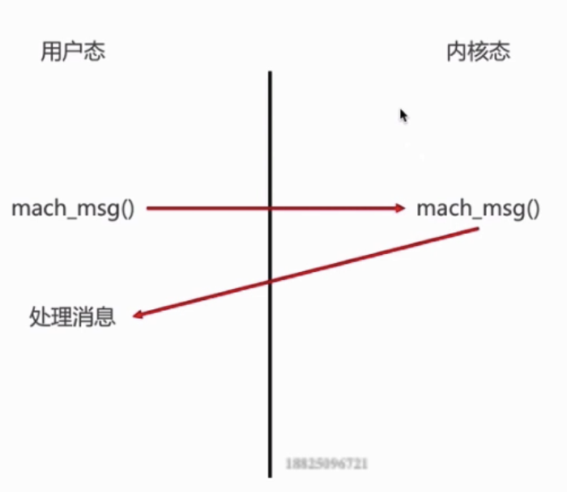

### 一、CFRunLoop部分源码

阅读源码:`CFRunLoop.c`

```c
CFRunLoopRef CFRunLoopGetCurrent(void) {
    CHECK_FOR_FORK();
    CFRunLoopRef rl = (CFRunLoopRef)_CFGetTSD(__CFTSDKeyRunLoop);
    if (rl) return rl;
    return _CFRunLoopGet0(pthread_self());
}
```


```c

CF_EXPORT CFRunLoopRef _CFRunLoopGet0(pthread_t t) {
  ...
  //从字典获取runloop
  CFRunLoopRef loop = (CFRunLoopRef)CFDictionaryGetValue(__CFRunLoops, pthreadPointer(t));
  __CFUnlock(&loopsLock);
  // 如果没获取到
  if (!loop) {
     //创建新的runloop
    CFRunLoopRef newLoop = __CFRunLoopCreate(t);
    __CFLock(&loopsLock);
      // 从字典里再找
    loop = (CFRunLoopRef)CFDictionaryGetValue(__CFRunLoops, pthreadPointer(t));
    if (!loop) {
          //如果还没有 就把新的存进去
        CFDictionarySetValue(__CFRunLoops, pthreadPointer(t), newLoop);
          // 新创建的赋值给loop
        loop = newLoop;
    }
          // don't release run loops inside the loopsLock, because CFRunLoopDeallocate may end up taking it
    __CFUnlock(&loopsLock);
    CFRelease(newLoop);
  }
  ...
}
```


#### 从源码中可以看出

一个线程对应一个RunLoop 

RunLoop保存在一个全局的字典里 线程为key RunLoop作为Value

线程刚创建的时候没有Ru nLoop对象，RunLoop会在第一次获取它的时候创建

主线程的RunLoop已经自动获取(创建)，子线程默认没有开启RunLoop 只有调用[NSRunLoop currentRunLoop] 才创建runLoop

由于key是线程 所以在线程结束的时候RunLoop也会随之销毁


### 二 Runtime相关的类

####1、Core Fuoundation中愿意RunLoop有5个类

###### CFRunLoopRef

###### CFRunLoopModelRef

###### CFRunLoopSourceRef

###### CFRunLoopTimerRef

###### CFRunLoopObserverRef

####  2、CFRunLoop

```c
struct __CFRunLoop {
    CFRuntimeBase _base;
    pthread_mutex_t _lock;			/* locked for accessing mode list */
    __CFPort _wakeUpPort;			// used for CFRunLoopWakeUp 
    Boolean _unused;
    volatile _per_run_data *_perRunData;              // reset for runs of the run loop
    pthread_t _pthread;
    uint32_t _winthread;
    CFMutableSetRef _commonModes;
    CFMutableSetRef _commonModeItems;
    CFRunLoopModeRef _currentMode;
    CFMutableSetRef _modes;
    struct _block_item *_blocks_head;
    struct _block_item *_blocks_tail;
    CFAbsoluteTime _runTime;
    CFAbsoluteTime _sleepTime;
    CFTypeRef _counterpart;
};

```

重点看下面几个

```c

struct __CFRunLoop {
   // 线程对象
    pthread_t _pthread;
    CFMutableSetRef _commonModes;
    CFMutableSetRef _commonModeItems;
    CFRunLoopModeRef _currentMode; //当前模式CFRunLoopMode
    CFMutableSetRef _modes; // CFRunLoopModes
}
```

看一下`CFRunLoopModeRef`

```c
typedef struct __CFRunLoopMode *CFRunLoopModeRef;

struct __CFRunLoopMode {
 ...
    char _padding[3];
    CFMutableSetRef _sources0;  //CFRunLoopSource
    CFMutableSetRef _sources1;  //CFRunLoopSource
    CFMutableArrayRef _observers;  //CFRunLoopObserver
    CFMutableArrayRef _timers; //CFRunLoopTimer
...
};
```


### 3、RunLoop结构






##### Sources0

触摸事件处理

`performSelector:OnThread:`

##### Source1

基于Port的线程间通信

系统事件的捕捉(source1 捕捉  source0处理)

##### Timers

NSTimer

`performSelector:withObject:afterDealy:`

##### observer

用于监听RunLoop的状态

UI刷新(BeforeWaiting)

AutoRelease pool

###### observer 监听类型

```c
typedef CF_OPTIONS(CFOptionFlags, CFRunLoopActivity) {
    kCFRunLoopEntry = (1UL << 0), // 进入runloop
    kCFRunLoopBeforeTimers = (1UL << 1), // 即将进入timers
    kCFRunLoopBeforeSources = (1UL << 2), // 即将进入source
    kCFRunLoopBeforeWaiting = (1UL << 5), // 即将进入休眠
    kCFRunLoopAfterWaiting = (1UL << 6), //刚从个休眠中唤醒
    kCFRunLoopExit = (1UL << 7), //即将推出Loop
    kCFRunLoopAllActivities = 0x0FFFFFFFU
};
```


* 如果model里没有任何source0/source1/observers/timers  会退出runloop

* CFRunLoopMode
  1. CFRunLoopDefaultMode 默认
  2. UITrackingRunLoopMode 用于界面跟踪Mode用于scrollview追踪触摸滑动，保证界面滑动不受其他的mode影响 
  3. CFRunLoopCommonModes

### 4、RunLoop运行逻辑


通过在打印调用栈 找到`CFRunLoopRunSpecific`

我们查看源码 看一下RunLoop的运行逻辑

```C++
/* rl, rlm are locked on entrance and exit */
static int32_t __CFRunLoopRun(CFRunLoopRef rl, CFRunLoopModeRef rlm, CFTimeInterval seconds, Boolean stopAfterHandle, CFRunLoopModeRef previousMode) {
   
    //如果有timer 处理timer   ->kCFRunLoopBeforeTimers
    if (rlm->_observerMask & kCFRunLoopBeforeTimers) __CFRunLoopDoObservers(rl, rlm, kCFRunLoopBeforeTimers);
    //如果有Source 处理Source - >kCFRunLoopBeforeSources
    if (rlm->_observerMask & kCFRunLoopBeforeSources) __CFRunLoopDoObservers(rl, rlm, kCFRunLoopBeforeSources);
   // 处理Block
__CFRunLoopDoBlocks(rl, rlm);
    //处理Source0  如果Source有block 处理Source0的block ->__CFRunLoopDoSources0
    Boolean sourceHandledThisLoop = __CFRunLoopDoSources0(rl, rlm, stopAfterHandle);
    if (sourceHandledThisLoop) {
        __CFRunLoopDoBlocks(rl, rlm);
}

    if (MACH_PORT_NULL != dispatchPort && !didDispatchPortLastTime) {
        msg = (mach_msg_header_t *)msg_buffer;
        // 处理Source1中的事件 port  __CFRunLoopServiceMachPort 如果有事件  goto-> handle_msg
        if (__CFRunLoopServiceMachPort(dispatchPort, &msg, sizeof(msg_buffer), &livePort, 0, &voucherState, NULL)) {
            goto handle_msg;
        }

    }
    //即将休眠 __CFRunLoopSetSleeping
	if (!poll && (rlm->_observerMask & kCFRunLoopBeforeWaiting)) __CFRunLoopDoObservers(rl, rlm, kCFRunLoopBeforeWaiting);
	__CFRunLoopSetSleeping(rl);

        do {
           
            //等待唤醒
            __CFRunLoopServiceMachPort(waitSet, &msg, sizeof(msg_buffer), &livePort, poll ? 0 : TIMEOUT_INFINITY, &voucherState, &voucherCopy);
            
            if (modeQueuePort != MACH_PORT_NULL && livePort == modeQueuePort) {
                // Drain the internal queue. If one of the callout blocks sets the timerFired flag, break out and service the timer.
                while (_dispatch_runloop_root_queue_perform_4CF(rlm->_queue));
                if (rlm->_timerFired) {
                    // Leave livePort as the queue port, and service timers below
                    rlm->_timerFired = false;
                    break;
                } else {
                    if (msg && msg != (mach_msg_header_t *)msg_buffer) free(msg);
                }
            } else {
                // Go ahead and leave the inner loop.
                break;
            }
        } while (1);

        // 被唤醒后 调用  即将唤醒
	__CFRunLoopUnsetSleeping(rl);
        //继续监听
	if (!poll && (rlm->_observerMask & kCFRunLoopAfterWaiting)) __CFRunLoopDoObservers(rl, rlm, kCFRunLoopAfterWaiting);

    
        handle_msg:;
    
       if (modeQueuePort != MACH_PORT_NULL && livePort == modeQueuePort) {
            CFRUNLOOP_WAKEUP_FOR_TIMER();
            // 如果有timer 处理timer; ->__CFRunLoopDoTimers
            if (!__CFRunLoopDoTimers(rl, rlm, mach_absolute_time())) {
                // Re-arm the next timer, because we apparently fired early
                __CFArmNextTimerInMode(rlm, rl);
            }
        }  else if (rlm->_timerPort != MACH_PORT_NULL && livePort == rlm->_timerPort) {
            CFRUNLOOP_WAKEUP_FOR_TIMER();
            // 如果有timer 处理timer; ->__CFRunLoopDoTimers

            if (!__CFRunLoopDoTimers(rl, rlm, mach_absolute_time())) {
                __CFArmNextTimerInMode(rlm, rl);
            }
        }
        // GCD唤醒
        else if (livePort == dispatchPort) {
            // ansy to MainQueue  同步到主线程
            __CFRUNLOOP_IS_SERVICING_THE_MAIN_DISPATCH_QUEUE__(msg);
            
        } else {
            //处理Source1
		sourceHandledThisLoop = __CFRunLoopDoSource1(rl, rlm, rls, msg, msg->msgh_size, &reply) || sourceHandledThisLoop;

            
            // Restore the previous voucher
            _CFSetTSD(__CFTSDKeyMachMessageHasVoucher, previousVoucher, os_release);
        } 

    //处理block
	__CFRunLoopDoBlocks(rl, rlm);
        
        //设置返回值
	if (sourceHandledThisLoop && stopAfterHandle) {
	    retVal = kCFRunLoopRunHandledSource;
        } else if (timeout_context->termTSR < mach_absolute_time()) {
            retVal = kCFRunLoopRunTimedOut;
	} else if (__CFRunLoopIsStopped(rl)) {
            __CFRunLoopUnsetStopped(rl);
	    retVal = kCFRunLoopRunStopped;
	} else if (rlm->_stopped) {
	    rlm->_stopped = false;
	    retVal = kCFRunLoopRunStopped;
	} else if (__CFRunLoopModeIsEmpty(rl, rlm, previousMode)) {
	    retVal = kCFRunLoopRunFinished;
	}
    
    return retVal;
}

```





mach_msg()直接睡眠 内核层面




*  [ NSRunLoop currentRunLoop]run ] 是无法停止的  是一个永不销毁的线程。 //可以看方法注释

* CFRunloopRunInMode 第三个参数是 执行完source后是否退出

* 结构体初始化最好赋值为{0} 避免内存垃圾


## 利用RunLoop线程常驻Demo
[戳我](https://github.com/Rui4u/iOS/tree/master/RunLoop线程常驻)