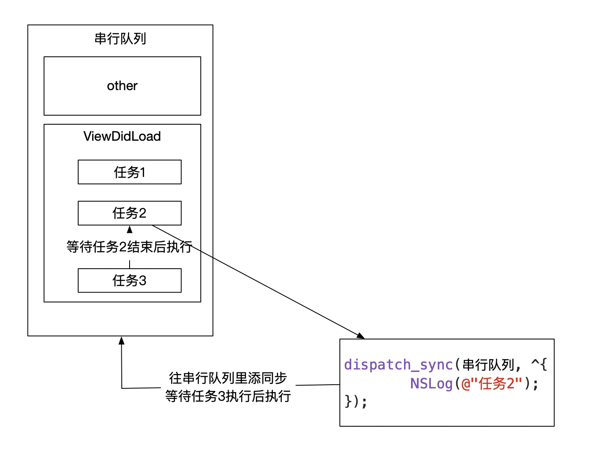

##多线程

###1、并发 串行  异步 同步

##### 并发 串行 是指队列

##### 异步同步 只是是否能开启线程


###### 举个🌰

> 并发队列   (双行(多行）道路  可以超车 只要你可以)

> 可以让多个任务并发执行   (异步的时候可以超车 所以可以并发)

> 同步或者异步 (你有没有超车的能力)  是否具备开启新线程的能力


> 串行队列 （单行线）

> 任务一个接一个  无论同步还是异步  （无论有没有超车能力都只能一条线）


* ==队列(串行并发)  决定了运行方式==

* ==同步异步 决定了能否开启新线程的能力  (主队列只在主线程)==


### 2、死锁




### 案例1

##### 题目：

```objc
- (void)touchesBegan:(NSSet<UITouch *> *)touches withEvent:(UIEvent *)event {
    dispatch_async(dispatch_get_global_queue(0, 0), ^{
        NSLog(@"1");
        [self performSelector:@selector(test) withObject:nil afterDelay:0];
        NSLog(@"3");
    });
}

- (void) test {
    NSLog(@"2");
}
```

##### 执行结果：

```objc
2019-09-01 17:55:37.962948+0800 GCD[16903:233631] 1
2019-09-01 17:55:37.963250+0800 GCD[16903:233631] 3	
```

#####分析原因：

未执行原因： RunLoop未开启  消息添加到RunLoop中也不会被调用。   

 `performSelector: withObject:`  底层调用[self msgSend];

 `performSelector: withObject:afterDelay;` RunLoop相关

往RunLoop里面添加一个定时器

##### 解决办法:：

开启线程RunLoop 


### 案例2

##### 题目：

```objc
- (void)touchesBegan:(NSSet<UITouch *> *)touches withEvent:(UIEvent *)event {
    NSThread *thread = [[NSThread alloc] initWithBlock:^{
        NSLog(@"1");
    }];
    [thread start];
    [self performSelector:@selector(test) onThread:thread withObject:nil waitUntilDone:YES];
    NSLog(@"3");
}

- (void) test {
    NSLog(@"2");
}
```

#####执行结果：

```objc
2019-09-01 18:23:51.670983+0800 GCD[17915:253178] 1
2019-09-01 18:23:51.674352+0800 GCD[17915:253102] *** Terminating app due to uncaught exception 'NSDestinationInvalidException', reason: '*** -[ViewController performSelector:onThread:withObject:waitUntilDone:modes:]: target thread exited while waiting for the perform'
...	
```

#####分析原因：

block执行完毕后 线程没有开启RunLoop。 所以线程销毁，销毁后再调用所以崩溃。


##### 解决办法:

开启RunLoop

```objc
NSThread *thread = [[NSThread alloc] initWithBlock:^{
        NSLog(@"1");
        [[NSRunLoop currentRunLoop] addPort:[NSPort new] forMode:NSDefaultRunLoopMode];
        [[NSRunLoop currentRunLoop] run];
    }];
```


