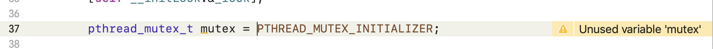
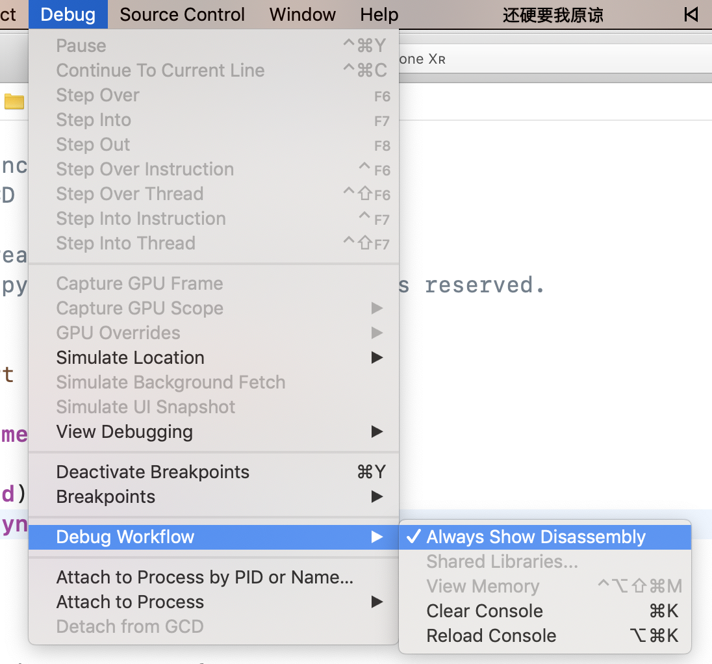
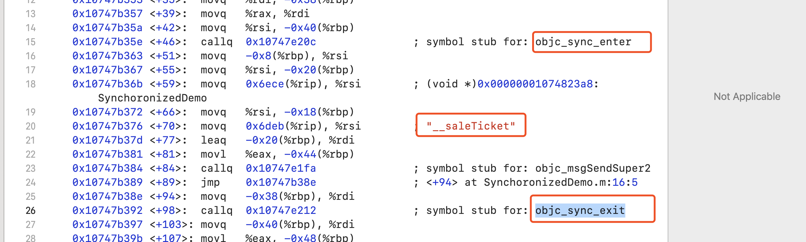

### 加锁

线程安全隐患解决方案

解决方案 使用线程同步技术(按照预定的先后次序进行）

#### 1、OSSpinLock 自旋锁 ( heigh-leve Lock、自旋锁)

`#import "<libkern/OSAtomic.h>"`

****

```objc
 OSSpinLock _lock = OS_SPINLOCK_INIT;
 OSSpinLockLock(&_lock);
 OSSpinLockUnlock(&_lock); 
 OSSpinLockTry(&_lock); //尝试加锁 如果不能加锁 返回No
```

* 因为是自旋锁( busy-wait) 所以一直cpu占用资源，线程不会休眠，一直等待，所以效率最高。

##### 存在的问题

* **ios10**之后过期

* 优先级反转

​		 由于锁是自旋锁，线程不会休眠，所以当低优先级线程先对操作进行Lock操作后，CPU调度高优先级线程操作，由于低优先级别UnLock，此时调用高优先级线程。高优先级无法处理该操作，而高优先级线程一直调用CPU资源， 系统等待高优先级线程执行完毕后才给低优先级线程资源。

> 高优先级线程等待低优先级线程Unlock。 低优先级线程等待CPU资源调度。造成类似死锁  导致锁无法释放。相互等待


####2、os_unfair_lock (low-level Lock、互斥锁 )

`import <os.lock.h>`

```objc
os_unfair_lock _lock = OS_UNFAIR_LOCK_INIT;
os_unfair_lock_lock(&_lock);
os_unfair_lock_unlock(&_lock);
os_unfair_lock_trylock(&_lock);//尝试加锁 如果不能加锁 返回No
```

* **ios10**之后支持

#### 3、ptheard_mutex (low-level Lock、互斥锁)

`#import"pthread.h"`

```objc
    pthread_mutexattr_t attr = {0};
    pthread_mutexattr_init(&attr);
		//设置锁的描述  PTHREAD_MUTEX_DEFAULT为一般互斥锁  PTHREAD_MUTEX_RECURSIVE为递归锁
		//pthread_mutexattr_settype(&attr, PTHREAD_MUTEX_RECURSIVE为递归锁); //递归锁
    pthread_mutexattr_settype(&attr, PTHREAD_MUTEX_DEFAULT);
    pthread_mutex_init(mutex, &attr);
		//释放  防止内存泄漏
    pthread_mutexattr_destroy(&attr);
```


##### 1、递归锁 PTHREAD_MUTEX_RECURSIVE

根据参数   attr PTHREAD_MUTEX_RECURSIVE  递归锁

PTHREAD_MUTEX_RECURSIVE ：允许**同一个线程** 重复加锁。

##### 2、条件 condition

> 线程激活信号 不一定会马上执行 先等上一次操作unlock

```objc
// 创建锁
- (void) __initLock:(pthread_mutex_t *) mutex {
    pthread_mutexattr_t attr = {0};
    pthread_mutexattr_init(&attr);
	  //互斥锁
    pthread_mutexattr_settype(&attr, PTHREAD_MUTEX_DEFAULT);
    pthread_mutex_init(mutex, &attr);
    pthread_mutexattr_destroy(&attr);
    
    pthread_condattr_t condAtt={0};
	  // 创建条件
    pthread_cond_init(&_condition, &condAtt);
    pthread_condattr_destroy(&condAtt);
}
- (instancetype)init
{
    self = [super init];
    if (self) {
        [self __initLock:&_lock];
        
        
       dispatch_queue_t queue = dispatch_queue_create(0, DISPATCH_QUEUE_CONCURRENT);
        dispatch_async(queue, ^{
            [self test2];
        });
        dispatch_async(queue, ^{
            sleep(2);
            [self test1];
            
        });
    }
    return self;
}
- (void)test1 {
    NSLog(@"%@",[NSThread currentThread]);
  	// lock
    pthread_mutex_lock(&_lock);
    NSLog(@"1");
	  //对condition发送信号
    pthread_cond_signal( &_condition);
	  NSLog(@"3");
	  //unlock
    pthread_mutex_unlock(&_lock);
	  NSLog(@"4");
}

- (void)test2 {
    NSLog(@"%@",[NSThread currentThread]);
  	// lock
    pthread_mutex_lock(&_lock);
  	// 等待condition发送信号
    pthread_cond_wait(&_condition, &_lock);
    NSLog(@"2");
  	//unlock
    pthread_mutex_unlock(&_lock);
}

```


输出结果为

```
2019-09-03 14:55:49.650729+0800 GCD[1918:36391522] 1
2019-09-03 14:55:49.650896+0800 GCD[1918:36391522] 3
2019-09-03 14:55:49.651025+0800 GCD[1918:36391522] 4
2019-09-03 14:55:49.651031+0800 GCD[1918:36391523] 2
```

上述代码   无论test1 和test2谁先调用 test2 依赖于test1的调用 只有当test1中执行 `pthread_cond_signal( &_condition);` test2中才会继续执行， 执行步骤为:

1. Test2
2. Test2 中lock `pthread_mutex_lock(&_lock);`
3. 等待condition发送信号` pthread_cond_wait(&_condition, &_lock);` 此时**unlock**锁 并且线程**休眠**
4. 2s后执行Test1
5. Test1 中lock `pthread_mutex_lock(&_lock);`
6. 输出1
7.  //对condition发送信号    `pthread_cond_signal( &_condition);`  test2线程被激活 
8. 输出3
9. Test1中解锁unlock
10. Test2 执行lock操作中继续执行 输出2
11. test2中解锁

* 8-9 和10-11是同时进行

* condition 不仅可以发送信号signal 还可以发送广播 `pthread_cond_boradcast`  激活所有pthread_cond_wait

##### 注意点

1. 使用condition的时候 不要使用同一个线程调用wait和signal 因为线程调度wait的时候线程将处于休眠状态，无法执行signal 可以试试上面的代码 把并发队列换成串行队列试一下。

2. 结构体初始化只能直接初始化  如下图所示

   ​			

   

   

#### 4、NSLock

NSLock是对**mutex**   `PTHREAD_MUTEX_DEFAULT` 普通锁的封装

```objc

- (void)lock;// 加锁
- (void)unlock;//解锁
- (BOOL)tryLock;// 尝试是否可以加锁 如果可以 直接加锁返回YES
- (BOOL)lockBeforeDate:(NSDate *)limit; //在一定时间内是否可以加锁 如果可以 直接加锁返回YES
```


#### 5、NSRecursiveLock

NSLock是对**mutex**  `PTHREAD_MUTEX_RECURSIVE`递归锁的封装

API和NSLock一样

```objc
- (void)lock;// 加锁
- (void)unlock;//解锁
- (BOOL)tryLock;// 尝试是否可以加锁 如果可以 直接加锁返回YES
- (BOOL)lockBeforeDate:(NSDate *)limit; //在一定时间内是否可以加锁 如果可以 直接加锁返回YES
```


#### 6、NSCondition

NSCondition是对mutex和cond的封装

```objc
//用法和mutex condtion 一样  可以参考上面代码
- (void)lock;// 加锁
- (void)unlock;//解锁
- (void)wait;//等待
- (BOOL)waitUntilDate:(NSDate *)limit; //等待多久  如果超时就不等了 就直接执行
- (void)signal; // 信号量
- (void)broadcast; //广播
```


#### 7、NSConditionLock 

NSConditionLock是对NSCondition的封装

```objc

- (void)lock;// 加锁
- (void)unlock;//解锁
- (void)lockWhenCondition:(NSInteger)condition; //休眠 直到符合conditon后  激活并lock
- (BOOL)tryLock;
- (BOOL)tryLockWhenCondition:(NSInteger)condition;
- (void)unlockWithCondition:(NSInteger)condition; // 解锁 修改condtion的值
- (BOOL)lockBeforeDate:(NSDate *)limit;
- (BOOL)lockWhenCondition:(NSInteger)condition beforeDate:(NSDate *)limit;
```


#### 8、Dispatch_semaphore

Dispatch_semaphore 可以控制线程的个数  当控制线程个数为1的时候 能确保同时只有1条线程去访问，已达到确保线程安全的目的

```objc
dispatch_semaphore_t semaphore = dispatch_semaphore_create(1);

// 如果信号量<=0 当前线程就会键入休眠状态 知道信号量的值>0
// 如果信号值>0 就-1 然后执行下面代码
dispatch_semaphore_wait(self.semaphore, DISPATCH_TIME_FOREVER);
[super __saleTicket];
// 信号量+1
dispatch_semaphore_signal(_semaphore);
```


设置信号量 达到控制线程个数

如果信号量 == 1   保证串行


如果信号量大于0  就让信号量的值-1  继续执行 

信号量值<= 0  休眠等待  直到信号量的值>0  然后-1 唤醒线程 继续操作

####9、dispatch_queue(DISPATCH_QUEUE_SERIAL)

串行队列,当在一个串行队列执行的时候，只有一个线程，能确保线程安全


#### 10、@synchronized

以前:对mutex递归锁的封装

**现在:os_unfair_recursive_lock的封装**

首先打开断点汇编模式






obj4源码中objc_sync.mm

底层存储  hash表  key :传进去的对象 

```c++
class recursive_mutex_tt : nocopy_t {
    os_unfair_recursive_lock mLock;
	  ...
}
using recursive_mutex_t = recursive_mutex_tt<LOCKDEBUG>;

typedef struct alignas(CacheLineSize) SyncData {
    struct SyncData* nextData;
    DisguisedPtr<objc_object> object;
    int32_t threadCount;  // number of THREADS using this block
    recursive_mutex_t mutex;
} SyncData;

int objc_sync_enter(id obj)
{
    int result = OBJC_SYNC_SUCCESS;

    if (obj) {
        SyncData* data = id2data(obj, ACQUIRE);
        assert(data);
        data->mutex.lock();
    } else {
        // @synchronized(nil) does nothing
        if (DebugNilSync) {
            _objc_inform("NIL SYNC DEBUG: @synchronized(nil); set a breakpoint on objc_sync_nil to debug");
        }
        objc_sync_nil();
    }

    return result;
}

```

```c++
int objc_sync_exit(id obj)
{
    int result = OBJC_SYNC_SUCCESS;
    
    if (obj) {
        SyncData* data = id2data(obj, RELEASE); 
        if (!data) {
            result = OBJC_SYNC_NOT_OWNING_THREAD_ERROR;
        } else {
            bool okay = data->mutex.tryUnlock();
            if (!okay) {
                result = OBJC_SYNC_NOT_OWNING_THREAD_ERROR;
            }
        }
    } else {
        // @synchronized(nil) does nothing
    }
	

    return result;
}
```

### 运行时间


**2019-09-03 17:35:52.687254+0800 Objective-C 锁[4098:37355878] OSSpinLock消耗时间:320**

**2019-09-03 17:35:52.744331+0800 Objective-C 锁[4098:37356150] os_unfair_lock消耗时间:377**

**2019-09-03 17:35:52.747909+0800 Objective-C 锁[4098:37355877] MutexDemo_Condition消耗时间:381**

**2019-09-03 17:35:52.774311+0800 Objective-C 锁[4098:37356152] MutexDemo消耗时间:407**

**2019-09-03 17:35:53.049666+0800 Objective-C 锁[4098:37356155] LockDemo消耗时间:683**

**2019-09-03 17:35:53.095270+0800 Objective-C 锁[4098:37355877] RecursiveLockDemo消耗时间:728**

**2019-09-03 17:35:53.108431+0800 Objective-C 锁[4098:37355875] ConditionLockDemo消耗时间:740**

**2019-09-03 17:35:53.137908+0800 Objective-C 锁[4098:37355886] ConditionDemo消耗时间:771**

**2019-09-03 17:35:53.367978+0800 Objective-C 锁[4098:37356151] SynchoronizedDemo消耗时间:1000**

**2019-09-03 17:35:53.456806+0800 Objective-C 锁[4098:37356155] SemaphoreDemo消耗时间:1089**


n什么情况使用自旋锁比较划算？

p预计线程等待锁的时间很短

p加锁的代码（临界区）经常被调用，但竞争情况很少发生

pCPU资源不紧张

p多核处理器

p

n什么情况使用互斥锁比较划算？

p预计线程等待锁的时间较长

p单核处理器

p临界区有IO操作

p临界区代码复杂或者循环量大

p临界区竞争非常激烈

