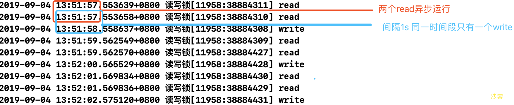
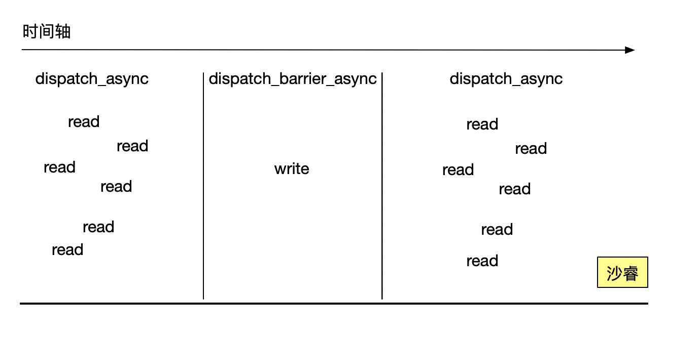

##iOS读写安全

### 1、atomic & noatomic

​	给属性添加atomic 可以保证属性的setter和getter原子性操作，也就是保证setter和getter内部是线程同步的

* 源码   objc4  objc-accessors.mm文件

```objc
//setter方法
void objc_setProperty(id self, SEL _cmd, ptrdiff_t offset, id newValue, BOOL atomic, signed char shouldCopy) 
{
    bool copy = (shouldCopy && shouldCopy != MUTABLE_COPY);
    bool mutableCopy = (shouldCopy == MUTABLE_COPY);
    reallySetProperty(self, _cmd, newValue, offset, atomic, copy, mutableCopy);
}

static inline void reallySetProperty(id self, SEL _cmd, id newValue, ptrdiff_t offset, bool atomic, bool copy, bool mutableCopy)
{
...
    if (!atomic) { // 如果非原子性 直接赋值
        oldValue = *slot;
        *slot = newValue;
    } else { //如果是原子性,加自旋锁
        spinlock_t& slotlock = PropertyLocks[slot];
        slotlock.lock();
        oldValue = *slot;
        *slot = newValue;        
        slotlock.unlock();
    }
...
}
// getter方法
  id objc_getProperty(id self, SEL _cmd, ptrdiff_t offset, BOOL atomic) {
   ...
    if (!atomic) return *slot; //如果非原子性 直接返回
        
    // Atomic retain release world
    spinlock_t& slotlock = PropertyLocks[slot]; //如果原子性 则加自旋锁
    slotlock.lock();
    id value = objc_retain(*slot);
    slotlock.unlock();
    ...
    // for performance, we (safely) issue the autorelease OUTSIDE of the spinlock.
    return objc_autoreleaseReturnValue(value);
}
```


* **从源码看 atomic是自旋锁，且只能保证在Setter和getter的时候安全，例如[NSMutableArray addobject]的时候  是不安全的**


### 2、读写锁

为什么会有读写锁，用其他的的锁来实现不可以么？

普通锁可以达到**同一时间段**只有**一个**线程对本地文件进行**读**或者**写**。效率低。无法保证read的时候可以多线程read，而只是在write的时候 只有一个线程在write。

所以 `pthread_rwlock`解决这个问题。可以达到 当线程write的时候，只有一个线程写入。read的时候可以多线程read。

* API:

```objc
#import <pthread.h>
pthread_rwlock_init(&_lock, NULL);
pthread_rwlock_rdlock(&_lock); //read的时候用的锁
pthread_rwlock_wrlock(&_lock);// write的时候用的锁
pthread_rwlock_unlock(&_lock);
pthread_rwlock_tryrdlock(pthread_rwlock_t *) //尝试read锁
pthread_rwlock_trywrlock(pthread_rwlock_t *) //尝试wirte锁
```

* 举个🌰

```objc
#import <pthread.h>

- (void)viewDidLoad {
    [super viewDidLoad];
    pthread_rwlock_init(&_lock, NULL);
}

- (void)touchesBegan:(NSSet<UITouch *> *)touches withEvent:(UIEvent *)event {
    dispatch_queue_t queue = dispatch_queue_create("rwqueue", DISPATCH_QUEUE_CONCURRENT);
    for (int i = 0; i < 10; i ++) {
        dispatch_async(queue, ^{
            for (int i = 0; i < 10; i ++) {
                [self read];
            }
        });
        
        dispatch_async(queue, ^{
            for (int i = 0; i < 10; i ++) {
                [self read];
            }
        });
        
        dispatch_async(queue, ^{
            [self write];
        });
    }
}

- (void) read {
    pthread_rwlock_rdlock(&_lock);
    sleep(1);
    NSLog(@"read");
    pthread_rwlock_unlock(&_lock);
}

- (void) write {
    pthread_rwlock_wrlock(&_lock);
    sleep(1);
    NSLog(@"write");
    pthread_rwlock_unlock(&_lock);
}
```

* 运行结果及分析:




### 3、dispatch_barrier_async

举个🌰

```objc
- (void)touchesBegan:(NSSet<UITouch *> *)touches withEvent:(UIEvent *)event {
    _queue = dispatch_queue_create("rwqueue", DISPATCH_QUEUE_CONCURRENT);
    
    for (int i = 0; i < 10; i ++) {
        [self read];
        [self write];
        [self write];
        [self read];
    }
    
}

- (void) read {
    dispatch_async(_queue, ^{
        sleep(1);
        NSLog(@"read");
    });
}

- (void) write {
    dispatch_barrier_async(_queue, ^{
        sleep(1);
        NSLog(@"write");
    });
}
```


* 运行结果分析


* 注意点

  > **必须**传入dispatch_queue_create的并发队列 **不能**传入`dispatch_get_global_queue`队列

  > 如果传入串行或者是global 就相当于dispatch_async ,没有栅栏(barrier)效果

* 原理



