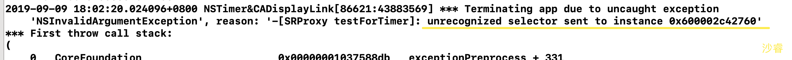

DisplayLink

调用频率为屏幕帧率一致  60FPS  (一秒钟调用60次)


NSTimer

循环引用

weakSelf 为什么不行


解决方式 利用block

```objc
__weak typeof(self) weakSelf = self;
self.timer = [NSTimer scheduledTimerWithTimeInterval:1 repeats:YES block:^(NSTimer * _Nonnull timer) {
        [weakSelf testForTimer];
}];
```


### NSProxy 设计消息转发

首先，了解下NSTimer的循环引用
```objc
@interface ViewController ()
@property (nonatomic, strong) NSTimer *timer;
@end

@implementation ViewController  
- (void)viewDidLoad {
    [super viewDidLoad];
    self.timer = [NSTimer scheduledTimerWithTimeInterval:1 
			                  													target:self 
                                                selector:@selector(testForTimer)
                                                userInfo:nil
                                                 repeats:YES];
}

- (void)testForTimer {
    NSLog(@"%s",__func__);
}
@end
```


循环引用:


* 可能有的人说用`__weak` 来修饰`self`  从而达到`targe`t指向`ViewController`是弱引用的效果。
* **不行！**  因为weak 也是把地址赋值给`target`，`target`还是强引用`viewController`地址。 我们用的weak是处理block的循环引用，block中会把`__weak`修饰的对象 描述为弱引用


####关于SRProxy

```objc
@interface SRProxy : NSProxy
@property (nonatomic, weak) id target;
+ (instancetype)proxyWithTarget:(id)target;
@end

```

```objc
@implementation SRProxy
+ (instancetype)proxyWithTarget:(id)target {
    SRProxy *proxy = [SRProxy alloc];
    proxy.target = target;
    return proxy;
}

- (id)forwardingTargetForSelector:(SEL)aSelector {
    if (self.target) {
        return self.target;
    }
    return self;
}

-(NSMethodSignature *)methodSignatureForSelector:(SEL)aSelector {
    return [self.target  methodSignatureForSelector:aSelector];
}

- (void)forwardInvocation:(NSInvocation *)invocation {
    [invocation invokeWithTarget:self.target];
}
@end
```

#### 关于解决方式

```objc
self.timer = [NSTimer scheduledTimerWithTimeInterval:1 target:[SRProxy proxyWithTarget:self] selector:@selector(testForTimer) userInfo:nil repeats:YES];
```


#### 解释NSProxy

#####  结构

```objc
@interface NSProxy <NSObject> {
    Class	isa;
}
```

NSProxy为基类，和NSObject同级， 专门处理这种代理实现事件。

SRProxy继承于NSProxy  如果继承NSObject 也可以实现功能。  

#####NSProxy 和NSObject比较

继承于NSProxy的类 找实现方法的时候 只会找当前类是否实现 而不找super，如果没找到直接进入消息动态解析，以及消息转发机制。 比继承NSObject的类少了找super，从而效率更高。

##### 实验1

如果把SRProxy中的消息转发机制去掉 看一下错误信息

###### 继承NSProxy


###### 继承NSObject




NSProxy**没有init**方法  只要alloc 既可

#####实验2

当我们继承于NSProxy 在上述`ViewDidLoad` 中打印此代码 结果为

```objc
 NSLog(@"isKindOfClass  == %d",[[SRProxy proxyWithTarget:self] isKindOfClass:[self class]]);
```


[]

###### 解释

调用`isKindOfClass` 进行消息转发  走的是下面的方法

```objc
-(NSMethodSignature *)methodSignatureForSelector:(SEL)aSelector {
    return [self.target  methodSignatureForSelector:aSelector];
}
```


```objc
- (void)forwardInvocation:(NSInvocation *)invocation {
	[invocation invokeWithTarget:self.target];
}
```


实际调用的是`self.target` 去执行`objc_msgSend(self.target,SEL)` 所以为1

isKindOfClass 为1 


