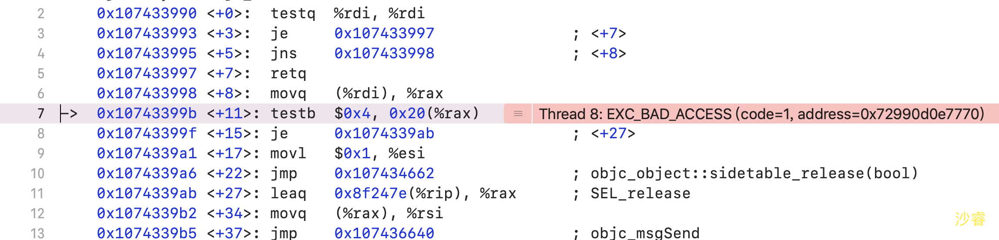
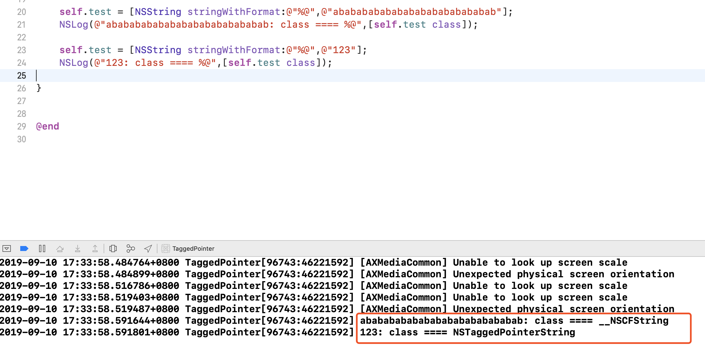
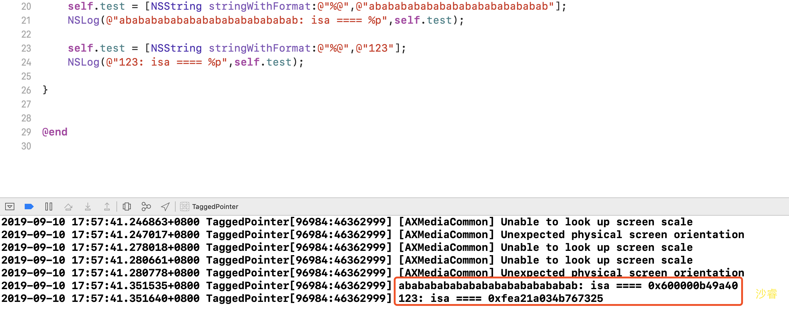

### GCD定时器

封装


### 内存布局

| 低   | 保留                                                  |
| ---- | ----------------------------------------------------- |
|      | 代码段(__TEXT)                                        |
|      | 数据段(__DATA) 字符串常量、已初始化数据、未初始化数据 |
|      | 堆（heap） （由底到高）                               |
|      | 栈（stack）（由高到底）                               |
| 高   | 内核区                                                |


- 代码段
  - 编译后的代码
- 数据段
  - 字符串常量
  - 已初始化数据：已初始化的全局变量、静态变量等
  - 未初始化数据：未初始化的全局变量、静态变量等
- 堆
  - 通过alloc、malloc、calloc等动态分配的空间 
  - 分配的空间地址越来越大
- 栈 
  - 函数调用开销
  - 分配的空间地址越来越小


代码演示


### Tagged Pointer

##### 首先定义

```objc
@property (nonatomic, copy) NSString *test;
```


##### 方法一

```objc
  for (int i = 0; i < 1000; i++) {
      dispatch_async(dispatch_get_global_queue(0, 0), ^{
          self.test = [NSString stringWithFormat:@"%@",@"123"];
      });
  }

```

##### 方法二

```objc

  for (int i = 0; i < 1000; i++) {
      dispatch_async(dispatch_get_global_queue(0, 0), ^{
          self.test = [NSString stringWithFormat:@"%@",@"abababababababababababababab"];
      });
  }
```


运行段代码 有什么区别？ 现象是什么？

* 方法一：正常运行
* 方法二：崩溃

#### 为什么？

查看崩溃日志



* 坏内存访问

#### 分析原因

test属性 setter方法实际执行以下内容

```objc
- (void)setTest:(NSString *)test {
    if (![_test isEqualToString:test]) {
        [_test release];
        _test = [test copy];
        [test release];
    }
}
```

由于test 修饰为nonatomic 所以是线程不安全的。 当多条线程同时访问，造成多次release ，所以坏内存访问。


#### 解决方式

修饰改为**atomic** 或者加锁


#### 疑问 

##### 为什么方式一不会崩溃？

首先打印两个NSString的类型



#### 解决疑问

正常对象都是 指针指向对象的地址, 指针指向堆内存中的地址，所以方法二会因为多线程访问而造成坏内存访问，而TaggedPointer 则不会创建内存，而是在isa指针上做手脚。在指针上存放具体值。

### TaggedPointer

64位开始  引入了Tagged Pointer 技术,用于优化NSNumber、NSDate、NSString 等小对象存储

#####  打印方式一、方式二的NSString地址




从上图可以看出 0结尾的为对象地址  因为以16位为基准 内存对齐

而方法二的明显不一样。


##### 我们看一下objc_release的源码

```objc
objc_release(id obj)
{
    if (!obj) return;
    if (obj->isTaggedPointer()) return;
    return obj->release();
}
```


当obj为isTaggedPointer的时候 直接返回。 所以更加验证了刚才的说法 即:**用指针存值，而不是在堆中生成对象**

```objc
objc_object::isTaggedPointer() 
{
    return _objc_isTaggedPointer(this);
}
```


```objc
#   define _OBJC_TAG_MASK 1UL
static inline bool 
_objc_isTaggedPointer(const void * _Nullable ptr)
{
    return ((uintptr_t)ptr & _OBJC_TAG_MASK) == _OBJC_TAG_MASK;
}
```


```c
#if (TARGET_OS_OSX || TARGET_OS_IOSMAC) && __x86_64__ //如果是OSX && X86 
    // 64-bit Mac - tag bit is LSB
#   define OBJC_MSB_TAGGED_POINTERS 0 
#else  //其他情况 包含iOS
    // Everything else - tag bit is MSB
#   define OBJC_MSB_TAGGED_POINTERS 1
#endif


#if OBJC_MSB_TAGGED_POINTERS
#   define _OBJC_TAG_MASK (1UL<<63)  //如果是OSX && X86 

#else
#   define _OBJC_TAG_MASK 1UL  //其他情况 包含iOS

#endif
```


从上面可以看当在==OSX && X86== 出当`1UL<<63`为1的时候为TaggedPointer  

从上面可以看当在==iOS平台== 出当尾数为1的时候为TaggedPointer  

